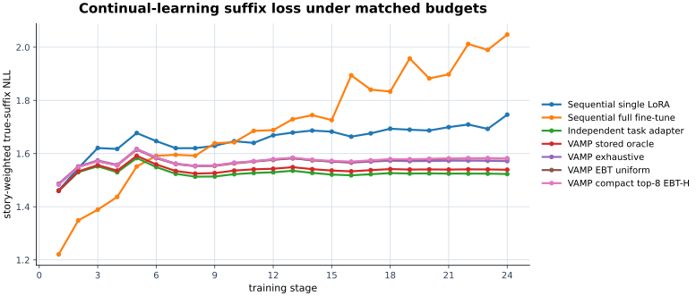
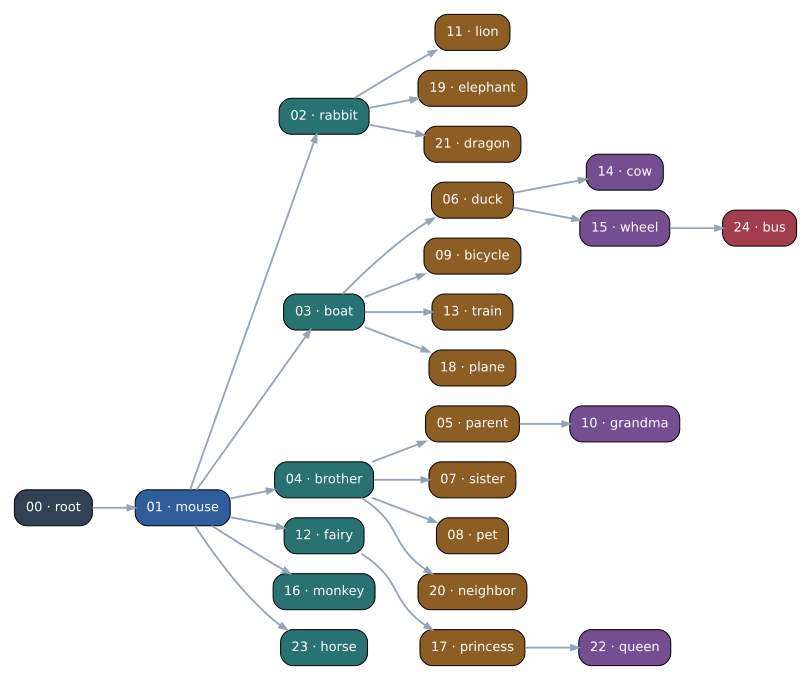

# VAMP

**Virtually Addressed Memory for Parameters (VAMP)** is an experimental
architectural paradigm for continual learning. Instead of repeatedly mutating
one model, VAMP stores immutable parameter updates in a dependency graph. At
inference time, a task-free router addresses a node from the observed input and
executes the base model plus the parameter deltas on that node's path.

The architecture is described in
[Virtually Addressed Memory for Parameters](docs/Virtually_Addressed_Memory_for_Parameters.pdf).
The repository explores dense parameter memories, predictive-coding networks,
and pathwise LoRA memories for language models.

> [!IMPORTANT]
> **TinyWorlds Nouns-v2 is the only supported benchmark.** TRACE Log-t VAMP is
> a completed, sealed research run with published reviewer evidence, but its
> one-seed/one-order result is not a supported benchmark claim. The
> MNIST/predictive-coding work, TinyShakespeare work, TinyStories work, and all
> other TinyWorlds variants are notional designs, negative results, or
> deprecated prototypes retained for research provenance.

## TinyWorlds Nouns-v2

Nouns-v2 is the completed VAMP experiment. It creates 24 disjoint continual
learning tasks from a pinned TinyStories archive: stories naming no selected
noun family train the base model, stories naming exactly one family train that
task, and stories naming multiple selected families are excluded. A fresh
GPT-Neo base is extended with immutable rank-eight LoRA edges, and task-free
routing is compared with sequential LoRA, full-model fine-tuning, independent
task adapters, and a task-aware VAMP oracle.

The benchmark contains 429,199 task-training stories and 4,440 held-out
validation stories. Every task was evaluated from its introduction through the
final stage. The stored VAMP nodes had exactly zero NLL drift, while the
task-free exhaustive router finished at 73.9% route accuracy and 1.572
true-suffix story NLL. On the same final evaluation, sequential LoRA reached
1.746 NLL with +0.2156 mean forgetting, and sequential full-model fine-tuning
reached 2.048 NLL with +0.5744 mean forgetting. These are results for this
specific benchmark, not a claim of general continual-learning performance.





- [Readable Markdown report](results/language_cl/tinyworlds-nouns-v2/report.md)
- [Standalone folding HTML report](results/language_cl/tinyworlds-nouns-v2/report.html)
- [Execution and verification record](docs/TINYWORLDS_NOUNS_V2_EXECUTION_REPORT.md)

## Experiment Map

| Experiment family | Current status | Scope and retained evidence |
|---|---|---|
| **TinyWorlds Nouns-v2** | **Usable** | Completed 24-task disjoint language benchmark with immutable VAMP stages, matched controls, routing audits, and a published [report](results/language_cl/tinyworlds-nouns-v2/report.md). |
| VAMP-AF Rotated MNIST | Top-two smoke complete | Full-rank deltas on the CNN's top two layers raised the real oracle-context preflight to 98.36%. The 5,000-example AF smoke completed at 45.88% routed versus 88.01% oracle-leaf accuracy, exposing routing as the remaining gap. |
| **TRACE Log-t VAMP** | **Completed research run** | Eight-task Llama-3.2-1B continual-learning study with SVD/Core controls, replay repair, four original routers, matched baselines, a CPU-only [task-known provenance follow-up](docs/experiments/trace-logt-vamp/followups/task-known-provenance/report.md), and a complete [reviewer bundle](docs/experiments/trace-logt-vamp/README.md). |
| TinyShakespeare | Deprecated prototype | Four-task character-level language-model experiments used to establish the pathwise LoRA and routing machinery. A selected [character-permutation report](results/language_cl/tinyshakespeare/character-permutation/standard-seed0-a7bd7d1479ba/report.html) is retained as historical evidence. |
| MNIST and predictive coding | Deprecated prototype | Early label-canvas VAE and FabricPC predictive-coding experiments established dense-delta graphs, energy-based addressing, and report tooling. The selected [digit-incremental FabricPC report](results/stage1_apm/digit_mnist_dense_delta_fabricpc_energy_converged/report.html) is not a current benchmark result. |
| Other TinyWorlds and TinyStories variants | Notional, failed, or deprecated | Dataset constructions, semantic partition attempts, pilots, and negative results are retained under `docs/`, `scripts/`, and versioned source packages for provenance. |

## How VAMP Is Organized

1. Train or load a base model at the graph root.
2. For each new task, score candidate parents and train a parameter delta from
   the selected parent without changing previously committed edges.
3. Store content keys and routing statistics separately from the immutable
   parameter graph.
4. At evaluation, address a node from input-only evidence and compose the root
   with the deltas along that path.

This separation makes parameter retention and task-free addressing distinct
measurements. An oracle path can verify whether old functions were retained;
router metrics then measure whether the correct path can still be found as the
graph grows.

## Development Setup

Python 3.10 or newer is required. Create the local environment and run the
default non-integration test suite with:

```bash
python -m venv ve
ve/bin/python -m pip install -e '.[dev]'
ve/bin/python -m pytest
```

The default CPU suite uses four `pytest-xdist` workers with work stealing.
Integration and benchmark tests remain opt-in through their pytest markers.

The language-model experiments additionally require the `lm` extra. CUDA hosts
can request the JAX CUDA 12 runtime through the `gpu` extra:

```bash
ve/bin/python -m pip install -e '.[dev,lm,gpu]'
```

The canonical prepared nouns-v2 run is resumable through:

```bash
ve/bin/python scripts/run_tinyworlds_nouns_v2.py
```

It is a full research run, not a quick-start demo: it expects the authenticated
parent corpus artifacts and uses substantial GPU time. The exact data,
checkpoint, evaluation, and resume contracts are recorded in the
[execution report](docs/TINYWORLDS_NOUNS_V2_EXECUTION_REPORT.md).

## TRACE Log-t VAMP Runner

The repository also contains a complete implementation of
the TRACE/Llama-3.2-1B-Instruct log-t temporal-consolidation experiment. It
trains 40 immutable LoRA leaves once, builds SVD and Core+TSV capacity-two
hierarchies with optional deterministic replay repair, evaluates two task-free
routers and two diagnostics, and runs the required baselines through a
resumable two-GPU job DAG. The primary run and two leaf-reusing Core-scale
controls completed all 562 jobs. The sealed report, raw candidate generations,
logs, ledgers, manifests, integrity records, and review guide are published in
the [TRACE reviewer bundle](docs/experiments/trace-logt-vamp/README.md).
The bundle also contains a reproducible
[task-known provenance follow-up](docs/experiments/trace-logt-vamp/followups/task-known-provenance/report.md)
that re-scores the sealed generations without loading model weights or running
new inference.

The canonical model remains Meta's exact revision
`9213176726f574b556790deb65791e0c5aa438b6`. Downloading does not require gated
Hugging Face access: TRACE pins public source
`alpindale/Llama-3.2-1B-Instruct` at revision
`f92201d8185818a9d079b3b52efdab4b68bdd17f` and authenticates the model,
tokenizer, and configuration bytes against Meta's repository metadata before
training. In particular, the 2.47-GB BF16 safetensor is byte-identical, with
SHA-256
`1ff795ff6a07e6a68085d206fb84417da2f083f68391c2843cd2b8ac6df8538f`.

The direct deployment uses RunPod's public PyTorch image; it needs neither a
custom registry nor a saved template. RunPod supplies the Pod-scoped API key,
Pod ID, and attached-volume ID to an image entrypoint. For a direct SSH-driven
deployment, place those three values in the launched process environment. An
optional `VAMP_NOTIFY_WEBHOOK_URL` enables notifications.

```bash
export RUNPOD_API_KEY=<runpod-key>
export TRACE_NETWORK_VOLUME_ID=<network-volume-id>
scripts/trace/launch_runpod.sh
```

After copying this checkout to `/workspace/vamp-trace/source/apm`, prepare the
isolated runtime with `scripts/trace/prepare_direct_runpod.sh`. The Dockerfile
remains available as an optional prebuilt-image path, not a deployment
requirement.

All durable state and model/data caches remain below
`/workspace/vamp-trace/`. A replacement two-4090 Pod resumes without repeating
completed work:

```bash
python -m apm.continual.trace.cli status \
  --run /workspace/vamp-trace/runs/<run-contract-hash>
python -m apm.continual.trace.cli resume \
  --run /workspace/vamp-trace/runs/<run-contract-hash>
```

After the primary DAG completes, a new Core scale or repair fraction reuses all
leaf adapters and records the reuse acceptance check:

```bash
python -m apm.continual.trace.cli rebuild-policy \
  --run /workspace/vamp-trace/runs/<run-contract-hash> \
  --policy configs/trace/policy_sweep_example.yaml
```

The source experiment contract is
`docs/TRACE Log-t VAMP Experiment Specification.pdf`; completed implementation
status and durable semantics are recorded in `PLAN.md` and `DESIGN.md`.

## VAMP-AF MNIST Runner

The Addressable Rotated MNIST mechanism POC uses the existing `vision` extra
and local MNIST IDX cache. One command runs or resumes the shared frozen CNN,
representation preflight, real smoke, three paired main seeds, and forced
consolidation stress pass:

```bash
uv run python -m apm.experiments.vamp_af_mnist \
  --config configs/vamp_af_mnist/poc.yaml
```

The `top-two-v3` preflight clears its adapter-capacity gate and the real smoke
pass is complete. The main three-seed and forced-consolidation passes remain
pending; rerunning the command resumes from authenticated checkpoints. Full
checkpoints and generated evidence are kept below the ignored
`artifacts/vamp-af-mnist/` tree; the protocol and output interpretation are summarized in
[the experiment note](docs/experiments/vamp_af_mnist.md).

## Repository Layout

- `src/apm/memory/`: immutable parameter graphs and addressing mechanisms.
- `src/apm/lm/`: plain-JAX GPT-Neo, LoRA, training, and evaluation components.
- `src/apm/data/mnist/`: MNIST task streams used by the early VAE and PC work.
- `src/apm/data/text/`: TinyShakespeare, TinyStories, and TinyWorlds datasets.
- `scripts/`: fixed experiment entry points and artifact builders.
- `docs/`: architecture notes, execution records, plans, and negative results.
- `results/`: selected presentation reports and only their direct media
  dependencies.

Raw corpora, checkpoints, optimizer state, and intermediate run artifacts are
normally excluded from Git. The sealed TRACE reviewer bundle is the deliberate
exception: its raw candidate-generation JSONL files are stored with Git LFS,
while caches, checkpoints, adapter tensors, and prompt embeddings remain on the
retained evidence volume.
