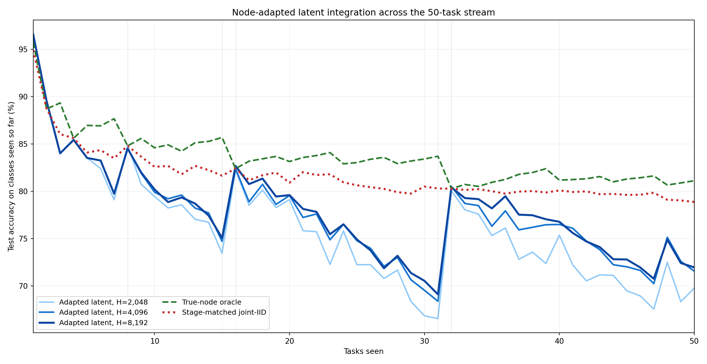
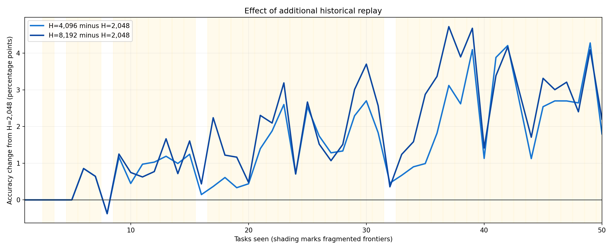
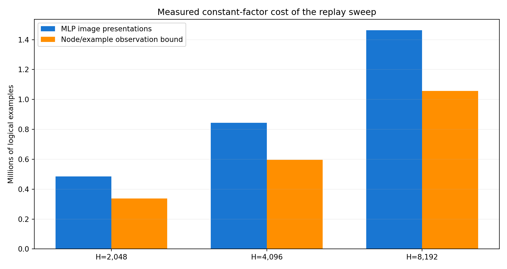

# ImageNet-R-50 Node-Adapted Latent Replay Sweep

## Abstract

This experiment replaced the score-only input with each live node's own LoRA-adapted 768-dimensional pre-classifier representation and swept deterministic historical replay from 2,048 to 8,192 examples. The hierarchy, data split, optimizer, four epochs per arrival, and residual MLP widths were fixed. Each six-slot observation has 8,214 values and never contains a label or task identity.

The best fragmented-frontier mean came from **H=8,192**. H=8,192 reached **71.950% final** and **77.837% over the 50-stage mean**. Relative to adapted-latent H=2,048, it changed fragmented-frontier accuracy by **+2.103 points on average** and one-node accuracy by **+0.070 points**. At task 50 it remained 6.917 points below stage-matched joint IID and 9.167 points below the diagnostic true-node oracle.

This is a post-hoc descriptive study on a test split already used for diagnosis. It tells us whether node-specific latent information and more replay are promising; it is not an untouched confirmation or a publishable benchmark claim.

## Primary result

| Condition | Final | 50-stage mean | Fragmented mean | One-node mean |
| --- | --- | --- | --- | --- |
| Adapted latent, H=2,048 | 69.750 | 75.978 | 74.549 | 86.460 |
| Adapted latent, H=4,096 | 71.550 | 77.473 | 76.242 | 86.498 |
| Adapted latent, H=8,192 | 71.950 | 77.837 | 76.652 | 86.529 |

| Tasks | Nodes | Adapted H=2,048 | Adapted H=4,096 | Adapted H=8,192 | Oracle | Joint IID |
| --- | --- | --- | --- | --- | --- | --- |
| 8 | 1 | 84.897 | 84.522 | 84.522 | 84.803 | 84.803 |
| 15 | 4 | 73.458 | 74.702 | 75.065 | 85.692 | 81.649 |
| 16 | 1 | 82.250 | 82.396 | 82.687 | 82.396 | 82.396 |
| 31 | 5 | 66.536 | 68.370 | 69.104 | 83.700 | 80.294 |
| 32 | 1 | 80.046 | 80.505 | 80.403 | 80.276 | 80.276 |
| 50 | 3 | 69.750 | 71.550 | 71.950 | 81.117 | 78.867 |

The names above are identical in the plot and tables. Tasks 8, 16, and 32 are single-node power-of-two frontiers. Tasks 15 and 31 are maximally fragmented frontiers immediately before a carry, and task 50 is the final three-node frontier.

## What the integrator observes

For every active level slot, the observer first installs that node's rank-16 LoRA in the shared ViT and extracts its adapted top-level pre-classifier representation. It layer-normalizes those 768 values, then appends 200 raw affine scores, 200 within-node log probabilities, a 200-value ownership mask, and one active bit. Six slots produce an 8,214-dimensional task-free input. This is not a shared frozen-backbone latent. The MLP has 9,122,760 parameters.

## Does more replay help?

Yellow bands identify fragmented frontiers. The H=8,192-minus-H=2,048 mean is +2.103 points across fragmented stages and +0.070 points across single-node stages. This separates a replay-budget effect from the representational change, although both remain single-seed measurements.

The old score-only H=2,048 run reached 69.433% final / 75.709% incremental accuracy. It is intentionally absent from the main figure because it changes the feature family as well as the initialization schedule; it is historical context, not a clean replay-capacity arm.

## Offline references

Stage-matched joint IID is a separate fresh rank-16 QKV-plus-fc1 LoRA at every prefix, trained on exactly the training tasks available at that stage. The true-node oracle uses the correct class-owning live node and is label-aware, so it is diagnostic rather than deployable. Neither comparator gated training or reporting.

## Work and asymptotic constraint

| Condition | Presentations | Optimizer steps | Node/example bound | Train time |
| --- | --- | --- | --- | --- |
| Adapted latent, H=2,048 | 484,988 | 1,024 | 337,123 | 0.09 min |
| Adapted latent, H=4,096 | 844,640 | 1,728 | 596,360 | 0.15 min |
| Adapted latent, H=8,192 | 1,462,776 | 2,944 | 1,057,451 | 0.26 min |

At arrival `t`, an arm presents the current four-class task plus at most `H` historical examples to `popcount(t)` live nodes. With fixed H this is O(t log t) cumulative behavior work. The sweep increases the constant factor and records it explicitly. Cache misses are physical forwards and depend on the descending-capacity execution order; the node/example bound is the order-independent logical comparison.

## Reuse and integrity

The run reused all 50 leaves and 47 fresh full-union parents from hierarchy `b5b6520b6b47f78b26350499bee2c5c0493e7504179f5eb31e0671f5ac1d5d11` with zero leaf and parent optimizer steps. All three integrators trained before any test behavior entered the follow-up cache. The immediate replay of the completed workflow performed zero optimizer steps and left every persistent checkpoint and the source hierarchy unchanged: `True`.

## Limitations and next decision

The matrix has one deterministic seed and repeatedly used test identities. A positive result should next be replicated on validation-derived or newly held-out identities, then combined with router-capacity/optimization ablations without changing the hierarchy. A flat replay curve would instead point toward integrator optimization or richer cross-node interaction, not more historical samples. In either case, the stage-matched joint-IID ceiling remains the primary target and local E2-LoRA is secondary context.

## Reproducibility

`stage_comparison.*` contains all plotted values, `condition_summary.*` and `fragmentation_checkpoints.*` contain the aggregate and selected-stage results, `task_accuracy_matrix.*` contains every stage/task cell, and `resource_accounting.*` records exact logical and physical work. Protocol manifests, the training seal, cache-seed records, chained ledgers, `reuse_proof.json`, and compact run/resume logs preserve the evidence needed for independent analysis. Large checkpoints and tensor caches remain local and ignored.
