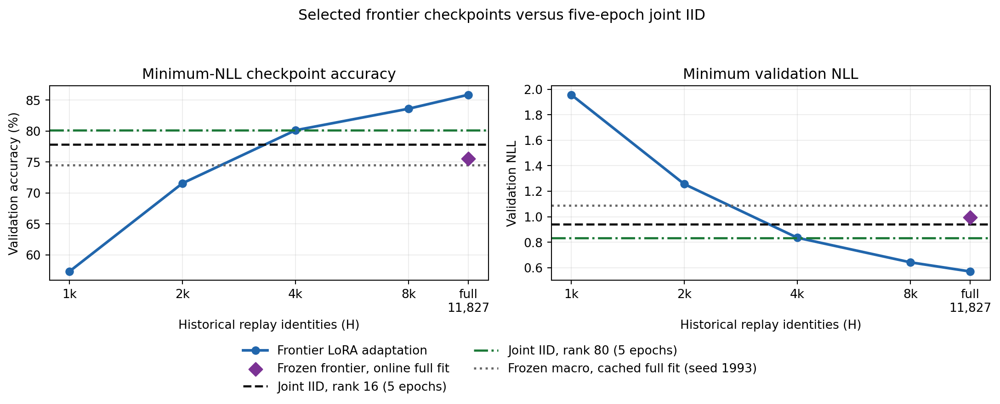
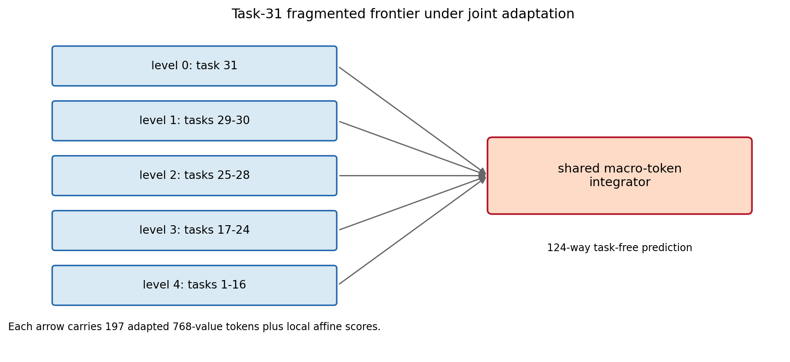
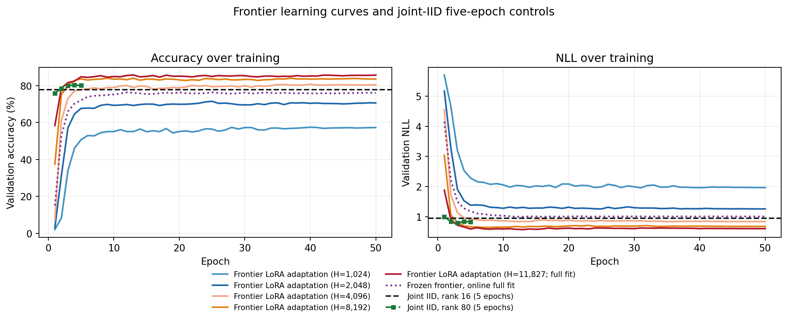
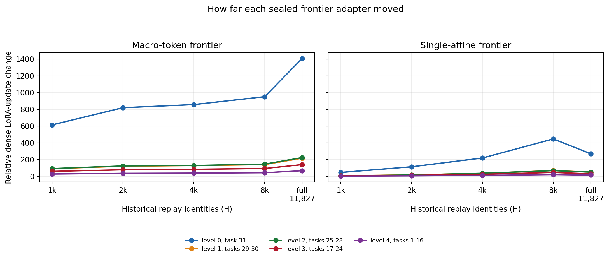

# ImageNet-R stage-31 frontier-LoRA adaptation

## Result

The minimum-NLL adaptive condition is **Frontier LoRA adaptation (H=11,827; full fit)**, with
**85.864% validation accuracy**
and **0.5710 NLL** at epoch
13. The largest observed adaptive accuracy is
**85.864%** from
**Frontier LoRA adaptation (H=11,827; full fit)** at epoch 13,
where NLL is 0.5710.
Frontier LoRA adaptation (H=4,096) is the smallest H to reach both rank-16 joint-IID metrics, first doing so at epoch 6.

The rank-16 joint-IID reference is 77.862% / 0.9425
NLL. The previous frozen cached macro result at the same seed is
74.483% / 1.0903; the new
augmentation-matched frozen control is
75.533% /
0.9967.

At the selected full-history checkpoint, LoRA adaptation gains
10.331 percentage points and reduces NLL by
0.4257 relative to the otherwise matched frozen-LoRA
control. At exactly 5 full-fit passes (60,970
image presentations), the adaptive frontier reaches
84.880% /
0.5897; the frozen frontier reaches
72.155% /
1.1788; and joint IID reaches
77.862% / 0.9425. The data exposure is
matched at this checkpoint. Compute is not: the frontier evaluates five
specialized ViTs plus the macro transformer, while joint IID evaluates one
ViT with one shared LoRA and classifier.

## Aggregate-rank control

The new rank-80 joint-IID control reaches
**80.125% accuracy / 0.8339 NLL**
at the fixed epoch-five endpoint. Increasing the joint adapter from rank 16 to
rank 80 raises accuracy by 2.263 percentage points and
lowers NLL by 0.1085. This recovers 32.2%
of the adaptive frontier's accuracy advantage and 30.8% of
its NLL advantage over rank-16 joint IID. At the same five-pass checkpoint,
the adaptive frontier remains 4.756 accuracy points
higher and 0.2443 NLL lower than rank-80 joint IID.

Both sides expose exactly 6,635,520 trainable LoRA parameters and 60,970 image
presentations. That is the full extent of the match. The adaptive frontier also
trains a 12,055,496-parameter macro integrator, starts from five separately
pretrained rank-16 adapters, and executes five ViT paths. Rank-80 joint IID
starts one adapter from the standard zero-effect initialization, trains a
95,356-parameter classifier, and executes one ViT path. Its minimum NLL within
the same five epochs is 0.7954 with
80.026% accuracy at epoch
3; this diagnostic does not replace the fixed
epoch-five comparison.

## What changed

The task-31 frontier contains five sealed rank-16 LoRAs over disjoint task
intervals. Every adaptive condition starts from those exact tensors and the
same seed-1993 macro head. The base ViT and all five node classifiers stay
frozen; the five node LoRAs and macro head train jointly from task-free inputs.
Every population includes all 367 current-task images. H is a nested uniform
hash-order prefix of the 11,827-image historical partition, so maximum H is
exactly the 12,194-image full fit. The 3,049 validation identities remain
excluded from optimization.

## Optimization behavior

The head uses the previous minimum-NLL winner: effective batch 64, peak AdamW
learning rate 3e-5, and 50 warmup-cosine epochs. Newly adaptive LoRAs use peak
5e-4 from the joint-IID recipe under the same AdamW schedule. That LoRA choice
is a starting point, not a tuned optimum. Checkpoint selection is minimum
validation NLL; maximum accuracy is a separately labeled diagnostic.

## Interpretation boundaries

This is one seed on a validation split, not a final test estimate. Repeated
epoch evaluation makes the maximum-accuracy statistic exploratory. The
full-fit frozen control isolates online augmentation and image forwarding from
LoRA adaptation. The five H cells differ in both unique identities and total
optimizer updates because each receives 50 full passes. No test identity was
requested. Exact replay authenticated all six cells with zero new optimizer
steps and left the source hierarchy unchanged. A separate fresh process also
authenticated the rank-80 result and its model artifact without an optimizer
step.
