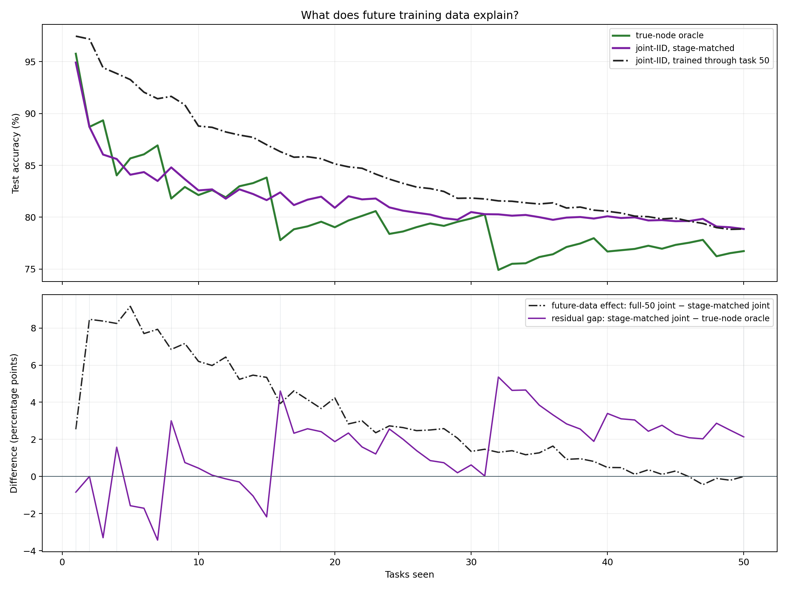

# ImageNet-R-50 Full-Union LogT Prediction Integrator

Run: `fd5cb0502d705bbd9662e197e9d867fda2b6c1b633c340f513be4b33579fd8b4`  
Workflow state: `COMPLETE`

## Abstract

We evaluate a capacity-one LogT hierarchy with full-union parent retraining and a persistent prediction integrator on a fixed ImageNet-R-50 split. The integrator reaches 65.567% final and 73.015% mean stage accuracy. A new post-hoc curve trains one fresh rank-16 joint model using exactly the tasks available at each stage, reaching 81.630% mean stage accuracy. Training one joint model through task 50 and retrospectively restricting its output rows changes the mean by +3.164 points, measuring the combined effect of future-task training under the joint architecture. Same-stage gaps at one-node frontiers remain, so future information is only one contributor; optimization path and shared-representation supervision are independently implicated.

This experiment replaces task-free node selection with a direct 200-way residual integrator over frozen node behavior. Its capacity-one binary counter retrains every parent on the complete represented training union; only persistent integrator history uses a bounded replay reservoir. No accuracy or comparator value gates execution.

## Primary benchmark comparison

| condition | Last (%) | Mean stage accuracy (%) | role |
| --- | --- | --- | --- |
| persistent LogT integrator (H=2048) | 65.567 | 73.015 | evaluated method |
| joint-IID, stage-matched | 78.867 | 81.630 | post-hoc available-data control |
| joint-IID, trained through task 50 | 78.867 | 84.795 | offline ceiling; earlier points are future-informed |
| Local E2-LoRA | 78.100 | 82.995 | secondary reference |
| Published E2-LoRA | 78.580 | 83.960 | external context |

| descriptive difference | Last (pp) | Mean-stage (pp) |
| --- | --- | --- |
| Persistent LogT − stage-matched joint | -13.300 | -8.615 |
| True-node oracle − stage-matched joint | -2.133 | -1.529 |
| Full-50 joint − stage-matched joint | +0.000 | +3.164 |
| Persistent LogT − full-50 joint | -13.300 | -11.780 |
| Integrator − local E2-LoRA | -12.533 | -9.980 |

The task-50 offline joint-IID rank-16 LoRA result is the primary ceiling. Its earlier prefix evaluations are future-informed references, not stage-matched ceilings. The local E2-LoRA reproduction is secondary, and published E2-LoRA values are external context. None is a pass/fail condition.

## Future-information diagnostic

The stage-matched control fits a fresh joint rank-16 LoRA adapter and affine head for five epochs at every stage, using exactly the training examples from tasks seen by that stage. The hierarchy nodes and both joint controls use the same pinned ViT backbone, rank and alpha 16, and attention-QKV plus MLP-fc1 adapter targets. Task 50 reuses and re-evaluates the authenticated offline model, providing an endpoint identity check. Test labels never influence fitting or model choice. The locked hierarchy and both joint curves use the same complete 24,000-image training population; the 19,200/4,800 split is confined to the separate clean-development panel.

Full-50 joint minus stage-matched joint is a task-horizon contrast within one joint-training recipe. It bundles later-task examples, their extra global-softmax competitors, and the additional optimizer updates those examples induce; it is not a pure causal estimate of semantic ‘future information.’ The compact table shows task 1, every power-of-two frontier, and task 50. Power-of-two frontiers contain exactly one hierarchy node, so they remove routing and multi-node score-combination effects. The figure and machine-readable tables retain all 50 stages.

| tasks | true-node oracle | joint-IID, stage-matched | joint-IID, trained through task 50 | future-data effect (pp) | matched joint − oracle (pp) |
| --- | --- | --- | --- | --- | --- |
| 1 | 95.763 | 94.915 | 97.458 | +2.542 | -0.847 |
| 2 | 88.710 | 88.710 | 97.177 | +8.468 | +0.000 |
| 4 | 84.035 | 85.614 | 93.860 | +8.246 | +1.579 |
| 8 | 81.801 | 84.803 | 91.651 | +6.848 | +3.002 |
| 16 | 77.789 | 82.396 | 86.324 | +3.928 | +4.607 |
| 32 | 74.917 | 80.276 | 81.577 | +1.301 | +5.359 |
| 50 | 76.733 | 78.867 | 78.867 | +0.000 | +2.133 |

| fresh models | training presentations | optimizer steps | training minutes | peak VRAM (GiB) |
| --- | --- | --- | --- | --- |
| 49 | 3020210 | 47330 | 77.61 | 3.86 |

| live hierarchy nodes | stages | mean matched joint − oracle (pp) | mean future-data effect (pp) |
| --- | --- | --- | --- |
| 1 | 6 | +2.283 | +5.222 |
| 2 | 15 | +1.514 | +4.357 |
| 3 | 18 | +1.586 | +2.524 |
| 4 | 9 | +1.046 | +1.674 |
| 5 | 2 | +1.027 | +0.513 |

At task 50 the two joint controls are the same authenticated model, so their difference is +0.000 point by construction, while it exceeds the true-node oracle by 2.133 points. This rules out tasks beyond the benchmark horizon, but not node-local missing transfer: the final older interval nodes were frozen before later intervals arrived. Before task 50, training through all 50 tasks changes prefix accuracy by +3.229 points on average (range -0.441 to +9.169); the contrast is positive at 45 stages and negative at 4. At the one-node power-of-two frontiers, where routing and frontier fragmentation disappear, the stage-matched joint-minus-oracle gaps average +2.283 points; those same-stage gaps cannot be caused by unseen later tasks. The task-32 row is also an exact decomposition of the oldest node retained at task 50 (tasks 1–32): later-task co-training changes that interval by +1.301 points, while the matched fresh joint model differs from the hierarchy parent by +5.359 points. The live-node grouping is descriptive rather than causal because node count is correlated with task stage.

### Task-32 recipe evidence

| task-32 condition | classifier initialization | weight decay | presentations | optimizer steps | test accuracy (%) |
| --- | --- | --- | --- | --- | --- |
| capacity-one hierarchy parent | unioned child classifier rows | 0 | 78255 | 1225 | 74.917 |
| joint-IID, stage-matched | fresh deterministic prefix head | 5e-4 | 78255 | 1225 | 80.276 |

Both task-32 fits receive the same training rows, presentations, and optimizer-step budget, yet the hierarchy parent tests 5.359 points worse. Fewer examples or steps cannot explain this contrast. Convergence and under-training remain possible because classifier initialization, regularization, and deterministic seed/order differ; they require the proposed factorial and epoch sweep. The recorded final-loss field is a last-minibatch diagnostic and is deliberately not compared.

### Hierarchy-compression context

| condition | live adapters/models | Last (%) | role |
| --- | --- | --- | --- |
| all-leaf true-task oracle | 50 | 93.117 | no consolidation; diagnostic task identity |
| capacity-two retrained true-node oracle | 8 | 79.350 | less-compressed source hierarchy |
| capacity-one full-union true-node oracle | 3 | 76.733 | current hierarchy |
| joint-IID, trained through task 50 | 1 | 78.867 | one shared adapter and global head |

The no-consolidation leaf oracle reaches 93.117%. The capacity-two retrained hierarchy loses 13.767 points but still exceeds the offline joint model by +0.483 points. Compressing further to the current capacity-one hierarchy loses another 2.617 points and finishes -2.133 points relative to joint-IID. Thus neither true-node routing nor rank-16 LoRA inherently prevents joint-level performance; the evidence points most strongly to accuracy lost as represented intervals are enlarged and consolidated, together with parent optimization. This is descriptive, not a clean capacity ablation: the oracle candidate sets shrink as more nodes are kept; the capacity-two parents used 5e-4 weight decay and distinct deterministic initialization/order seeds, whereas the current capacity-one parents used zero weight decay.

At task 50 the true-node oracle is given the correct one of three hierarchy nodes and predicts within only 128, 64, or 8 owned classes, whereas the joint model must choose among all 200 classes. The oracle therefore has an easier decision problem. Finishing below joint-IID cannot be blamed on routing and is direct evidence that the retained parent representations or classifier rows are weaker; it is not evidence that label-aware routing itself is harmful.

The remaining explanations are architectural and optimization differences, not routing error: the joint model shares one adapter across every seen class and receives global negative-class gradients; the oracle chooses among interval-local adapters whose heads were trained with local softmax objectives. Consolidated parents inherit unioned child head rows rather than initializing a fresh global head, and their repeated carry path can land in a different optimum. The hierarchy also uses zero weight decay while the joint control uses 5e-4. At non-power-of-two stages, several independent live adapters additionally prevent cross-interval representation sharing. Node-local absence of later-task transfer remains plausible at the final fragmented frontier even though benchmark-level future data does not. A single seed and untuned five-epoch budget leave optimizer variance and under-training as unresolved contributors.

### Discriminating next experiments

| experiment | hypothesis | comparison | decisive value |
| --- | --- | --- | --- |
| One-node parent-recipe factorial | union-head initialization, weight decay, order seed, or training budget | At tasks 16 and 32, vary one factor at a time between the parent and stage-matched recipes. | Attributes the routing-free same-data gap instead of treating it as hierarchy loss. |
| Final-frontier interval decomposition | missing transfer from tasks outside each frozen node | Use the completed task-32 decomposition for tasks 1–32; train fresh offset interval models only for tasks 33–48 and 49–50, then mask full-50 joint to each. | Separates parent-recipe loss from other-task co-training with matched output choices. |
| Matched capacity-one/capacity-two rebuild | interval size and consolidation severity | Use identical parent initialization, optimizer, seed schedule, and epochs at both capacities. | Tests whether the observed 2.617-point capacity difference survives recipe matching. |
| Replicated optimization sweep | single-seed variance or five-epoch under-training | Repeat decisive controls over fixed seeds and extend epochs with validation-only stopping. | Adds uncertainty and determines whether gaps are stable or optimization noise. |

The adapter-dependent R3 condition remains relevant to the separate task-free routing gap. A routing-only change cannot strengthen the owned node used by the true-node diagnostic; an R3 response integrator could nevertheless exceed that diagnostic if it extracts complementary evidence from non-owning adapters. The parent-quality and task-free routing questions should therefore be measured as separate axes.

## Report-only feature diagnostic

| feature family | mean validation accuracy |
| --- | --- |
| behavior | 85.188 |
| behavior_base | 85.201 |
| scores | 85.194 |

Configured feature family: `scores`.

## Frozen development choices

`{"feature_variant": "scores", "historical_capacity": 2048, "parent_training": "full_union"}`

The feature family and H were frozen from the authenticated v2 task-16 development evidence before test access. All displayed fresh and static differences are diagnostic, not thresholds.

| stage | fresh full-replay integrator | raw LogT union | true-node oracle | persistent LogT integrator (H=2048) | persistent H=2048 − fresh (pp) |
| --- | --- | --- | --- | --- | --- |
| 2 | 88.265 | 85.714 | 85.714 | 88.265 | -0.000 |
| 4 | 83.555 | 83.186 | 83.186 | 84.071 | +0.516 |
| 8 | 80.958 | 79.505 | 79.505 | 80.801 | -0.157 |
| 16 | 77.994 | 77.284 | 77.284 | 77.040 | -0.954 |
| 50 | 68.340 | 66.812 | 74.521 | 63.146 | -5.194 |

Here ‘fresh full-replay integrator’ is a newly initialized three-hidden-layer residual prediction MLP fit on all prefix observer examples; it is not a newly trained LoRA adapter. ‘Persistent LogT integrator (H=2048)’ is the same MLP family warm-started across arrivals with at most 2,048 historical examples. Validation identities are excluded from every clean node and integrator update. Full-union parent retraining is the primary condition, matching the successful Permuted-MNIST consolidation methodology.

## Final-frontier diagnostics

| task-free/oracle diagnostic | Last (%) |
| --- | --- |
| raw LogT union | 69.267 |
| cosine LogT union | 67.000 |
| affine-calibrated LogT union | 69.567 |
| true-node oracle | 76.733 |

These rows explain the hierarchy frontier; they do not define acceptance.

## Complexity boundary

The hierarchy retains at most `popcount(t)` live adapters and performs at most `bit_length(t)` carries per arrival. A carry retrains on its complete represented union, so its worst-case data work grows with interval size and cumulative parent presentations are O(N T log T) for N examples per task. Persistent observer work remains bounded by `popcount(t) * (current + H)` per arrival.

| condition | node forwards | hierarchy presentations | integrator backward |
| --- | --- | --- | --- |
| hierarchy:full_union:fit | — | 532280 | — |
| hierarchy:full_union:all_train | — | 665325 | — |
| integrator:75d54abc0555…_scores_history2048_fit_seed1993 | — | — | 462492 |
| integrator:a0eb0c952b80…_scores_history2048_all_train_seed1993 | — | — | 484988 |
| fresh:clean_fresh:31b06f39e7cf… | — | — | 15860 |
| fresh:clean_fresh:4441fcf79df9… | — | — | 36540 |
| fresh:clean_fresh:4b656329a6ab… | — | — | 131880 |
| fresh:clean_fresh:50dd6999d74c… | — | — | 384000 |
| fresh:clean_fresh:729d1e7e749e… | — | — | 36540 |
| fresh:clean_fresh:75261357ff55… | — | — | 15860 |
| fresh:clean_fresh:7a5de48ba373… | — | — | 36540 |
| fresh:clean_fresh:9688456cf3e9… | — | — | 15860 |
| fresh:clean_fresh:9b535e6dda45… | — | — | 68480 |
| fresh:clean_fresh:b15e63d1bc69… | — | — | 131880 |
| fresh:clean_fresh:b20210792e4b… | — | — | 384000 |
| fresh:clean_fresh:c1523572ea55… | — | — | 68480 |
| fresh:clean_fresh:deca4d0f27c1… | — | — | 131880 |
| fresh:clean_fresh:ec682464cdac… | — | — | 68480 |
| fresh:clean_fresh:f3b45c65d237… | — | — | 384000 |
| fresh:sealed_diagnostic:1923c8b743d9… | — | — | 384000 |
| fresh:sealed_diagnostic:354337c25846… | — | — | 384000 |
| fresh:sealed_diagnostic:60930840a43c… | — | — | 384000 |
| fresh:sealed_diagnostic:66efa248c2ec… | — | — | 384000 |
| fresh:sealed_diagnostic:6c1b6aec78fb… | — | — | 384000 |
| fresh:sealed_diagnostic:7a8f3effadf0… | — | — | 384000 |
| fresh:sealed_diagnostic:7b9344884db9… | — | — | 384000 |
| fresh:sealed_diagnostic:b2939a5b1bdb… | — | — | 384000 |
| fresh:sealed_diagnostic:b62fa06539b8… | — | — | 384000 |
| all_behavior_requests | 906760 | — | — |
| shared_behavior_cache | — | — | — |

Exact per-request cache/model work is retained in `resource_accounting.*`.

## Figures

The middle accuracy panel shows fresh full-replay and persistent integrator measurements only at the selected clean-validation checkpoints (tasks 2/4/8/16/50). The right panel shows complete locked-test curves. ‘Joint-IID, stage-matched’ means a separately initialized rank-16 model trained only on data available through that stage. ‘Joint-IID, trained through task 50’ means the one offline model trained on all tasks and then evaluated on each class prefix; its points before task 50 use future training information. Validation and test curves remain in separate panels and must not be compared point-for-point across splits.

