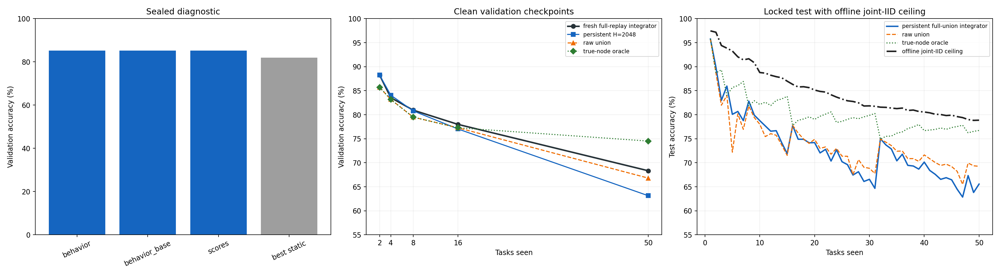
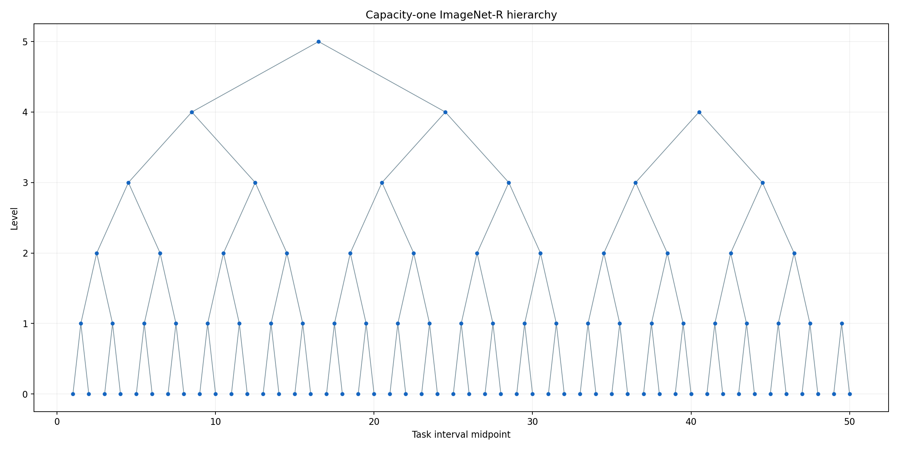

# ImageNet-R-50 Full-Union LogT Prediction Integrator

Run: `fd5cb0502d705bbd9662e197e9d867fda2b6c1b633c340f513be4b33579fd8b4`  
Workflow state: `COMPLETE`

This experiment replaces task-free node selection with a direct 200-way residual integrator over frozen node behavior. Its capacity-one binary counter retrains every parent on the complete represented training union; only persistent integrator history uses a bounded replay reservoir. No accuracy or comparator value gates execution.

## Primary benchmark comparison

| condition | Last (%) | Incremental (%) | role |
| --- | --- | --- | --- |
| LogT full-union integrator | 65.567 | 73.015 | evaluated method |
| Offline joint-IID LoRA | 78.867 | 84.795 | primary ceiling |
| Local E2-LoRA | 78.100 | 82.995 | secondary reference |
| Published E2-LoRA | 78.580 | 83.960 | external context |

| descriptive difference | Last (pp) | Incremental (pp) |
| --- | --- | --- |
| Integrator − offline joint-IID | -13.300 | -11.780 |
| Integrator − local E2-LoRA | -12.533 | -9.980 |

The offline joint-IID rank-16 LoRA run is the primary ceiling. The local E2-LoRA reproduction is secondary, and the published E2-LoRA values are external context. None is a pass/fail condition.

## Report-only feature diagnostic

| feature family | mean validation accuracy |
| --- | --- |
| behavior | 85.188 |
| behavior_base | 85.201 |
| scores | 85.194 |

Configured feature family: `scores`.

## Frozen development choices

`{"feature_variant": "scores", "historical_capacity": 2048, "parent_training": "full_union"}`

The feature family and H were frozen from the authenticated v2 task-16 development evidence before test access. All displayed fresh and static differences are diagnostic, not thresholds.

| stage | fresh mean | raw union | true-node oracle | H=2048 | H=2048 - fresh (pp) |
| --- | --- | --- | --- | --- | --- |
| 2 | 88.265 | 85.714 | 85.714 | 88.265 | -0.000 |
| 4 | 83.555 | 83.186 | 83.186 | 84.071 | +0.516 |
| 8 | 80.958 | 79.505 | 79.505 | 80.801 | -0.157 |
| 16 | 77.994 | 77.284 | 77.284 | 77.040 | -0.954 |
| 50 | 68.340 | 66.812 | 74.521 | 63.146 | -5.194 |

Validation identities are excluded from every clean node and integrator update. Full-union parent retraining is the primary condition, matching the successful Permuted-MNIST consolidation methodology.

## Final-frontier diagnostics

| task-free/oracle diagnostic | Last (%) |
| --- | --- |
| raw union | 69.267 |
| cosine union | 67.000 |
| affine-calibrated union | 69.567 |
| true-node oracle | 76.733 |

These rows explain the hierarchy frontier; they do not define acceptance.

## Complexity boundary

The hierarchy retains at most `popcount(t)` live adapters and performs at most `bit_length(t)` carries per arrival. A carry retrains on its complete represented union, so its worst-case data work grows with interval size and cumulative parent presentations are O(N T log T) for N examples per task. Persistent observer work remains bounded by `popcount(t) * (current + H)` per arrival.

| condition | node forwards | hierarchy presentations | integrator backward |
| --- | --- | --- | --- |
| hierarchy:full_union:fit | — | 532280 | — |
| hierarchy:full_union:all_train | — | 665325 | — |
| integrator:75d54abc0555939fd1087e49a740de3864c3578ff97db98f8c2ddb111e8eab98_scores_history2048_fit_seed1993 | — | — | 462492 |
| integrator:a0eb0c952b8061b8534fbfcb08f172b8a7702144a51eb58422e04afada20ce03_scores_history2048_all_train_seed1993 | — | — | 484988 |
| fresh:clean_fresh:31b06f39e7cf4a85b07cc6f0164a552ed448ec885f03ff875b1d3e6c37c26a8a | — | — | 15860 |
| fresh:clean_fresh:4441fcf79df90f8d2d128bfed94ec43ae9b303be035c2eb28213148ed659631e | — | — | 36540 |
| fresh:clean_fresh:4b656329a6abca3f9483fa58fb178ddaab6268e1b5d058870efdf9b84437577a | — | — | 131880 |
| fresh:clean_fresh:50dd6999d74c4acf90e858b29fb9b5c6b4954bb8a5b327d847a2d71775780abb | — | — | 384000 |
| fresh:clean_fresh:729d1e7e749e1ff73f3075f418b700340cbb465d994f04625aae77dae4cbfb89 | — | — | 36540 |
| fresh:clean_fresh:75261357ff558df63bcff167d0337a51239938c0c7a38d3c592056d831382657 | — | — | 15860 |
| fresh:clean_fresh:7a5de48ba3739e0547c750224be7cc8b8b65061dbfa9e328fe8f1967ae17c75e | — | — | 36540 |
| fresh:clean_fresh:9688456cf3e9d9674da1e7e5b2242dcf61aa87b09351edce067e968ebce7eac7 | — | — | 15860 |
| fresh:clean_fresh:9b535e6dda456d90fcbcddc2624dc1de3340ce468651ed577980541185ef1659 | — | — | 68480 |
| fresh:clean_fresh:b15e63d1bc69c0c8f1872fa0f3475bb362dd9a067198091b5fcec6acaa3af897 | — | — | 131880 |
| fresh:clean_fresh:b20210792e4b8a3e105db79fd79df2b852e33e66724e9bbd9f9260116fca6e63 | — | — | 384000 |
| fresh:clean_fresh:c1523572ea55661a8d3e88b2194d591ec2609c6c4ace3deef3c8c26eaffcdebe | — | — | 68480 |
| fresh:clean_fresh:deca4d0f27c1d067a3db0317d526f01bd6930f6af9d57c54ef8eb73ea186110d | — | — | 131880 |
| fresh:clean_fresh:ec682464cdacd640c95a493228912da4a5be063a29ea5cf301f451efeb863877 | — | — | 68480 |
| fresh:clean_fresh:f3b45c65d237abd6bbf96a3a5773c59b978a52421c52e700e4a7b2b684335522 | — | — | 384000 |
| fresh:sealed_diagnostic:1923c8b743d945cbaf6cf09ff56ba9812a326ead9a2dea6b30c6a5e9b73af7cd | — | — | 384000 |
| fresh:sealed_diagnostic:354337c25846e88b174be424c2dac24050dff576c689534fc635004365ec160c | — | — | 384000 |
| fresh:sealed_diagnostic:60930840a43c1051e7c5dcb9ee621a10d41f63a1a4a10e69a8bc79e1fea67767 | — | — | 384000 |
| fresh:sealed_diagnostic:66efa248c2ece28a08c9dee49feb717b6422da94cb5bea57545b4b0ab221be79 | — | — | 384000 |
| fresh:sealed_diagnostic:6c1b6aec78fbe0c13a9cba6175bc54b2501f54b48720650c262695a1d3aed491 | — | — | 384000 |
| fresh:sealed_diagnostic:7a8f3effadf0d5b819982604623fe9e8b232c763e5046e1b30b313e1673efdc9 | — | — | 384000 |
| fresh:sealed_diagnostic:7b9344884db9379786ec8967f14749492b2eacba8b56665cd74ada85d8f94657 | — | — | 384000 |
| fresh:sealed_diagnostic:b2939a5b1bdb559e0db7da37a77a1cfc6b77e3e3d8b6fb6e8e1c0e7c4adecb4c | — | — | 384000 |
| fresh:sealed_diagnostic:b62fa06539b83f8e70bd7a84c645766924273ddb9a043755e84399b54ac6c3e4 | — | — | 384000 |
| all_behavior_requests | 906760 | — | — |
| shared_behavior_cache | — | — | — |

Exact per-request cache/model work is retained in `resource_accounting.*`.

## Figures

The middle accuracy panel shows fresh full-replay and persistent integrator measurements only at the selected clean-validation checkpoints (tasks 2/4/8/16/50). The right panel shows the complete locked-test curves, including the offline joint-IID ceiling. Validation and test curves are deliberately kept in separate panels and must not be compared point-for-point across splits.

