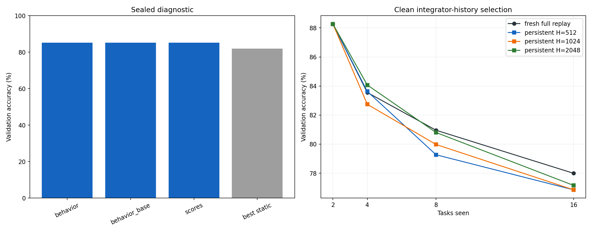

# ImageNet-R-50 LogT Prediction Integrator

Run: `7f8ac3ef574fe7ec3a2097c3a4b8a8ed13c5c1e4f34a856d69b6c32108a6a946`  
Workflow state: `COMPLETE_HISTORY_SELECTION_FAILURE`

This experiment replaces task-free node selection with a direct 200-way residual integrator over frozen node behavior. Its capacity-one binary counter retrains every parent on the complete represented training union; only persistent integrator history uses a bounded replay reservoir.

## Sealed capacity diagnostic

| feature family | mean validation accuracy |
| --- | --- |
| behavior | 85.188 |
| behavior_base | 85.201 |
| scores | 85.194 |

Gate open: **True**. Selected: `scores`.

## Frozen clean selection

`{"feature_variant": "scores", "historical_capacity": null, "parent_training": "full_union"}`

Gate open: False. Stop reason: no bounded historical reservoir met the fresh/control gates.

| stage | fresh mean | raw union | true-node oracle | H=512 | H=512 - fresh (pp) | H=1024 | H=1024 - fresh (pp) | H=2048 | H=2048 - fresh (pp) |
| --- | --- | --- | --- | --- | --- | --- | --- | --- | --- |
| 2 | 88.265 | 85.714 | 85.714 | 88.265 | -0.000 | 88.265 | -0.000 | 88.265 | -0.000 |
| 4 | 83.555 | 83.186 | 83.186 | 83.628 | +0.074 | 82.743 | -0.811 | 84.071 | +0.516 |
| 8 | 80.958 | 79.505 | 79.505 | 79.270 | -1.688 | 79.976 | -0.982 | 80.801 | -0.157 |
| 16 | 77.994 | 77.284 | 77.284 | 76.857 | -1.137 | 76.857 | -1.137 | 77.162 | -0.832 |

Validation identities are excluded from every clean node and integrator update. Full-union parent retraining is the primary condition, matching the successful Permuted-MNIST consolidation methodology.

## Locked local result

_No completed rows._

Published E2-LoRA values (78.58 Last / 83.96 Incremental) remain external context; the paired local E2-LoRA rerun is the direct comparator.

## Complexity boundary

The hierarchy retains at most `popcount(t)` live adapters and performs at most `bit_length(t)` carries per arrival. A carry retrains on its complete represented union, so its worst-case data work grows with interval size and cumulative parent presentations are O(N T log T) for N examples per task. Persistent observer work remains bounded by `popcount(t) * (current + H)` per arrival.

| condition | node forwards | hierarchy presentations | integrator backward |
| --- | --- | --- | --- |
| hierarchy:full_union:fit | — | 164850 | — |
| integrator:75d54abc0555939fd1087e49a740de3864c3578ff97db98f8c2ddb111e8eab98_scores_history1024_fit_seed1993 | — | — | 84320 |
| integrator:75d54abc0555939fd1087e49a740de3864c3578ff97db98f8c2ddb111e8eab98_scores_history2048_fit_seed1993 | — | — | 133540 |
| integrator:75d54abc0555939fd1087e49a740de3864c3578ff97db98f8c2ddb111e8eab98_scores_history512_fit_seed1993 | — | — | 56572 |
| fresh:clean_fresh:1cda51bc2a496a9dc8ca165027284d2d31937328f637f84d78f181d4eead328b | — | — | 131880 |
| fresh:clean_fresh:29b514af3ca6d8abad8c4e1e96172d84c649cc692f92f9d333bd0facc9c0c09a | — | — | 15860 |
| fresh:clean_fresh:2ecf4d6be13dd3dde74813b7974b563b14e71ed395153c303c3ad0b2d36fce58 | — | — | 68480 |
| fresh:clean_fresh:415717f22b999645906e18149b40573c9ae6545af2549b57b6bec92cef28a18b | — | — | 15860 |
| fresh:clean_fresh:4b76fe25a8bf958ae1338dc714c7bf3fbe4475ad26e91739b0d220b74fc33b17 | — | — | 36540 |
| fresh:clean_fresh:59cd126daa1c518f3e0b1c2cbab05521daa44e13a9d6ec55ed377a849110442e | — | — | 36540 |
| fresh:clean_fresh:6bf1bca7f3aaf5d47b39dbe33e8f4bb4fdf7833d488e63d4d0830ba4073fc791 | — | — | 68480 |
| fresh:clean_fresh:6f5ffd76743ae4f1035ced532ccd8cbf499f2b5ff94cb69de6680eee03fc5dec | — | — | 68480 |
| fresh:clean_fresh:827674cb3c4ae8115ebf9ec8bc54b8e68632bfbcf579089b3c6b10defe4eedd5 | — | — | 131880 |
| fresh:clean_fresh:cd17ee61e12842e1edca7ab0be531032a51cef79230232cf1129913af6e33d75 | — | — | 131880 |
| fresh:clean_fresh:e0bd5ce9154980375ee0adabe23e833e3a0226cc2083b271d019ae61a813d15a | — | — | 36540 |
| fresh:clean_fresh:e88416e68a175330b8594cda09500435a8c19dc3b83ab3d206b1351409508686 | — | — | 15860 |
| fresh:sealed_diagnostic:1923c8b743d945cbaf6cf09ff56ba9812a326ead9a2dea6b30c6a5e9b73af7cd | — | — | 384000 |
| fresh:sealed_diagnostic:354337c25846e88b174be424c2dac24050dff576c689534fc635004365ec160c | — | — | 384000 |
| fresh:sealed_diagnostic:60930840a43c1051e7c5dcb9ee621a10d41f63a1a4a10e69a8bc79e1fea67767 | — | — | 384000 |
| fresh:sealed_diagnostic:66efa248c2ece28a08c9dee49feb717b6422da94cb5bea57545b4b0ab221be79 | — | — | 384000 |
| fresh:sealed_diagnostic:6c1b6aec78fbe0c13a9cba6175bc54b2501f54b48720650c262695a1d3aed491 | — | — | 384000 |
| fresh:sealed_diagnostic:7a8f3effadf0d5b819982604623fe9e8b232c763e5046e1b30b313e1673efdc9 | — | — | 384000 |
| fresh:sealed_diagnostic:7b9344884db9379786ec8967f14749492b2eacba8b56665cd74ada85d8f94657 | — | — | 384000 |
| fresh:sealed_diagnostic:b2939a5b1bdb559e0db7da37a77a1cfc6b77e3e3d8b6fb6e8e1c0e7c4adecb4c | — | — | 384000 |
| fresh:sealed_diagnostic:b62fa06539b83f8e70bd7a84c645766924273ddb9a043755e84399b54ac6c3e4 | — | — | 384000 |
| all_behavior_requests | 240238 | — | — |
| shared_behavior_cache | — | — | — |

Exact per-request cache/model work is retained in `resource_accounting.*`.

## Figures

