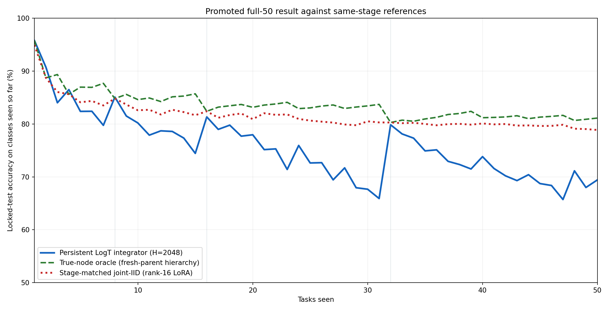
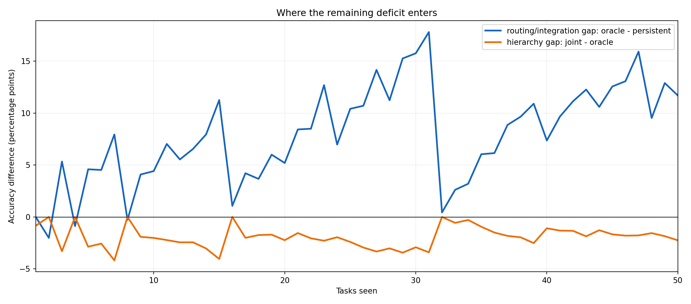

# Technical-writer handoff

# ImageNet-R-50 Persistent LogT Integrator With Fresh Parents

## Abstract

The clean factorial identified inherited classifier rows as the dominant one-node consolidation failure. This full 50-task confirmation replaces every parent head with a fresh prefix-local affine head, restores weight decay 5e-4, and uses the joint model initialization and augmentation/order schedule. Leaves, the binary-counter topology, full-union parent data, rank-16 LoRA architecture, H=2,048 persistent replay, and locked 24,000/6,000 ImageNet-R split remain fixed.

The updated persistent LogT integrator reached **69.433% final accuracy** and **75.709% incremental accuracy**. This improves the otherwise matched inherited-head run by **3.867 points final** and **2.694 points incremental**. It remains 9.433 points below stage-matched joint IID at task 50 and 5.922 points below it on the 50-stage mean.

The fresh-parent true-node oracle reached 81.117% final and 83.556% incremental accuracy. The corresponding stage-matched joint-IID values were 78.867% and 81.630%.

The central result is diagnostic rather than an endpoint win: fresh consolidation closes the same-data parent gap completely at every power-of-two frontier, while the persistent task-free integrator still fails when several independently adapted nodes are live. The next experiment should target adapter-dependent routing or response integration, not further parent initialization changes.

## Primary comparison

| Tasks | Live nodes | Persistent LogT | True-node oracle | Stage-matched joint-IID |
| --- | --- | --- | --- | --- |
| 8 | 1 | 85.084 | 84.803 | 84.803 |
| 15 | 4 | 74.443 | 85.692 | 81.649 |
| 16 | 1 | 81.329 | 82.396 | 82.396 |
| 31 | 5 | 65.907 | 83.700 | 80.294 |
| 32 | 1 | 79.842 | 80.276 | 80.276 |
| 50 | 3 | 69.433 | 81.117 | 78.867 |

All three lines use the same locked test identities at each stage and are evaluated over exactly the classes seen at that stage. The joint curve uses a fresh rank-16 LoRA trained only on that prefix. The true-node oracle is diagnostic label-aware routing over the live fresh-parent hierarchy. The persistent LogT line is task-free. Checkpoints 8, 16, and 32 are one-node binary-counter frontiers; 15 and 31 are the immediately preceding, maximally fragmented frontiers; 50 is the final three-node endpoint.

## Same-data parent question: resolved

| Tasks | Persistent - joint | Oracle - joint |
| --- | --- | --- |
| 2 | +2.016 | +0.000 |
| 4 | +0.877 | +0.000 |
| 8 | +0.281 | +0.000 |
| 16 | -1.067 | +0.000 |
| 32 | -0.434 | +0.000 |

At tasks 2, 4, 8, 16, and 32, the hierarchy has one live node and its true-node oracle equals stage-matched joint IID to the stored precision. Every classifier and adapter tensor is bit-identical at all five checkpoints; some safetensors file hashes differ only because their metadata differ. This is expected after the repair: both models now start from the same fresh prefix-local head and LoRA initialization and consume the same examples with the same optimizer and deterministic order. There is no remaining parent-construction gap at these frontiers.

The persistent integrator is also close at the one-node checkpoints: relative to joint IID it is +2.016, +0.877, +0.281, -1.067, and -0.434 points at tasks 2/4/8/16/32. It is therefore not being held back by the consolidated adapter at those points.

## Frontier fragmentation is now the dominant failure

At task 31, five live nodes expose independently adapted score spaces. Persistent LogT falls to 65.907%, versus 83.700% for label-aware node selection and 80.294% for joint IID. The task-32 carry replaces that frontier with one parent that is identical to the joint model; persistent accuracy immediately recovers to 79.842%. The repeated sawtooth in the primary plot ties most of the remaining deficit to task-free combination across live adapters, not to missing future-task information or weak parent training.

## Gap decomposition

The blue curve isolates task-free prediction integration from the available live-node oracle. The orange curve is joint minus oracle. Negative orange values mean the label-aware oracle beats the global joint classifier because it restricts each image to its known owning node; that is diagnostic and not deployable. The gaps should not be added to the retrospective curve of one task-50 model evaluated on earlier prefixes.

## Reference interpretation

The stage-matched joint curve is the clean comparison for absence of future training: each point is a separate rank-16 QKV-plus-fc1 LoRA trained from scratch on exactly the task prefix available at that stage. Its final / incremental accuracy is 78.867% / 81.630%. The single offline task-50 joint model has the same 78.867% endpoint but 84.795% retrospective incremental accuracy because its earlier-prefix evaluations have seen future tasks. Local E2-LoRA reaches 78.100% / 82.995%. These are context, not gates.

The prior inherited-head persistent run reached 65.567% / 73.015%. Fresh parents improve nearly every stage, but the new 69.433% endpoint is still not competitive with joint IID or E2-LoRA. The experiment closes the parent gap, not the full task-free benchmark gap.

## Promoted recipe

- Head initialization: `fresh`.
- Parent weight decay: `0.0005`.
- Seed schedule: `joint`.
- Development selection source: the immutable task-8/16/32 2 x 2 x 2 parent-recipe factorial.

## Protocol integrity

The recipe was selected before this full run. All hierarchy and persistent-integrator training completed before the 6,000 locked-test identities were opened. The training seal records zero test behavior requests before completion. The report is descriptive; joint IID and E2-LoRA are comparisons, not execution gates.

The workflow began before its source commit was finalized, so immutable nodes contain either `ce066ba` or `d8924e8` in their informational `git_commit` field. That field is deliberately excluded from node identity. The authoritative protocol code manifest binds the exact material bytes used by the run, and all of those bytes match commit `d8924e8`; the report-only presentation changes came later.

This is one deterministic seed. The locked split has also been evaluated by earlier project experiments, although those test outcomes did not select this fresh-parent recipe. A publishable claim therefore needs replication and, ideally, an additional untouched evaluation protocol.

## Hierarchy and resource accounting

| Component | Image presentations | Optimizer steps | Peak VRAM |
| --- | --- | --- | --- |
| hierarchy nodes | 733,805 | 11,750 | 3.859 GiB |
| persistent integrator | 484,988 | 1,024 | 0.083 GiB |

The initial full workflow completed in about 47 minutes on the local RTX 4090. An immediate exact resume completed in 3.798 seconds, performed zero new optimizer work, and left all 170 node manifests, all 170 node records, and all 50 persistent checkpoints unchanged by count, nanosecond-mtime sum, and stat fingerprint.

Use the machine-readable stage and task tables for any independent analysis.
