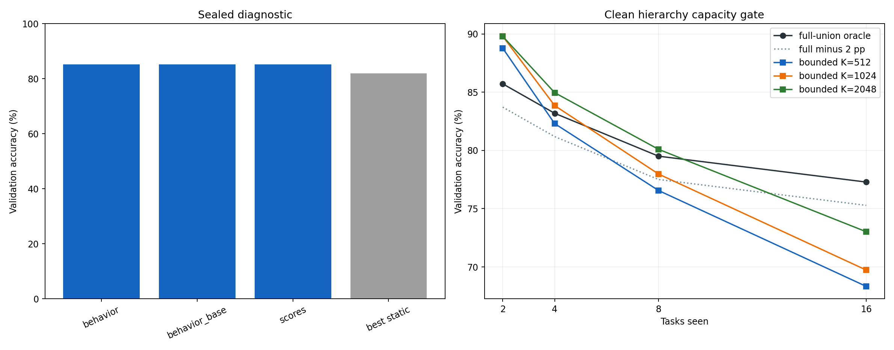

# ImageNet-R-50 LogT Prediction Integrator

Run: `fe939dc4ae27e7ee825970a3c57da14f19b39a8d9884cb68f80ba961883bd737`  
Workflow state: `COMPLETE_CLEAN_SELECTION_FAILURE`

This experiment replaces task-free node selection with a direct 200-way residual integrator over frozen node behavior. The scalable condition uses a capacity-one binary counter, bounded consolidation replay, and bounded persistent integrator replay.

## Sealed capacity diagnostic

| feature family | mean validation accuracy |
| --- | --- |
| behavior | 85.188 |
| behavior_base | 85.201 |
| scores | 85.194 |

Gate open: **True**. Selected: `scores`.

## Frozen clean selection

`{"consolidation_capacity": null, "feature_variant": "scores", "historical_capacity": null}`

Gate open: False. Required every bounded-minus-full difference to be at least -2 percentage points. Stop reason: no bounded consolidation reservoir stayed within the hierarchy-oracle tolerance.

| stage | full-union oracle | K=512 | K=512 - full (pp) | K=1024 | K=1024 - full (pp) | K=2048 | K=2048 - full (pp) |
| --- | --- | --- | --- | --- | --- | --- | --- |
| 2 | 85.714 | 88.776 | +3.061 | 89.796 | +4.082 | 89.796 | +4.082 |
| 4 | 83.186 | 82.301 | -0.885 | 83.850 | +0.664 | 84.956 | +1.770 |
| 8 | 79.505 | 76.561 | -2.945 | 77.974 | -1.531 | 80.094 | +0.589 |
| 16 | 77.284 | 68.331 | -8.952 | 69.732 | -7.552 | 73.021 | -4.263 |

Validation identities are excluded from every clean node and integrator update. Full-union training is an empirical ceiling and is excluded from the scalable claim.

## Locked local result

_No completed rows._

Published E2-LoRA values (78.58 Last / 83.96 Incremental) remain external context; the paired local E2-LoRA rerun is the direct comparator.

## Complexity boundary

Per arrival, the capacity-one hierarchy performs at most `bit_length(t)` carries and the persistent observer evaluates at most `popcount(t) * (current + H)` node/example pairs. Cumulative model work is therefore O(T log T). Classifier-row union arithmetic is reported separately because the 200-way output space is fixed in this benchmark.

| condition | node forwards | hierarchy presentations | integrator backward |
| --- | --- | --- | --- |
| hierarchy:bounded:fit:512 | — | 71370 | — |
| hierarchy:bounded:fit:2048 | — | 129630 | — |
| hierarchy:full_union:fit:2048 | — | 164850 | — |
| hierarchy:bounded:fit:1024 | — | 101730 | — |
| integrator:14217b6c89286ec7cdfc2056b6e092ab01988165f4ad3f0a914fac6c8601e17f_scores_history512_fit_seed1993 | — | — | 27508 |
| fresh:sealed_diagnostic:1923c8b743d945cbaf6cf09ff56ba9812a326ead9a2dea6b30c6a5e9b73af7cd | — | — | 384000 |
| fresh:sealed_diagnostic:354337c25846e88b174be424c2dac24050dff576c689534fc635004365ec160c | — | — | 384000 |
| fresh:sealed_diagnostic:60930840a43c1051e7c5dcb9ee621a10d41f63a1a4a10e69a8bc79e1fea67767 | — | — | 384000 |
| fresh:sealed_diagnostic:66efa248c2ece28a08c9dee49feb717b6422da94cb5bea57545b4b0ab221be79 | — | — | 384000 |
| fresh:sealed_diagnostic:6c1b6aec78fbe0c13a9cba6175bc54b2501f54b48720650c262695a1d3aed491 | — | — | 384000 |
| fresh:sealed_diagnostic:7a8f3effadf0d5b819982604623fe9e8b232c763e5046e1b30b313e1673efdc9 | — | — | 384000 |
| fresh:sealed_diagnostic:7b9344884db9379786ec8967f14749492b2eacba8b56665cd74ada85d8f94657 | — | — | 384000 |
| fresh:sealed_diagnostic:b2939a5b1bdb559e0db7da37a77a1cfc6b77e3e3d8b6fb6e8e1c0e7c4adecb4c | — | — | 384000 |
| fresh:sealed_diagnostic:b62fa06539b83f8e70bd7a84c645766924273ddb9a043755e84399b54ac6c3e4 | — | — | 384000 |
| all_behavior_requests | 261182 | — | — |
| shared_behavior_cache | — | — | — |

Exact per-request cache/model work is retained in `resource_accounting.*`.

## Figures

