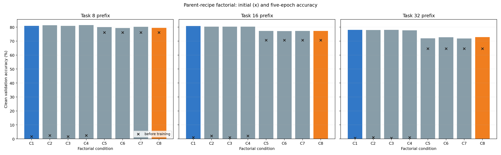
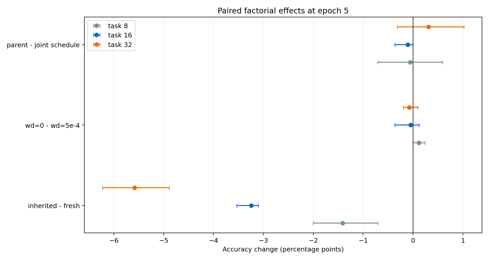

# ImageNet-R Parent-Recipe Factorial

## Abstract

At the task-8, task-16, and task-32 one-node frontiers, routing is absent, yet the consolidated parent lagged a fresh stage-matched joint LoRA trained on the same classes and examples. This development-only experiment isolates the three implementation differences: fresh versus inherited classifier rows, joint versus zero weight decay, and joint versus parent initialization/data-order seeds. It evaluates the complete 2 x 2 x 2 matrix after the same five epochs. No locked-test identity or label is used.

The strongest development condition was **Fresh head | wd=5e-4 | joint seed/order**. Relative to the original parent cell, its closure of the fresh-joint gap was task 16: 100.0%; task 32: 100.0%. The preregistered full-50 trigger passed.

## Protocol

- Training data: the frozen router-fit subset, restricted to tasks available at each prefix.
- Evaluation data: the disjoint frozen router-validation subset.
- Architecture: the same pinned ViT-B/16, 24 rank-16 LoRA projections, and prefix-wide affine classifier in every cell.
- Work: five epochs, batch size 64, SGD momentum 0.9, LoRA learning rate 5e-4, and head learning rate 1e-2.
- Replication: one deterministic screening seed (1993) to meet the 30-minute decision window.
- Reference cells: C1 is the stage-matched joint recipe; C8 is the exact original full-union parent recipe and reuses its authenticated source model.
- Trigger: the selected condition must close at least 50% of the C1 versus C8 gap at both tasks 16 and 32.

## Condition key

| Code | Exact condition |
| --- | --- |
| C1 | Fresh head | wd=5e-4 | joint seed/order |
| C2 | Fresh head | wd=5e-4 | parent seed/order |
| C3 | Fresh head | wd=0 | joint seed/order |
| C4 | Fresh head | wd=0 | parent seed/order |
| C5 | Inherited union head | wd=5e-4 | joint seed/order |
| C6 | Inherited union head | wd=5e-4 | parent seed/order |
| C7 | Inherited union head | wd=0 | joint seed/order |
| C8 | Inherited union head | wd=0 | parent seed/order |

The same codes and labels are used in every table and figure. There are no renamed or approximately matched conditions.

## Results

| Condition | Task 8 | Task 16 | Task 32 |
| --- | --- | --- | --- |
| C1 | 80.919 | 80.755 | 78.090 |
| C2 | 81.390 | 80.390 | 77.898 |
| C3 | 80.919 | 80.390 | 78.058 |
| C4 | 81.508 | 80.390 | 77.739 |
| C5 | 79.976 | 77.223 | 72.022 |
| C6 | 79.388 | 77.162 | 72.756 |
| C7 | 80.212 | 77.284 | 71.830 |
| C8 | 79.505 | 77.284 | 72.852 |

| Stage | Paired contrast | Mean pp | Range pp |
| --- | --- | --- | --- |
| 8 | inherited - fresh | -1.413 | [-2.002, -0.707] |
| 8 | wd=0 - wd=5e-4 | +0.118 | [+0.000, +0.236] |
| 8 | parent - joint schedule | -0.059 | [-0.707, +0.589] |
| 16 | inherited - fresh | -3.243 | [-3.532, -3.106] |
| 16 | wd=0 - wd=5e-4 | -0.046 | [-0.365, +0.122] |
| 16 | parent - joint schedule | -0.107 | [-0.365, +0.000] |
| 32 | inherited - fresh | -5.581 | [-6.228, -4.887] |
| 32 | wd=0 - wd=5e-4 | -0.072 | [-0.192, +0.096] |
| 32 | parent - joint schedule | +0.311 | [-0.319, +1.022] |

The paired effects average four controlled contrasts per stage while holding the other two factors fixed. With one replication seed, they are descriptive effect decompositions, not confidence intervals.

## Full-50 decision

The selected condition is `fresh__wd5e4__joint`. The preregistered full-50 trigger passed. The trigger record is machine-readable in `summary.json`; it is a compute-allocation decision, not a claim of statistical significance or a benchmark pass/fail threshold.

## Interpretation and limitations

This experiment directly tests optimization recipe and head-state mismatch. It does not test missing future tasks, routing, persistent-integrator replay, or longer optimization. Initial markers in the first figure show the feature/head compatibility before consolidation training; the bars show what five epochs recover. Because the screening matrix uses one seed and inherits one canonical child hierarchy, any promoted recipe needs confirmation in the full continual run. The locked 6,000-image test set remains untouched.

## Reproducibility

`protocol/protocol.json` binds the source hierarchy roots and children, fit/validation identity hashes, model and dataset manifests, environment, resolved configuration, and all material code. Per-job hash-chained ledgers record the initial and final validation measurements. CSV, JSON, and Parquet projections accompany this report.
