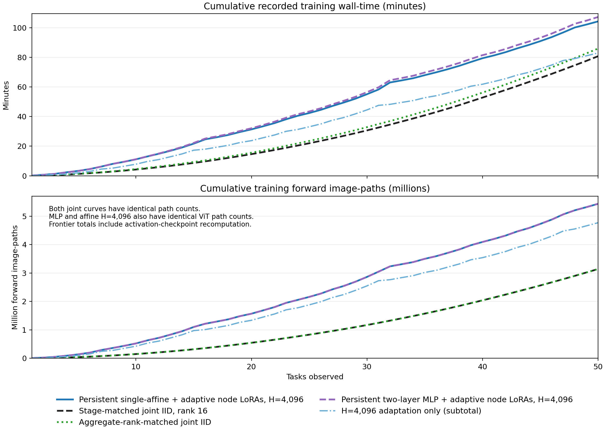

# ImageNet-R-50 persistent frontier integrators

## Result

At task 50, MLP H=4,096 reaches 76.100% accuracy, versus 75.867% for affine H=4,096 and 76.217% for affine H=8,192. Rank-16 and aggregate-rank joint IID reach 78.867% and 79.767%. Mean accuracy over all 50 stages is 82.416% for MLP, 82.434% and 82.452% for the affine arms, and 81.630% and 82.759% for the joint curves.

Blue and orange are the single-affine H=4,096 and H=8,192 conditions. Purple is the two-layer ReLU MLP at H=4,096. All use each live node's own adapted 768-value pre-classifier latent, without macro tokens or metadata. Dotted matching colors are label-aware true-node diagnostics, not deployable conditions. Black is stage-matched rank-16 joint IID; green matches total live LoRA rank. Vertical guides mark power-of-two consolidations.

## Selected stages

| Stage | Nodes | Affine 4k | Affine 8k | MLP 4k | MLP oracle | Joint r16 | Rank-matched | Rank |
|---|---|---|---|---|---|---|---|---|
| 1 | 1 | 97.46% | 95.76% | 98.31% | 98.31% | 94.92% | 94.92% | 16 |
| 2 | 1 | 93.55% | 93.55% | 93.95% | 93.95% | 88.71% | 88.71% | 16 |
| 4 | 1 | 91.58% | 92.11% | 91.40% | 91.23% | 85.61% | 85.61% | 16 |
| 8 | 1 | 89.59% | 88.37% | 89.31% | 89.02% | 84.80% | 84.80% | 16 |
| 16 | 1 | 83.41% | 85.11% | 83.90% | 83.61% | 82.40% | 82.40% | 16 |
| 31 | 5 | 77.52% | 78.04% | 77.91% | 85.82% | 80.29% | 82.10% | 80 |
| 32 | 1 | 78.69% | 81.19% | 79.23% | 79.15% | 80.28% | 80.28% | 16 |
| 50 | 3 | 75.87% | 76.22% | 76.10% | 81.65% | 78.87% | 79.77% | 48 |

Here 4k means H=4,096 and 8k means H=8,192; oracle columns are diagnostic only.

Positive values mean the named persistent integrator is ahead. The top panel
holds joint rank fixed at 16; the bottom panel adjusts joint rank to the number
of live nodes. Neither reference is an execution gate.

NLL is shown for the persistent integrators and newly trained aggregate-rank models.
The imported one-node rank-16 artifacts retained predictions but not logits,
so those six green NLL points are intentionally absent; accuracy is complete.

## Fragmentation diagnosis

| Nodes | Stages | Affine 4k acc. | Affine 4k gap | Affine 8k acc. | Affine 8k gap | MLP 4k acc. | MLP 4k gap |
|---|---|---|---|---|---|---|---|
| 1 | 6 | 89.05% | 0.16 | 89.35% | 0.09 | 89.35% | -0.14 |
| 2 | 15 | 83.76% | 2.66 | 84.31% | 2.46 | 83.73% | 2.67 |
| 3 | 18 | 81.39% | 4.22 | 81.05% | 4.13 | 81.15% | 4.13 |
| 4 | 9 | 79.10% | 6.27 | 78.82% | 5.55 | 79.18% | 5.98 |
| 5 | 2 | 77.13% | 7.37 | 76.75% | 6.48 | 77.70% | 6.92 |

The true-node oracle is label-aware and not deployable. Its widening advantage
is consistent with cross-node competition, but the diagnostic also substitutes
the frozen node-local classifier, so it does not isolate routing alone.

## Frontier-node LoRA lifetimes

Every marker is followed by adaptation at that stage. Blue circles continue the
exact final LoRA factors and named AdamW state from the preceding stage. Orange
diamonds load an authenticated source leaf or full-union parent. Consolidation
parents do not inherit the online-adapted LoRAs of their retired children.

## Protocol

- H=4,096 uses four epochs per arrival; H=8,192 uses five.
- Replay is class-stratified and deterministically redrawn at every stage.
- Dense-head parameters and AdamW state persist. A node LoRA and its moments persist
  only while the exact hierarchy-node hash remains live.
- A leaf or consolidation parent enters from its authenticated source model.
- Local classifiers and the ViT base stay frozen. Evaluation is task-free.
- The test split is used only after each stage is sealed and never selects a
  checkpoint, replay population, or condition.

### Measured effect of the second layer

At task 50 the MLP reaches 76.100% accuracy and 1.1945 NLL, a change of +0.233 accuracy points and -0.0206 NLL relative to affine H=4,096. Its mean accuracy change over the 44 fragmented stages is -0.061 points. Its final true-node diagnostic is 81.650%.

### Architecture and size

Every input vector is the final 768-value latent from a live node's own base ViT plus adaptive rank-16 LoRA. The head is Linear(768 x live nodes, 1024), ReLU, then Linear(1024, 200). At five nodes it has 4,138,184 head parameters, versus 768,200 for affine. Both have 6,635,520 trainable LoRA parameters. There is no skip connection, normalization, dropout, metadata, score input, or macro token.

### Initialization and continuing state

The first 400 hidden units split the 200 source-union logits into positive and negative parts; their signed output reproduces the source union. Another 624 units begin as random latent projections with zero output weights. Both dense matrices train freely. Surviving input blocks, hidden biases, old-class output rows, and AdamW moments persist. New node blocks and adapters initialize from the sealed source. The shared MLP output layer is not reset at consolidation.

### What this comparison tests

The MLP uses exactly the affine H=4,096 replay identities, augmentation/order seeds, four epochs, batch 64, learning rates, and LoRA carry/reset boundaries. Both joint curves and both affine arms are reused unchanged. This tests the larger nonlinear head under the existing optimization budget, not whether a separately tuned MLP has converged. It is one seed, with no test-selected checkpoint. Rank-matched joint IID does not match the MLP's extra parameters or multiple ViT paths.

| Stage | Nodes | Affine acc. | MLP acc. | Affine NLL | MLP NLL | Affine oracle | MLP oracle |
|---|---|---|---|---|---|---|---|
| 1 | 1 | 97.458% | 98.305% | 0.077 | 0.073 | 97.458% | 98.305% |
| 2 | 1 | 93.548% | 93.952% | 0.243 | 0.257 | 93.548% | 93.952% |
| 4 | 1 | 91.579% | 91.404% | 0.311 | 0.297 | 91.930% | 91.228% |
| 8 | 1 | 89.587% | 89.306% | 0.472 | 0.482 | 89.681% | 89.024% |
| 16 | 1 | 83.414% | 83.899% | 0.701 | 0.695 | 83.802% | 83.608% |
| 31 | 5 | 77.516% | 77.909% | 1.091 | 1.091 | 85.639% | 85.823% |
| 32 | 1 | 78.694% | 79.229% | 0.981 | 0.965 | 78.847% | 79.153% |
| 50 | 3 | 75.867% | 76.100% | 1.215 | 1.194 | 81.833% | 81.650% |

MLP result `e86a99f4ead8eb40be436a88b6dd927ef6732a64c02c78077dce32ffea2aaf8f` under protocol `bb991cf93bd05d74a92d796735768c67e1f2e9b78e5b40e1c2ee314b29594fd6`.

## Resource and provenance

| Condition / component | Train min | Forward M | Recompute M | Backward M |
|---|---|---|---|---|
| Affine H=4,096 total | 104.23 | 3.051 | 2.385 | 3.051 |
|   H4 hierarchy subtotal | 21.33 | 0.665 | 0.000 | 0.665 |
|   H4 adaptation subtotal | 82.90 | 2.385 | 2.385 | 2.385 |
| Joint IID, rank 16 | 80.72 | 3.140 | 0.000 | 3.140 |
| Joint IID, rank matched | 85.88 | 3.140 | 0.000 | 3.140 |
| MLP H=4,096 total | 107.19 | 3.051 | 2.385 | 3.051 |

M means million image-paths. Recompute is activation checkpointing, additional to
ordinary forwards. H4 subtotals add to the affine H=4,096 total; do not sum the total again.

### Training cost at 50 tasks

Affine H=4,096 costs 1.29 times the rank-16 joint curve's recorded training time and 1.73 times its forward image-path count including checkpoint recomputation. The hierarchy subtotal includes all 50 leaves and 47 parents, including intermediate parents created and retired in the same arrival. The smaller asymptotic bound has not produced a wall-time saving at this horizon. The MLP H=4,096 total is 107.19 recorded training minutes, with exactly the same ViT path counts as affine H=4,096.

### What is measured

One image-path is one image processed by one ViT with one installed adapter. Forward and backward counts are reconstructed from completed image-presentation counters and actual live-node counts. Recomputation is one additional forward invocation per image/node under activation checkpointing; it can stop early. These are path counts, not profiled FLOPs or equal-cost forward/backward operations. The dense head (affine or MLP), optimizer, and differing LoRA ranks also affect wall time.

### Wall-time and reuse

Curves sum recorded training-job wall times, including data loading and checkpoint writes inside those timers. They exclude setup, artifact validation, inter-job overhead, and evaluation. Source training is charged when its subtree becomes available. The imported final rank-16 joint model is charged its original training cost; each reused reference is counted once within each condition. These are alternative algorithm totals, not a sum of actual work across the experiment invocations.

### Why ViT training is O(T log T)

Let P_t = 4(m_t + min(4096, M_(t-1))), where m_t is the new task size and M_t is the seen training prefix. With k_t = popcount(t), adaptive forwards are A_T = sum(k_t P_t). Each hierarchy example belongs to at most one five-epoch job per level, giving S_T = 5 sum_v(n_v). Total forward work including checkpoint recomputation is S_T + 2A_T; backward work is S_T + A_T. For fixed replay capacity, epochs, model size, and bounded task size, both are O(T log T). The joint curves each use 5 sum_t(M_t) forward/backward pairs, which is O(T squared) in model paths.

### The entire benchmarking workflow has a larger bound

Repeated full-prefix tests add 471,565 forward image-paths and 6.06 measured minutes for affine H=4,096. Each joint curve adds 157,149 test paths. Rank-16 test time is 2.55 minutes; rank-matched test wall-time was not retained. Testing every growing prefix is O(T squared log T) for the frontier. The replay sampler also scans all earlier identities at each arrival, giving at least quadratic CPU bookkeeping. The O(T log T) claim therefore applies to ViT training, not the whole runner. Both head architectures have 200 outputs here; unbounded class growth would require separate head-cost accounting. MLP H=4,096 adds 6.22 minutes for the same test-path count.

### Joint curves versus one final offline fit

Both joint curves refit at every prefix, so their base-model path counts coincide. The larger rank changes arithmetic per path, not the number of paths. A single final rank-16 offline fit cost 3.11 minutes and 120,000 forward/backward pairs; it provides only the final model and has linear training work in the total image count.

The original affine/joint comparison is result `4fa601c9b8e3cc87f07897f06ba51f88b75b7ecde1bf47ef01881526df4b4b58` under protocol
`5f60e2f5c25e3318ba9c9b66d41ce8c159ba57a0f1a4fc524567c098b222d686`. Source hierarchy unchanged:
`True`. Work in that original completing invocation:
`{"affine_optimizer_steps": 41990, "affine_stages": 100, "rank_optimizer_steps": 46700, "rank_stages": 44}`.
