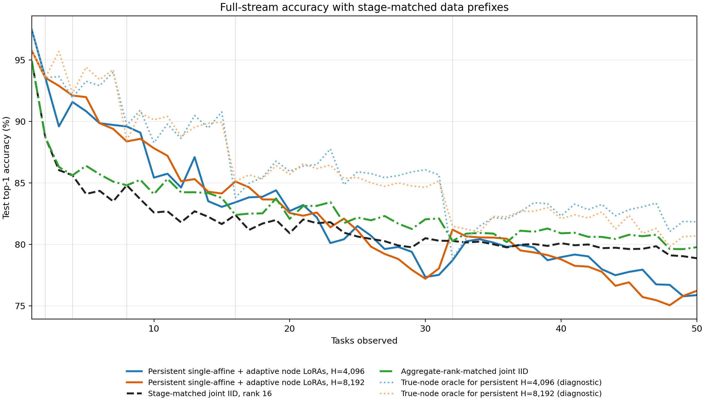
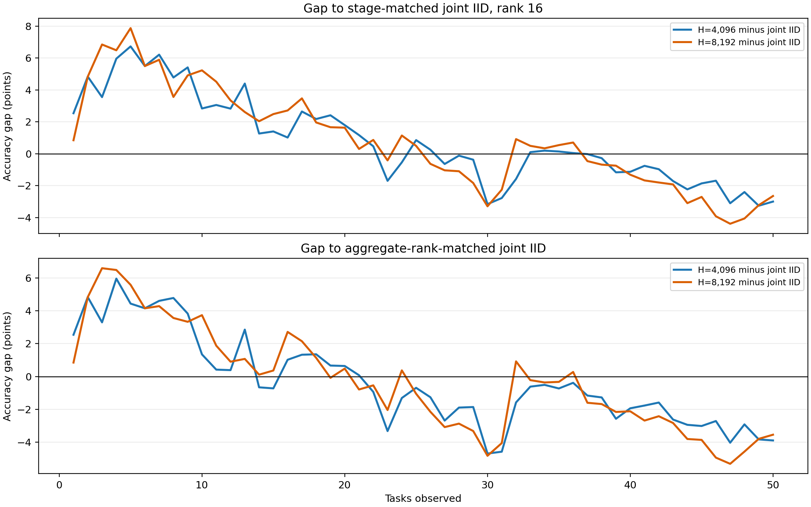
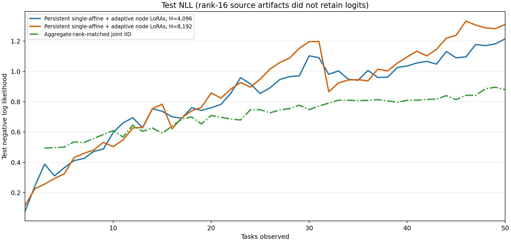
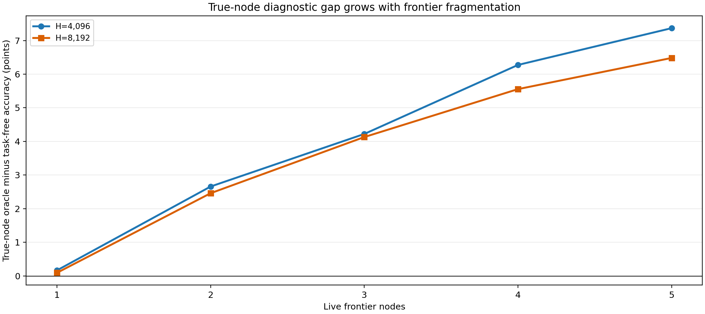
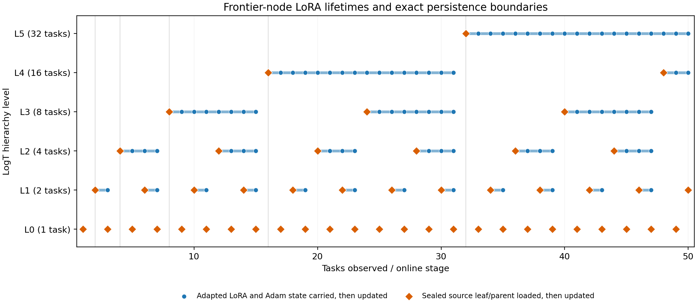

# ImageNet-R-50 persistent single-affine frontier

## Result

At task 50, H=4,096 reaches 75.867% and H=8,192 reaches 76.217%. The corresponding rank-16 and aggregate-rank joint-IID references are 78.867% and 79.767%. Across all 50 stages, incremental accuracy is 82.434% for H=4,096 and 82.452% for H=8,192, versus 81.630% and 82.759% for the two joint-IID curves.

The solid blue/orange curves are the only adaptive frontier conditions. Both use
one affine layer over the live nodes' 768-value pre-classifier vectors; neither
uses macro tokens or metadata. The dashed black curve is a fresh rank-16 joint
fit at every data prefix. The green curve is also fresh joint IID, with rank
`16 x popcount(stage)` so its LoRA rank equals the sum across live frontier
nodes. Dotted blue/orange curves are label-aware true-node diagnostics for the
corresponding adapted frontiers. Vertical guides mark power-of-two consolidation
stages.

## Selected stages

| Stage | Nodes | H=4,096 | H=8,192 | H4 oracle | H8 oracle | Joint r16 | Rank-matched | Matched rank |
|---:|---:|---:|---:|---:|---:|---:|---:|---:|
| 1 | 1 | 97.458% | 95.763% | 97.458% | 95.763% | 94.915% | 94.915% | 16 |
| 2 | 1 | 93.548% | 93.548% | 93.548% | 93.548% | 88.710% | 88.710% | 16 |
| 4 | 1 | 91.579% | 92.105% | 91.930% | 92.281% | 85.614% | 85.614% | 16 |
| 8 | 1 | 89.587% | 88.368% | 89.681% | 88.462% | 84.803% | 84.803% | 16 |
| 16 | 1 | 83.414% | 85.112% | 83.802% | 85.112% | 82.396% | 82.396% | 16 |
| 31 | 5 | 77.516% | 78.040% | 85.639% | 85.168% | 80.294% | 82.102% | 80 |
| 32 | 1 | 78.694% | 81.194% | 78.847% | 81.475% | 80.276% | 80.276% | 16 |
| 50 | 3 | 75.867% | 76.217% | 81.833% | 80.683% | 78.867% | 79.767% | 48 |

Positive values mean the persistent affine frontier is ahead. The top panel
holds joint rank fixed at 16; the bottom panel adjusts joint rank to the number
of live nodes. Neither reference is an execution gate.

NLL is shown for both persistent arms and newly trained aggregate-rank models.
The imported one-node rank-16 artifacts retained predictions but not logits,
so those six green NLL points are intentionally absent; accuracy is complete.

## Fragmentation diagnosis

| Live nodes | Stages | H4 accuracy | H4 oracle gap | H8 accuracy | H8 oracle gap |
|---:|---:|---:|---:|---:|---:|
| 1 | 6 | 89.047% | 0.164 | 89.348% | 0.092 |
| 2 | 15 | 83.756% | 2.658 | 84.312% | 2.459 |
| 3 | 18 | 81.386% | 4.221 | 81.053% | 4.129 |
| 4 | 9 | 79.097% | 6.274 | 78.819% | 5.555 |
| 5 | 2 | 77.129% | 7.368 | 76.747% | 6.482 |

The true-node oracle is label-aware and not deployable. Its widening advantage
is consistent with cross-node competition, but the diagnostic also substitutes
the frozen node-local classifier, so it does not isolate routing alone.

## Frontier-node LoRA lifetimes

Every marker is followed by adaptation at that stage. Blue circles continue the
exact final LoRA factors and named AdamW state from the preceding stage. Orange
diamonds load an authenticated source leaf or full-union parent. Consolidation
parents do not inherit the online-adapted LoRAs of their retired children.

## Protocol

- H=4,096 uses four epochs per arrival; H=8,192 uses five.
- Replay is class-stratified and deterministically redrawn at every stage.
- The affine head and AdamW state persist. A node LoRA and its moments persist
  only while the exact hierarchy-node hash remains live.
- A leaf or consolidation parent enters from its authenticated source model.
- Local classifiers and the ViT base stay frozen. Evaluation is task-free.
- The test split is used only after each stage is sealed and never selects a
  checkpoint, replay population, or condition.

## Resource and provenance

This report authenticates result `4fa601c9b8e3cc87f07897f06ba51f88b75b7ecde1bf47ef01881526df4b4b58` under protocol
`5f60e2f5c25e3318ba9c9b66d41ce8c159ba57a0f1a4fc524567c098b222d686`. Source hierarchy unchanged:
`True`. New work in the completing invocation:
`{"affine_optimizer_steps": 41990, "affine_stages": 100, "rank_optimizer_steps": 46700, "rank_stages": 44}`.
