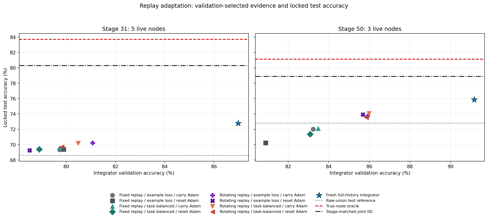
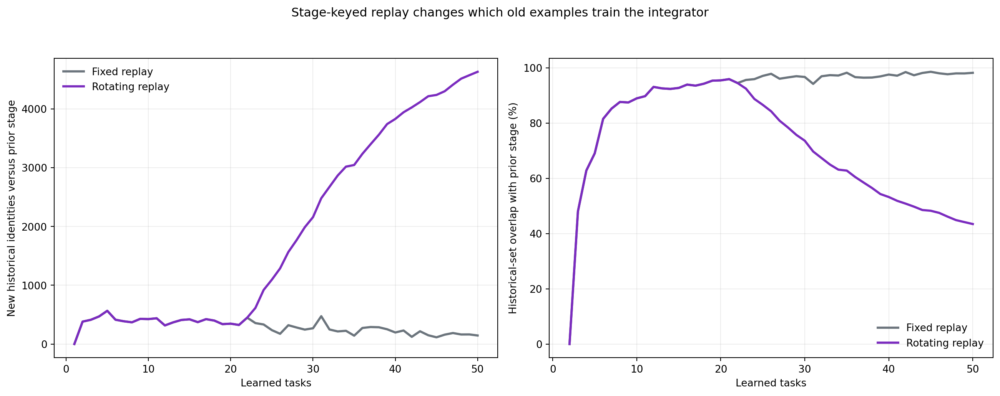
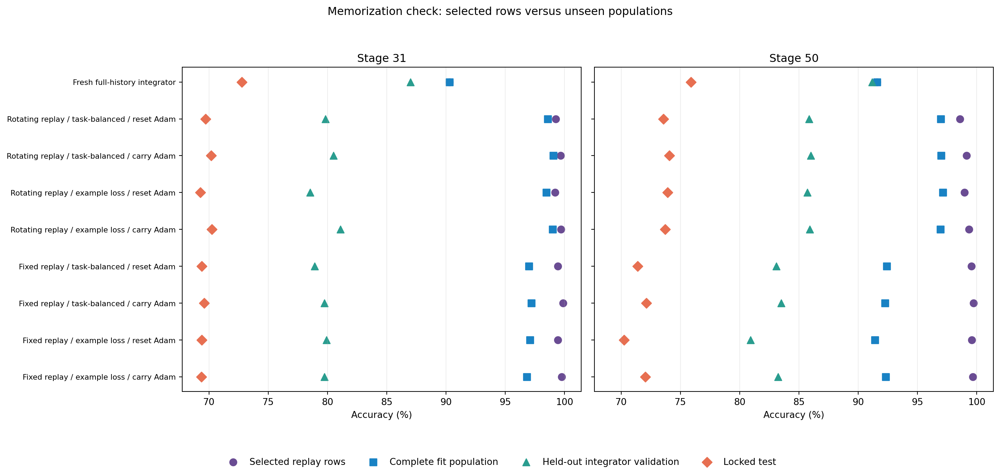
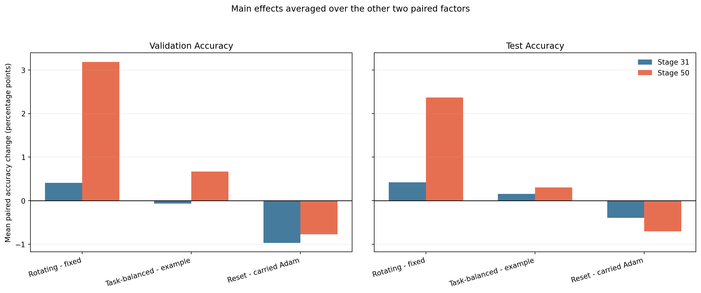

# Technical-analysis handoff

# ImageNet-R-50 replay-adaptation diagnosis

## Finding

The Permuted-MNIST integrator drew a fresh deterministic historical subset at every arrival; the earlier ImageNet-R integrator did not. This run restores that stage-keyed sampling and separates it from task weighting and AdamW-state carry. The validation-selected online condition is **Rotating replay / example loss / carry Adam**.

| Stage | Fixed baseline | Best online | Fresh full history | Raw union | True-node oracle | Joint IID |
| --- | --- | --- | --- | --- | --- | --- |
| 31 | 69.340 | 70.231 | 72.773 | 68.606 | 83.700 | 80.294 |
| 50 | 72.017 | 73.700 | 75.867 | 72.800 | 81.117 | 78.867 |

Across stages 31 and 50, rotation changes locked-test accuracy by +1.395 points on average over the four matched weighting/optimizer cells. Task-balanced loss changes it by +0.231 points, and resetting Adam moments changes it by -0.549 points. These are paired diagnostic effects from one seed, not uncertainty estimates.

## What differed from Permuted-MNIST

Permuted-MNIST sampled uniformly from the complete historical archive with a seed containing the macro-step, so each arrival received a new reproducible draw. It trained on 256 current and 256 historical examples. ImageNet-R used a permanent-priority namespace independent of stage. The fixed subset was reproducible, but stage-keyed random replay would have been equally reproducible and retained the same fixed-H O(T log T) work bound.

## Memorization and old-task adaptation

| Stage | Condition | Selected train | Full fit | Validation | Test | Old-task test | Current-task test |
| --- | --- | --- | --- | --- | --- | --- | --- |
| 31 | Fresh full-history integrator | 90.299 | 90.299 | 86.979 | 72.773 | 72.319 | 71.053 |
| 31 | Rotating replay / example loss / carry Adam | 99.685 | 98.991 | 81.076 | 70.231 | 69.607 | 76.316 |
| 31 | Rotating replay / example loss / reset Adam | 99.194 | 98.466 | 78.518 | 69.261 | 68.518 | 74.561 |
| 31 | Rotating replay / task-balanced / carry Adam | 99.673 | 99.057 | 80.485 | 70.178 | 69.636 | 73.684 |
| 31 | Rotating replay / task-balanced / reset Adam | 99.241 | 98.565 | 79.829 | 69.706 | 69.278 | 69.298 |
| 31 | Fixed replay / example loss / carry Adam | 99.755 | 96.818 | 79.731 | 69.340 | 68.668 | 73.684 |
| 31 | Fixed replay / example loss / reset Adam | 99.439 | 97.089 | 79.895 | 69.392 | 68.711 | 71.930 |
| 31 | Fixed replay / task-balanced / carry Adam | 99.871 | 97.195 | 79.731 | 69.575 | 68.841 | 74.561 |
| 31 | Fixed replay / task-balanced / reset Adam | 99.416 | 96.982 | 78.911 | 69.392 | 68.661 | 75.439 |
| 50 | Fresh full-history integrator | 91.573 | 91.573 | 91.167 | 75.867 | 75.300 | 78.182 |
| 50 | Rotating replay / example loss / carry Adam | 99.345 | 96.927 | 85.917 | 73.700 | 72.996 | 86.364 |
| 50 | Rotating replay / example loss / reset Adam | 98.947 | 97.146 | 85.688 | 73.917 | 73.209 | 83.636 |
| 50 | Rotating replay / task-balanced / carry Adam | 99.123 | 96.990 | 85.979 | 74.050 | 73.527 | 80.909 |
| 50 | Rotating replay / task-balanced / reset Adam | 98.573 | 96.969 | 85.854 | 73.550 | 72.934 | 84.545 |
| 50 | Fixed replay / example loss / carry Adam | 99.661 | 92.323 | 83.229 | 72.017 | 71.202 | 86.364 |
| 50 | Fixed replay / example loss / reset Adam | 99.579 | 91.406 | 80.896 | 70.233 | 69.276 | 88.182 |
| 50 | Fixed replay / task-balanced / carry Adam | 99.719 | 92.250 | 83.479 | 72.117 | 71.353 | 82.727 |
| 50 | Fixed replay / task-balanced / reset Adam | 99.555 | 92.411 | 83.083 | 71.367 | 70.606 | 85.455 |

The selected-row versus complete-fit and held-out gaps distinguish adaptation to retained identities from adaptation to the old-task distribution. The 4,800-image validation partition is held out from every integrator optimizer, although the already-frozen LoRA nodes were trained earlier on the complete 24,000-image train split.

## Paired factor effects

| Factor | Metric | Mean paired change (pp) |
| --- | --- | --- |
| reset_minus_carried_adam | test_accuracy | -0.549 |
| reset_minus_carried_adam | validation_accuracy | -0.869 |
| rotating_minus_fixed | test_accuracy | 1.395 |
| rotating_minus_fixed | validation_accuracy | 1.799 |
| task_balanced_minus_example | test_accuracy | 0.231 |
| task_balanced_minus_example | validation_accuracy | 0.301 |

## Interpretation boundaries

The full-history condition is a fresh, three-restart, validation-selected diagnostic ceiling at stages 31 and 50. It does not satisfy the online effort constraint. This experiment uses one seed and a test split already examined by prior work, so locked-test results are descriptive. Condition selection in this report uses only the mean validation accuracy at stages 31 and 50.

Use the accompanying machine-readable tables for independent analysis.
