# ImageNet-R-50 Log-t VAMP Report

Protocol identity: `08d22d66a713f9d3d45454935af6043a716a71888a169946ef5c2244af0809db`. This report uses one immutable local
24,000/6,000 split for every internal condition and the local E2-LoRA reproduction.
Published E2-LoRA values are external context and are not treated as a pass threshold.

## Protocol and environment

- Backbone: `vit_base_patch16_224.augreg_in21k`, rank/alpha `16/16`.
- Seed: `1993`; 50 tasks of four classes; no test identities in gradient,
  proxy, repair, or calibration inputs.
- GPU preflight: `NVIDIA GeForce RTX 4090`, BF16 `True`,
  peak `3.85` GiB.

## Primary results

| Condition | Last affine | Inc. affine | Forgetting | Oracle last | Routing gap | Centroid last | Centroid route |
|---|---:|---:|---:|---:|---:|---:|---:|
| logt_retrain_union_r16 | 59.533 | 66.808 | 16.096 | 79.350 | 19.817 | 58.733 | 66.717 |
| logt_svd_r16_repair000 | 42.667 | 51.321 | 30.765 | 64.533 | 21.867 | 50.817 | 66.717 |
| logt_svd_r16_repair005 | 47.417 | 54.872 | 26.430 | 69.067 | 21.650 | 53.850 | 66.717 |
| logt_core_tsv_r16_repair000 | 42.517 | 51.250 | 30.947 | 64.600 | 22.083 | 50.917 | 66.717 |
| logt_core_tsv_r16_repair005 | 47.517 | 54.811 | 26.166 | 69.183 | 21.667 | 53.900 | 66.717 |
| logt_drift_r16_repair000 | 42.550 | 51.292 | 30.791 | 64.450 | 21.900 | 50.767 | 66.717 |
| logt_drift_r16_repair005 | 47.267 | 54.877 | 26.556 | 69.050 | 21.783 | 53.817 | 66.717 |
| leaf_bank_50 | 52.267 | 60.188 | 10.045 | 93.117 | 40.850 | 55.100 | 55.600 |
| frozen_reference | 45.150 | 52.854 | 5.699 | 45.150 | 0.000 | 45.150 | 100.000 |
| seq_lora_r16 | 55.233 | 58.957 | 3.084 | 55.233 | 0.000 | 55.233 | 100.000 |
| joint_iid_lora_r16 | 78.867 | 84.795 | 5.290 | 78.867 | 0.000 | 78.867 | 100.000 |
| logt_svd_r16_repair001 | 44.400 | 52.570 | 29.284 | 66.050 | 21.650 | 51.900 | 66.717 |
| logt_core_tsv_r16_repair001 | 44.450 | 52.508 | 29.365 | 66.133 | 21.683 | 52.033 | 66.717 |
| logt_drift_r16_repair001 | 44.417 | 52.544 | 29.314 | 66.100 | 21.683 | 51.967 | 66.717 |

## External E2-LoRA reference

Local reproduction succeeded: `True`. Local LastAcc:
`78.1`; local IncAcc: `82.99520000000003`.
Published context remains LastAcc `78.58`, IncAcc `83.96`. Failure record, if any:
`None`.

## Artifact reuse

- leaf hashes unchanged: `True`; leaf optimizer steps: `0`; new gradient work: `repair only`
- leaf hashes unchanged: `True`; leaf optimizer steps: `0`; new gradient work: `none`

## Causal diagnosis

Interpret the all-leaf true-task oracle first, then all-leaf task-free routing,
union-retrained true-node performance, cheap-merge true-node performance, repair
closure, and finally the remaining task-free routing gap. Negative outcomes are
retained in the tables and are not hidden by selecting on test accuracy.

## Compute, memory, and addressing

See `resource_metrics.json` for separate leaf, parent-retraining, repair-gradient,
forward-only proxy, experimental-archive, and live-deployment accounting.

## Lineage

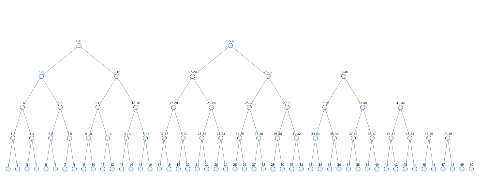

## Plots

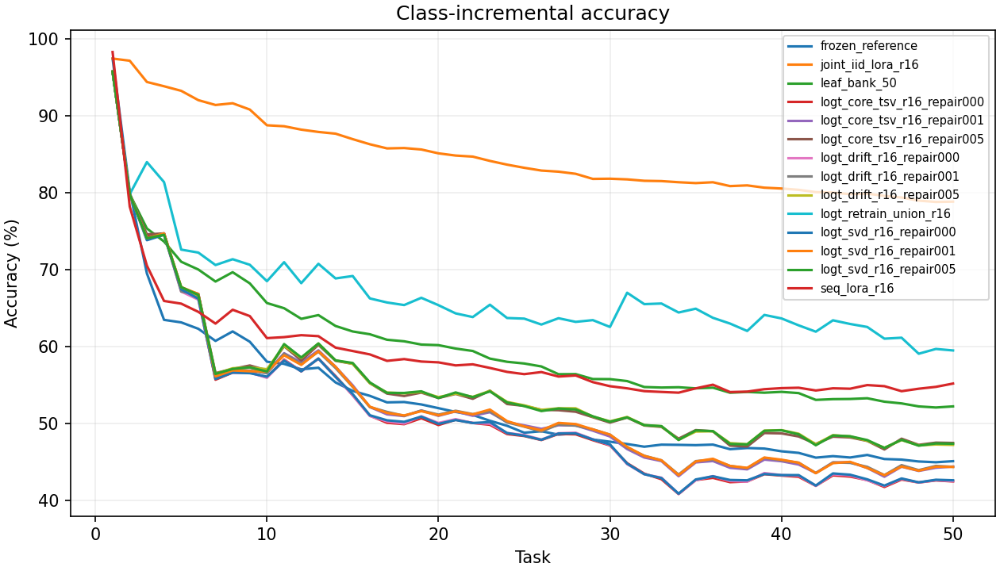

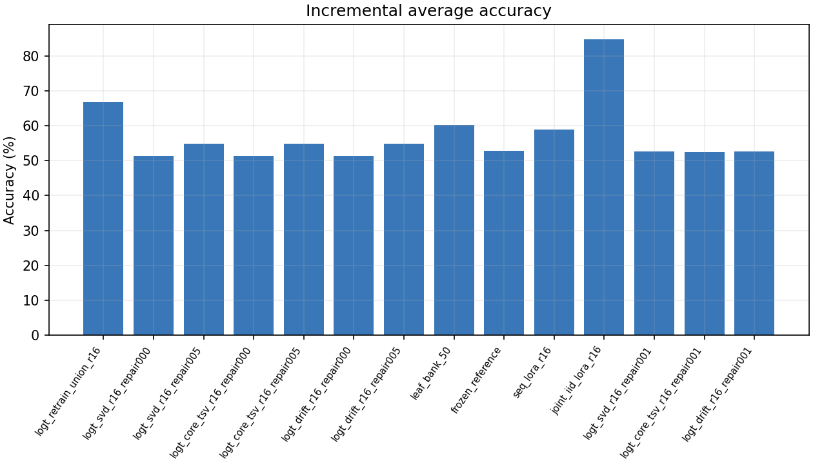
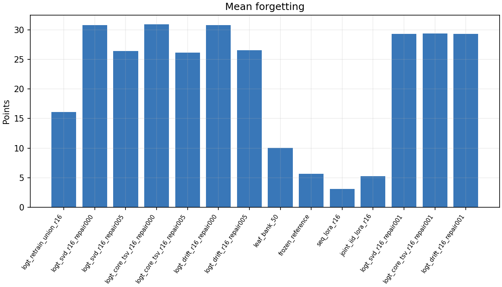

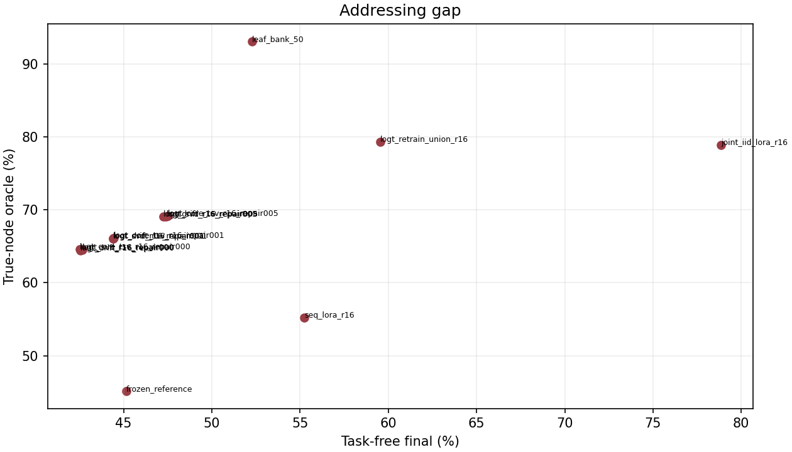
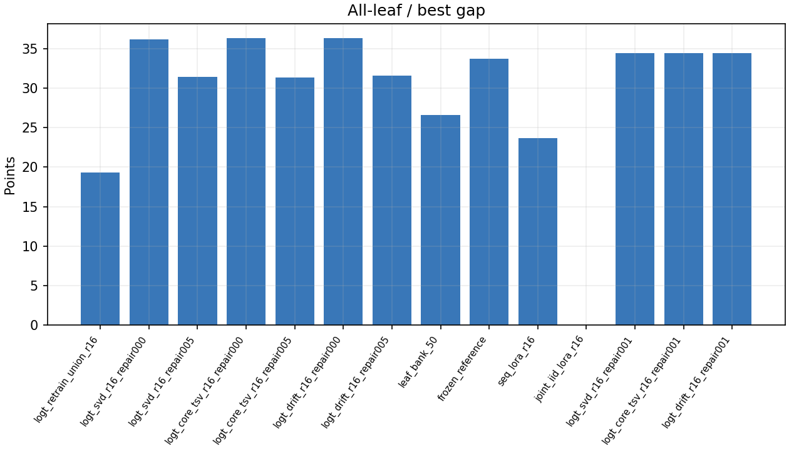
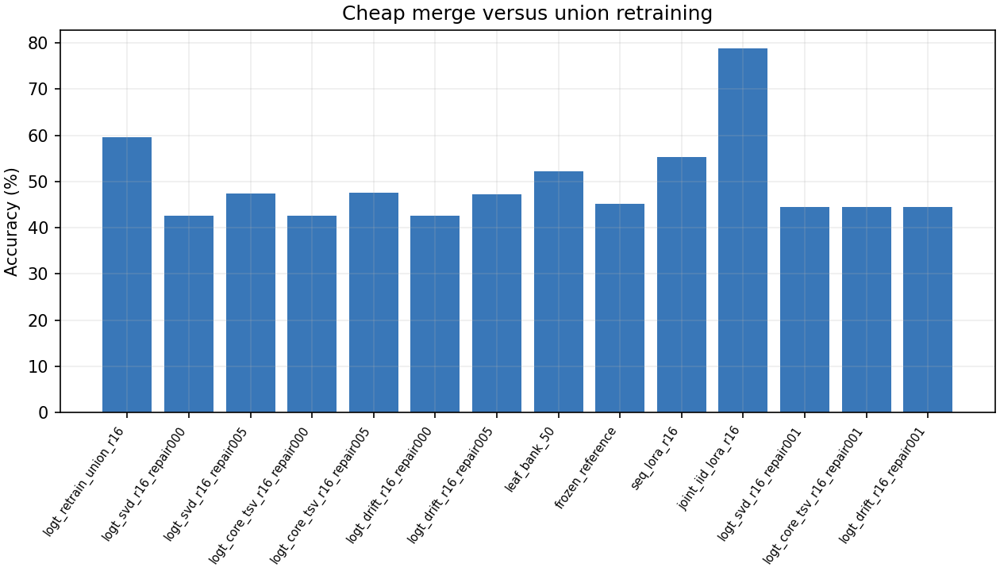

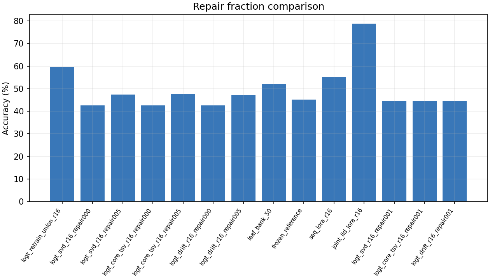
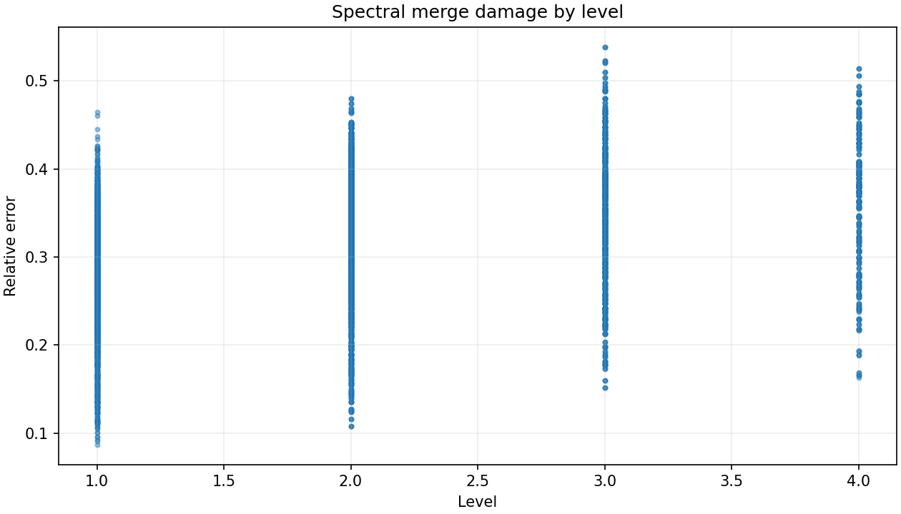
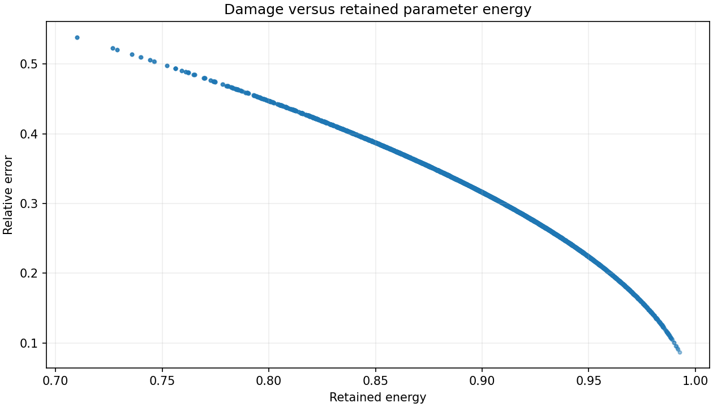
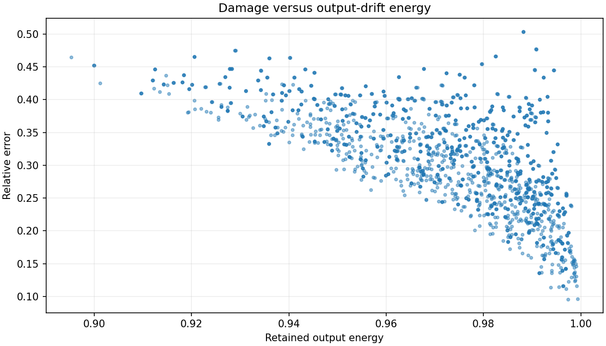
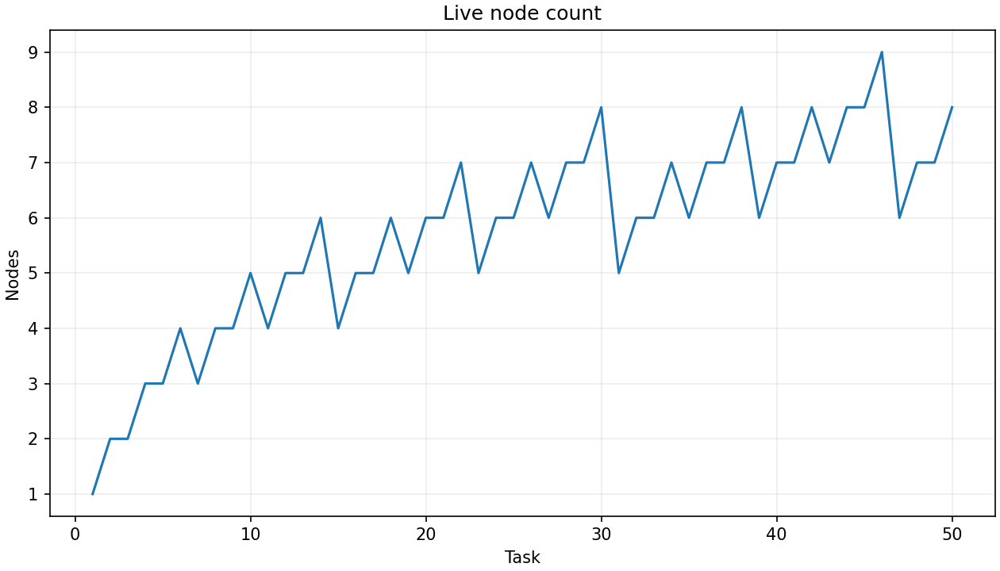
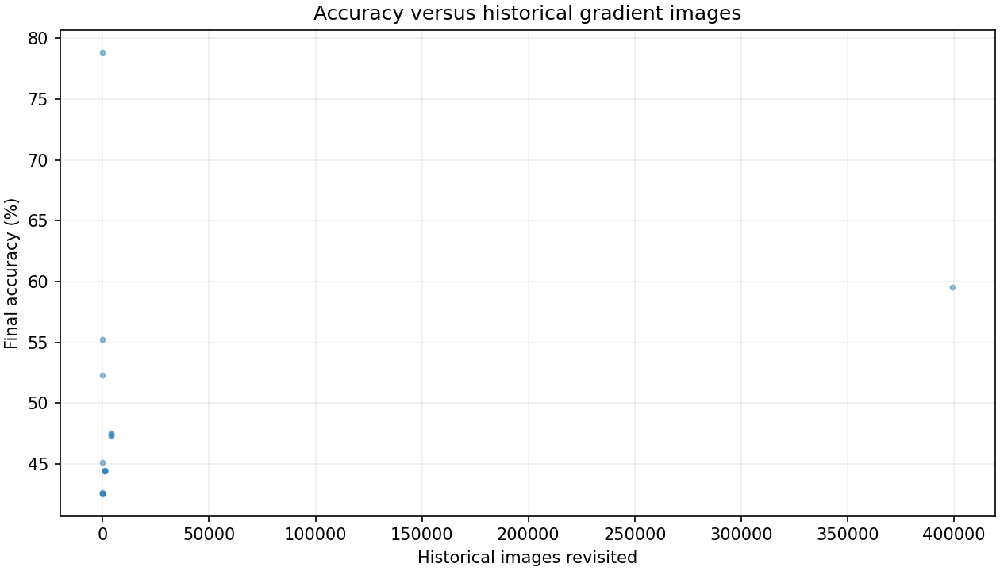
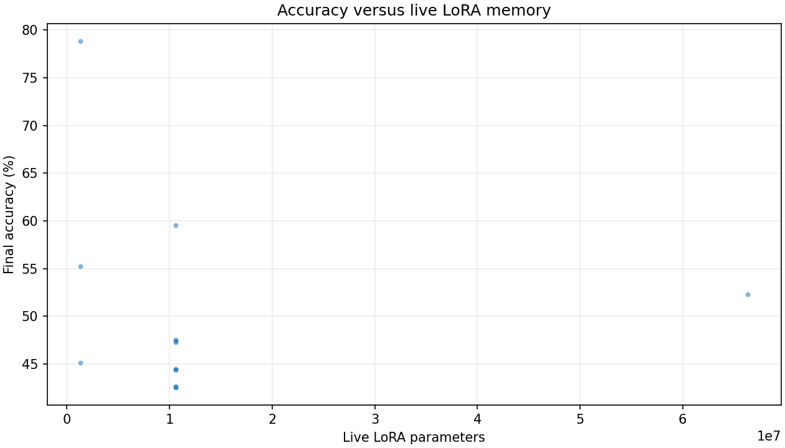
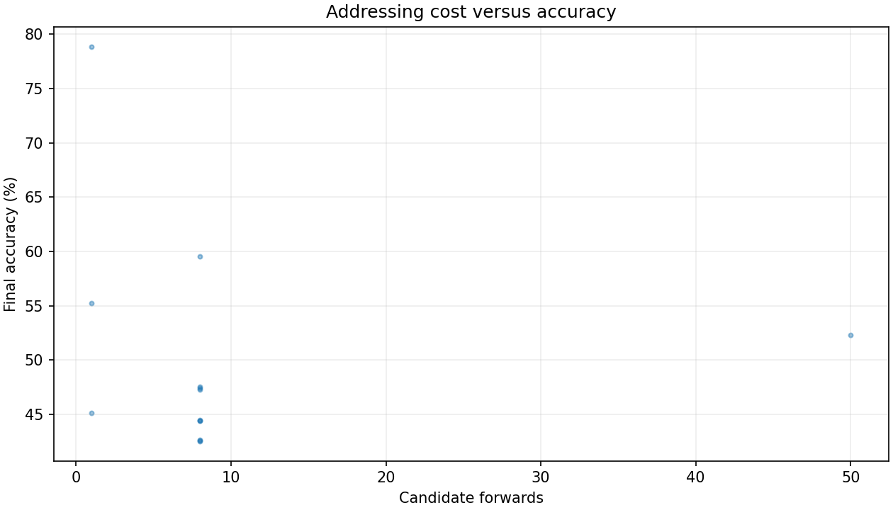

## Conclusions and next experiments

The primary tables determine whether logarithmic consolidation works, how close it
comes to joint IID, whether output-drift beats weight-space compression, how much
repair is needed, and how much residual error is routing. Scale/proxy/rank/CtM
sweeps remain secondary until this complete matrix is interpreted.
