# ImageNet-R-50: single-adapter Spaced Repetition Training

## Original validation-selected results

New checkpoint diagnostics: the offline-minus-uniform NLL gap changes from +0.1512 to +0.0185 after out-of-fold temperature scaling. The final four sections also compare the same clean training images by SRT review history. These are post-hoc diagnostics; all original benchmark scores remain raw and unchanged.

Does confidence-based spaced repetition improve a single continuing rank-16 adapter compared with uniform replay under identical realized exposure? The ImageNet-R split is unchanged: 24,000 training images, 6,000 test images, and fifty four-class tasks in the existing seed-1993 order.

Uniform replay has higher final accuracy and lower final NLL at 2 of the two tested budgets. This comparison tests the selected SRT recipes, not every possible confidence threshold or spacing rule.

At the 1,024-equivalent budget, SRT finishes at 79.267% accuracy and 0.9585 NLL. Relative to its exposure-matched uniform control, the differences are -1.267 accuracy points and +0.0993 NLL. Its accuracy difference from the original five-epoch joint rank 16 is +0.400 points.

At the 4,096-equivalent budget, SRT finishes at 77.333% accuracy and 1.1100 NLL. Relative to its exposure-matched uniform control, the differences are -3.067 accuracy points and +0.1977 NLL. Its accuracy difference from the original five-epoch joint rank 16 is -1.533 points.

Mean accuracy is the arithmetic mean of the fifty stage test accuracies. NLL is uncalibrated, all-seen-class cross-entropy; lower is better. These are single-seed results, not estimates of training-run variability. Final-run times below exclude calibration.

| Condition | Final acc. | Mean acc. | Final NLL | Train min. |
| --- | --- | --- | --- | --- |
| SRT rank 16, 1,024-equivalent budget | 79.267% | 83.916% | 0.9585 | 14.52 |
| Uniform replay rank 16, 1,024-equivalent budget | 80.533% | 85.059% | 0.8592 | 14.05 |
| SRT rank 16, 4,096-equivalent budget | 77.333% | 81.908% | 1.1100 | 40.11 |
| Uniform replay rank 16, 4,096-equivalent budget | 80.400% | 84.197% | 0.9123 | 40.46 |

## Original full-stream comparison at both work budgets

Each panel compares one SRT/uniform pair with the five existing task-free conditions. Historical curve names, values, and colors are unchanged. A budget of H-equivalent work means 4 x (current images + min(H, historical images)) presentations per task, not a memory cap. Both methods can revisit every arrived training image.

The black diamond at task 50 shows validation accuracy-selected joint IID; the hollow blue square shows offline joint IID with the replay-matched optimizer schedule. Markers show three-seed means +/- sample SD, not new stage-matched curves. Details appear in the final sections.

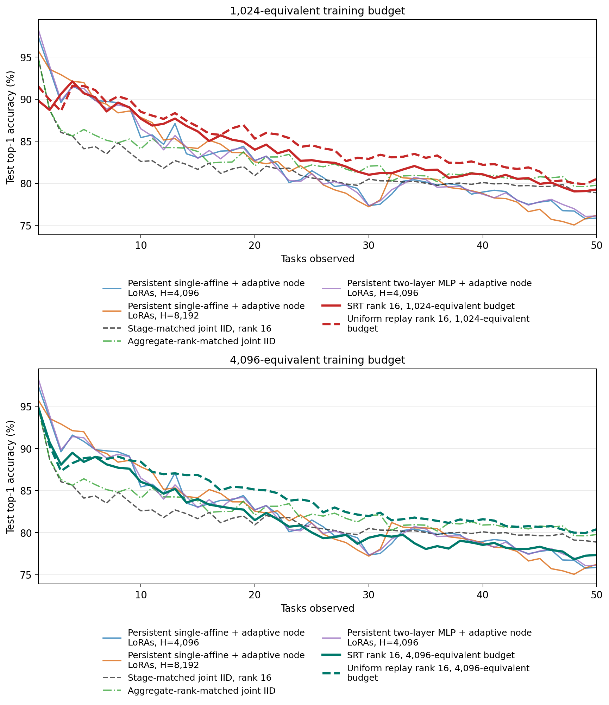

## Fixed-policy follow-up: H=4,096, old=0.8, unit=8

Four additional cold-start 50-task streams hold H=4,096, historical target 0.8, and interval unit 8 fixed. Standard and strict thresholds each have an exposure-matched uniform control. Every stream uses 844,640 training presentations. The optimizer, model, data split, seeds, and checkpoint timing are unchanged; no calibration jobs are repeated.

Standard thresholds are [.10,.25,.50,.75,.90]; strict thresholds are [.20,.40,.70,.85,.95]. The 0.8 target applies after the mandatory current-task first pass. Actual shares can differ when a due pool is short. A uniform condition's profile name identifies the SRT batch schedule it copies, not a quality rule applied to uniform sampling.

Batch size 64 is a maximum. When few examples are due, partial batches consume more optimizer updates for the same image budget. The table reports these updates separately; each uniform control matches them exactly.

With standard thresholds, SRT minus its matched uniform control is -6.950 final accuracy points and +0.3731 NLL.

With strict thresholds, SRT minus its matched uniform control is -5.033 final accuracy points and +0.3243 NLL.

For SRT with standard thresholds, old target 0.8, and unit 8 fixed, raising H from 1,024 to 4,096 changes final accuracy by -5.300 points and NLL by +0.3097.

For uniform replay with standard thresholds, old target 0.8, and unit 8 fixed, raising H from 1,024 to 4,096 changes final accuracy by +0.383 points and NLL by +0.0359.

The new standard SRT run ends with 10 overdue images, and strict with 6,078, out of 24,000. A due backlog measures failure to meet a requested schedule, not whether that schedule maximizes accuracy.

These settings were requested after reviewing the original test curves. Treat them as exploratory single-seed ablations, not an independently selected final winner. Original result hashes and the validation selection remain unchanged.

| Condition | Final acc. | Mean acc. | Final NLL | Updates | Train min. |
| --- | --- | --- | --- | --- | --- |
| SRT rank 16, H=4,096; standard, old=0.8, unit=8 | 73.967% | 79.490% | 1.2682 | 56,243 | 60.41 |
| Uniform replay rank 16, H=4,096; standard, old=0.8, unit=8 | 80.917% | 84.820% | 0.8951 | 56,243 | 62.77 |
| SRT rank 16, H=4,096; strict, old=0.8, unit=8 | 75.717% | 81.014% | 1.2217 | 21,926 | 43.32 |
| Uniform replay rank 16, H=4,096; strict, old=0.8, unit=8 | 80.750% | 84.816% | 0.8974 | 21,926 | 43.46 |

## Full-stream accuracy with the fixed-policy conditions

All four new conditions use a single rank-16 adapter. Colors distinguish standard and strict profiles; solid lines denote SRT and dashed lines their matched uniform controls. All five earlier task-free frontier and joint-IID conditions remain overlaid. The original selected-policy SRT curves remain on the preceding accuracy page.

The black diamond at task 50 shows validation accuracy-selected joint IID; the hollow blue square shows offline joint IID with the replay-matched optimizer schedule. Markers show three-seed means +/- sample SD, not new stage-matched curves. Details appear in the final sections.

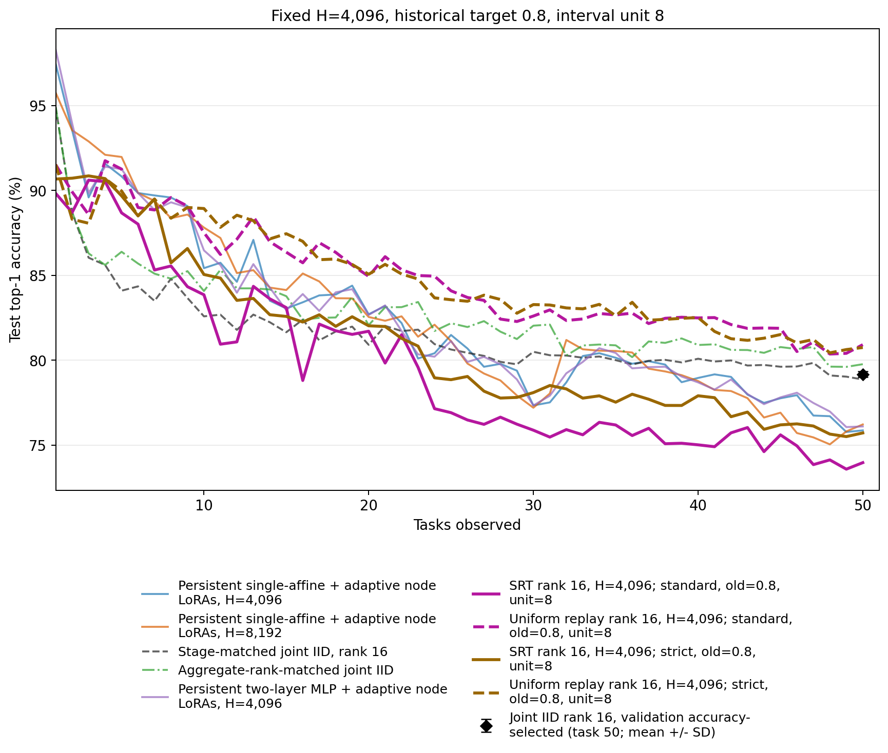

## Direct comparisons with the original SRT recipes

Left: standard thresholds, old target 0.8, and unit 8 are fixed; only H changes from 1,024 to 4,096. Right: H=4,096 and strict thresholds are fixed; old target/unit change together from 0.5/1 to 0.8/8. The right comparison does not isolate mixture from spacing. Each uniform line copies its associated SRT batch schedule. The lower row shows NLL for the identical conditions; the original five-epoch joint rank-16 source has no retained NLL curve.

The black diamond at task 50 shows validation accuracy-selected joint IID; the hollow blue square shows offline joint IID with the replay-matched optimizer schedule. Markers show three-seed means +/- sample SD, not new stage-matched curves. Details appear in the final sections.

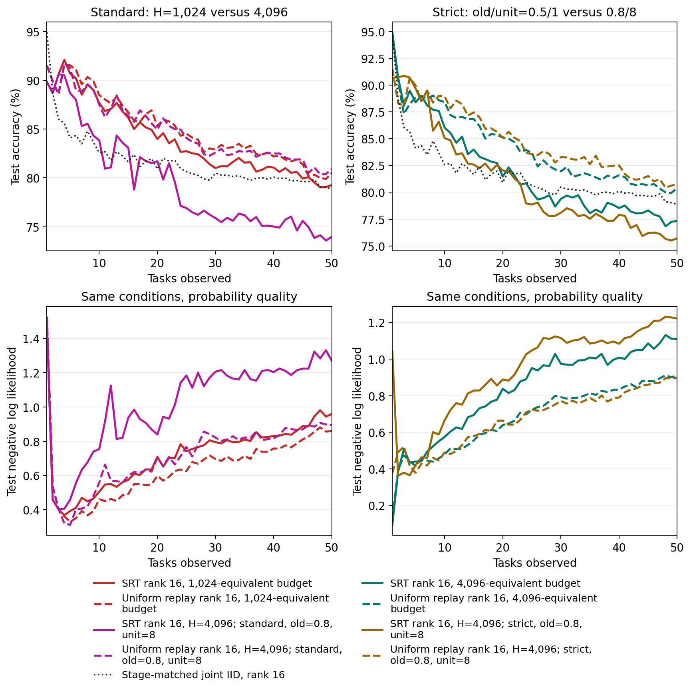

## Equal image work does not mean equal optimizer work

Each line represents an SRT recipe and its exact-count uniform partner. H=4,096 fixes 844,640 image presentations, but the due-only scheduler can produce batches smaller than 64. Cross-entropy is averaged within each actual batch; each batch then takes one full-learning-rate SGD update, with momentum and weight decay. More small batches therefore change optimization as well as overhead. No gradient accumulation is applied. The interval unit measures virtual scheduling ticks, not a fixed amount of intervening image work; empty-queue clock advances and due backlogs also separate requested from actual replay gaps.

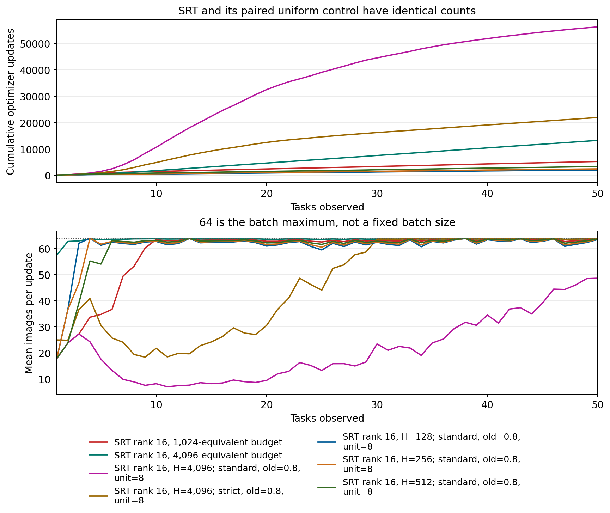

## Carried-forward accuracy figure

This is the original full-stream accuracy figure, copied byte-for-byte from the previous report. The pale dotted curves are label-aware true-node diagnostics for the frontier models, not deployable methods and not SRT baselines. The prior frontier results and report were not changed.

Joint rank 16 uses the same adapter targets, rank, and affine classification architecture as SRT, but retrains on each full prefix. Aggregate-rank-matched joint IID matches the total rank of the frontier nodes, not the rank of the single SRT adapter.

## Probability quality and the joint-IID gap

The original rank-16 joint source did not retain NLL, so no full-stream rank-16 NLL curve is fabricated. The lower panel uses its retained five-epoch accuracy curve. Neither original joint reference is an execution gate or a mathematical upper bound. Each original stage-matched joint model receives five epochs. The original final rank-16 joint model received 120,000 training presentations and 1,875 updates, whereas continuing uniform H=1,024 received 294,368 presentations and 5,253 updates across its lifetime. Earlier joint-prefix models do not warm-start later ones.

The black diamond at task 50 shows validation accuracy-selected joint IID; the hollow blue square shows offline joint IID with the replay-matched optimizer schedule. Markers show three-seed means +/- sample SD, not new stage-matched curves. Details appear in the final sections.

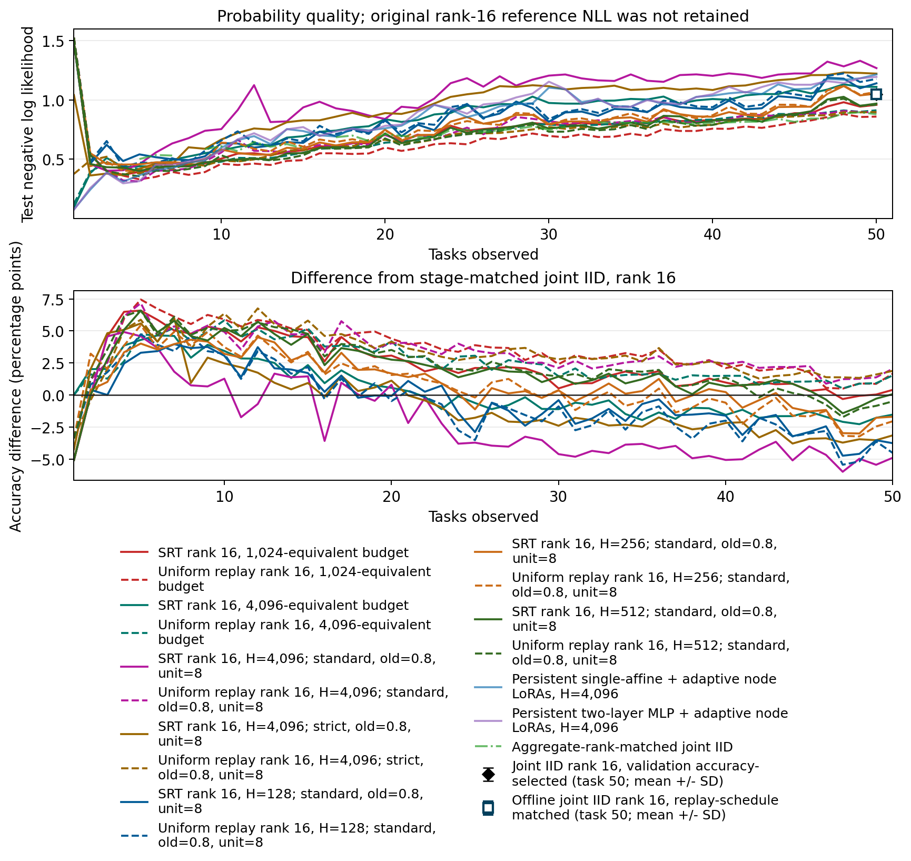

## Measured training work

Each new training presentation produces one ViT forward/backward pair. Confidence comes from that same forward: there are no quality-only passes, source hierarchy jobs, or activation recomputation. Prior frontier costs include their source hierarchy. The table separates their extra recomputation forwards.

Training time sums measured batch work and committed checkpoint I/O. Loader and scheduler timings are components of that time, not costs to add again. Setup, model serialization outside those counters, between-job overhead, and evaluation are separate. Calibration is excluded from this comparison.

| Condition | Forward/backward pairs | Recompute forwards | Train min. |
| --- | --- | --- | --- |
| SRT rank 16, 1,024-equivalent budget | 294,368 | 0 | 14.52 |
| Uniform replay rank 16, 1,024-equivalent budget | 294,368 | 0 | 14.05 |
| SRT rank 16, 4,096-equivalent budget | 844,640 | 0 | 40.11 |
| Uniform replay rank 16, 4,096-equivalent budget | 844,640 | 0 | 40.46 |
| SRT rank 16, H=4,096; standard, old=0.8, unit=8 | 844,640 | 0 | 60.41 |
| Uniform replay rank 16, H=4,096; standard, old=0.8, unit=8 | 844,640 | 0 | 62.77 |
| SRT rank 16, H=4,096; strict, old=0.8, unit=8 | 844,640 | 0 | 43.32 |
| Uniform replay rank 16, H=4,096; strict, old=0.8, unit=8 | 844,640 | 0 | 43.46 |
| Persistent single-affine + adaptive node LoRAs, H=4,096 | 3,050,765 | 2,385,440 | 104.23 |
| Stage-matched joint IID, rank 16 | 3,140,210 | 0 | 80.72 |
| Aggregate-rank-matched joint IID | 3,140,210 | 0 | 85.88 |
| Persistent two-layer MLP + adaptive node LoRAs, H=4,096 | 3,050,765 | 2,385,440 | 107.19 |

## Cumulative work across the stream

The fixed H-equivalent budget gives linear training-image work for bounded task size and this fixed model. Repeated prefix testing is quadratic. CPU population scans and report reductions are not covered by the linear model-work claim. These counts are image paths, not profiled FLOPs; equal counts do not imply equal arithmetic for different adapter ranks or multiple frontier models.

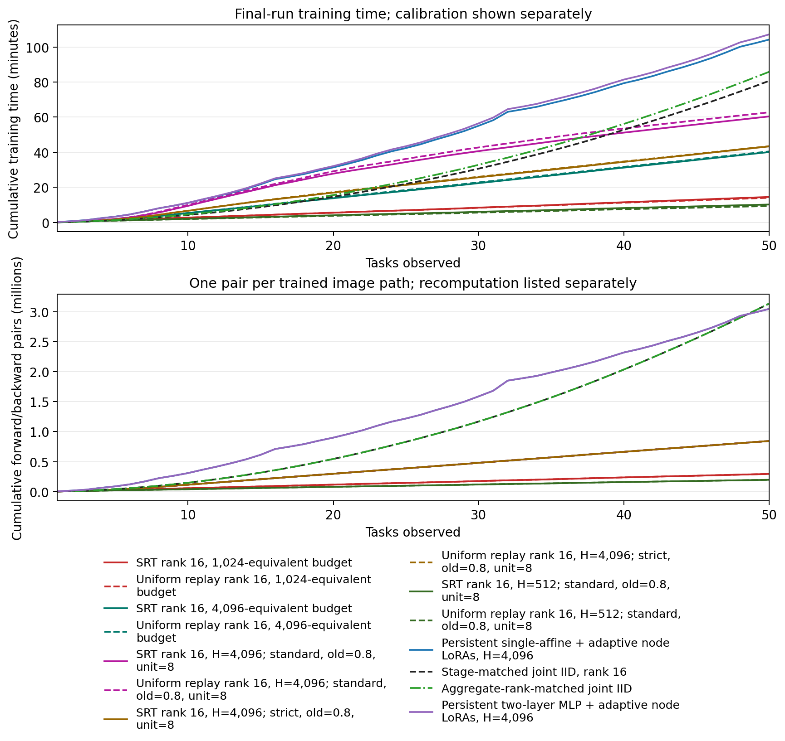

## When reviews actually happened

The distributions are review-event weighted and separate real optimizer gaps from virtual scheduling-clock delays. Scheduling time advances to the next due item when neither pool is ready; that does not perform a training update. A large due backlog means requested spacing and actual spacing differ.

The historical fraction plotted includes the mandatory first pass over new images. Its realized value can differ from the configured post-introduction fraction when one due pool is short. Each uniform control copies the exact resulting old/current counts and partial batch sizes.

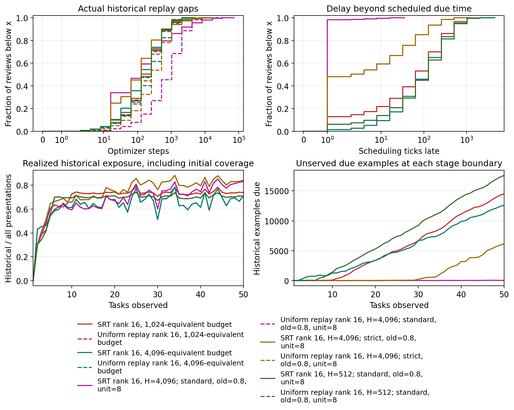

## Which samples received replay

Earlier arrival cohorts have more opportunities for historical replay. Compare methods within a cohort rather than interpreting that age effect as preferential selection. The lower plot gives each image one vote. Task-50 images cannot receive a historical replay within this experiment.

The per-sample table retains exact mean, median, 90th-percentile, minimum, and maximum optimizer gaps, review counts, and terminal waits. Every unfinished next-review interval is marked censored; images with no observed second presentation are retained rather than silently omitted.

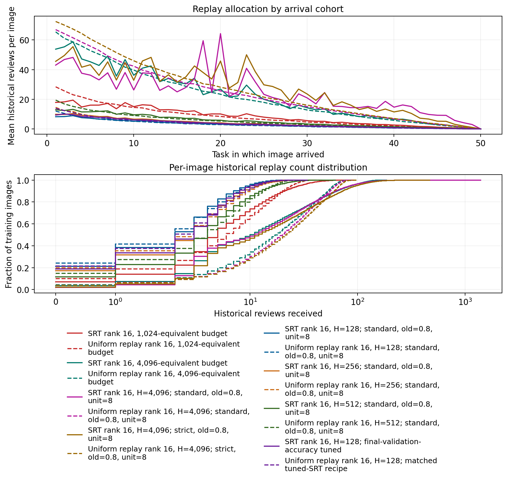

## Requested spacing versus realized spacing

These curves use the same historical review events and the same scheduling-clock unit. Requested intervals come from the previous SM-2 update; actual intervals run from that previous presentation to the next real review. Any rightward displacement is waiting beyond the requested spacing.

CDF values are evaluated at logarithmic bin boundaries, using completed intervals only. Terminal unfinished intervals are retained separately as censored waits, not interpreted as completed long gaps. The earlier optimizer-gap plot measures actual learning updates rather than virtual clock advances.

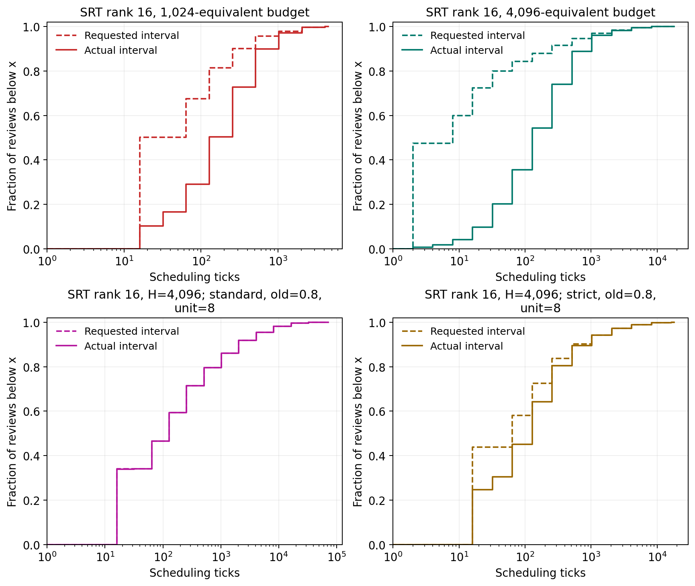

## Individual review histories

Eight image identities were selected by a fixed hash rule: two each from arrival tasks 1, 16, 31, and 50. Selection does not use accuracy, confidence, or whether SRT looks successful. SRT marks sit above each sample row and uniform marks below. The full identities and every event are retained in the analysis tables.

The horizontal coordinate is task arrival plus the fraction of that task's optimizer updates, not elapsed wall time. Exact optimizer-step gaps are in the timing distributions and per-sample tables.

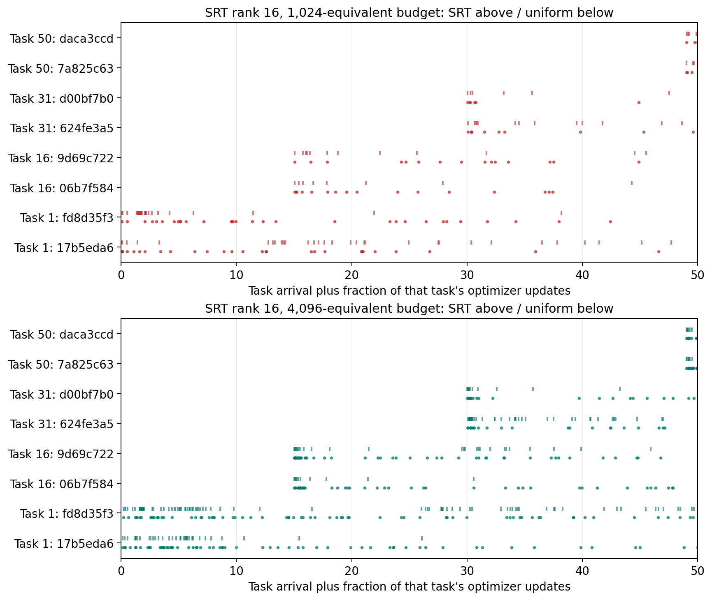

## Calibration and selected settings

Eighteen settings per budget were screened through task 16 on the existing 19,200/4,800 training-derived fit/validation split. Two finalists per budget continued through task 50. Selection maximized mean stage validation accuracy, then minimized mean NLL, then used canonical policy order. No test images entered this process.

Calibration consumed 6,752,992 training presentations, 7.49 measured training hours, and 34.94 evaluation minutes. The four final models restarted from cold adapters after selection.

Relaxed thresholds are [.05,.15,.30,.60,.85], standard [.10,.25,.50,.75,.90], and strict [.20,.40,.70,.85,.95]. Quality counts thresholds met by the pre-update probability of the correct class. The interval unit scales the first/failure interval and the first two successful intervals.

These numerical thresholds were hand-chosen search candidates, not values reported by the paper. Validation selected among them; it did not establish that a quality score predicts retention after a given delay. Calibration costs above exclude the preserved, superseded development run and preflight.

| Budget | Threshold profile | Old fraction | Time unit | Mean val. acc. |
| --- | --- | --- | --- | --- |
| 1,024 | standard | 0.8 | 8 | 82.593% |
| 4,096 | strict | 0.5 | 1 | 80.512% |

## Complete calibration matrix

Screen accuracy averages tasks 1-16; full accuracy averages tasks 1-50 and is present only for continued finalists. An asterisk marks the selected setting. All values are validation percentages, not test results. NLL, resource counters, hashes, and every stage curve are included in the accompanying tables.

| Budget | Profile | Old | Unit | Screen acc. | Full acc. |
| --- | --- | --- | --- | --- | --- |
| 1,024 | relaxed | 0.2 | 1 | 85.757 | - |
| 1,024 | relaxed | 0.2 | 8 | 86.323 | - |
| 1,024 | relaxed | 0.5 | 1 | 85.627 | - |
| 1,024 | relaxed | 0.5 | 8 | 85.929 | - |
| 1,024 | relaxed | 0.8 | 1 | 86.295 | - |
| 1,024 | relaxed | 0.8 | 8 | 86.207 | - |
| 1,024 | standard | 0.2 | 1 | 84.973 | - |
| 1,024 | standard | 0.2 | 8 | 86.578 | - |
| 1,024 | standard | 0.5 | 1 | 85.604 | - |
| 1,024 | standard | 0.5 | 8 | 87.325 | 82.475 |
| 1,024 | standard | 0.8 | 1 | 86.776 | - |
| 1,024 | standard * | 0.8 | 8 | 87.442 | 82.593 |
| 1,024 | strict | 0.2 | 1 | 84.721 | - |
| 1,024 | strict | 0.2 | 8 | 86.768 | - |
| 1,024 | strict | 0.5 | 1 | 85.732 | - |
| 1,024 | strict | 0.5 | 8 | 86.183 | - |
| 1,024 | strict | 0.8 | 1 | 87.090 | - |
| 1,024 | strict | 0.8 | 8 | 86.743 | - |
| 4,096 | relaxed | 0.2 | 1 | 84.917 | - |
| 4,096 | relaxed | 0.2 | 8 | 82.927 | - |
| 4,096 | relaxed | 0.5 | 1 | 84.462 | - |
| 4,096 | relaxed | 0.5 | 8 | 82.950 | - |
| 4,096 | relaxed | 0.8 | 1 | 85.071 | - |
| 4,096 | relaxed | 0.8 | 8 | 82.946 | - |
| 4,096 | standard | 0.2 | 1 | 84.760 | - |
| 4,096 | standard | 0.2 | 8 | 84.455 | - |
| 4,096 | standard | 0.5 | 1 | 85.222 | - |
| 4,096 | standard | 0.5 | 8 | 85.382 | - |
| 4,096 | standard | 0.8 | 1 | 85.642 | - |
| 4,096 | standard | 0.8 | 8 | 84.835 | - |
| 4,096 | strict | 0.2 | 1 | 85.702 | - |
| 4,096 | strict | 0.2 | 8 | 85.910 | - |
| 4,096 | strict * | 0.5 | 1 | 86.296 | 80.512 |
| 4,096 | strict | 0.5 | 8 | 85.638 | - |
| 4,096 | strict | 0.8 | 1 | 86.328 | 80.226 |
| 4,096 | strict | 0.8 | 8 | 85.546 | - |

## Protocol, verification, and interpretation limits

The frozen ViT-B/16 uses rank/alpha-16 LoRA on QKV and fc1 in all twelve blocks. An ordinary affine head adds four rows per task. Old rows, adapter parameters, and SGD momentum persist; all seen rows remain trainable. SGD uses batch limit 64, momentum 0.9, weight decay 0.0005, LoRA learning rate 0.0005, and head learning rate 0.01, without clipping or a learning-rate schedule.

Our implementation follows Atreya et al.'s pre-update scoring and SM-2 equations. Their code is proprietary and their classification thresholds are unspecified. The guaranteed first pass, calibrated thresholds/interval unit, and explicit empty-queue clock rule are documented local choices, not claims of an exact reproduction.

The real smoke test verified zero-LoRA parity, BF16 batch 64, eight task arrivals, exact interrupted/uninterrupted weights and review events, and matched uniform exposure. Reporting revalidates all committed events and reconstructs accuracy/NLL from stored predictions. A completed rerun performs zero optimizer steps.

The uniform control is conditioned on SRT's realized allocation; it is not an independently tuned uniform-replay optimum. Quality is measured on random training crops, so a low score can reflect an uninformative crop as well as forgetting. Hyperparameters were selected offline using a training-derived full-stream validation sweep. One seed cannot establish reproducibility or a publishable state-of-the-art result.

For the original validation-selected policies, 14,498 of 24,000 training images are overdue at the final boundary at H=1,024, and 12,560 at H=4,096. Requested spacing is therefore not reliably delivered. This does not isolate the cause of the accuracy difference: crop-dependent confidence, sample selection, and review delays can all contribute.

The next tests should replicate the paired SRT/uniform comparison across seeds and, on training-derived validation data, measure how pre-review confidence predicts later retention at observed delays. Then test spacing calibrated to the available review budget. H changes both work and the selected recipe here, so it is not a pure work ablation. The original selection stays frozen. The separately identified, user-requested fixed-policy follow-up is exploratory because it was requested after examining these test results.

Source: Atreya et al. (2026), When to Review: Spaced Repetition for Continual Pre-Training of Language Models, arXiv:2608.17530v1. https://arxiv.org/html/2608.17530v1

## What correct-class probability does and does not measure

The quality signal is p(correct class), equivalently exp(-cross-entropy), measured before the update on the sampled training crop. Appendix C.2 of Atreya et al. proposes this signal for classifiers. It is cheap and follows the training loss, but is not a measured probability that an example will be forgotten, nor a measure of the expected accuracy gain from replaying it now.

Two 200-class predictions can both assign 0.50 to the correct class while giving their strongest competitor 0.01 or 0.49. Both are currently correct and have the same 0.693 cross-entropy, but probability margins of 0.49 versus 0.01. The present scheduler assigns them identical quality. At exactly 0.50, standard assigns quality 3 (success), while strict assigns quality 2 (failure, resetting the interval to 8 ticks).

Raw confidence also changes under positive temperature rescaling without changing the winning class. New classifier rows can change the softmax denominator, and a random crop covering as little as 5% of an image can omit the object. Low confidence is therefore not synonymous with forgotten knowledge. Conversely, a wide margin on today's crop does not prove that later tasks cannot erase the decision.

Our threshold values are hand-chosen candidates. Validation selected recipes by average accuracy, but did not calibrate quality to future retention or replay benefit. Prioritizing low-confidence examples also changes their effective training weights and can overemphasize ambiguous crops. Following per-image loss does not establish that this allocation maximizes held-out accuracy. A useful next study would compare correctness, correct-versus-runner-up margin, and confidence against later prediction failures at measured delays, using training-derived probes. Then compare a retention-based scheduler under matched work. Margin is a hypothesis to test, not an established replacement.

Source: Atreya et al., https://arxiv.org/html/2608.17530v1#A3.SS2

## Individual review histories for the fixed-policy follow-up

The same eight hash-selected training images appear in both profile panels. SRT marks sit above their paired uniform marks. Neither the identities nor their inclusion was selected using these outcomes. Timing is task arrival plus the within-task update fraction.

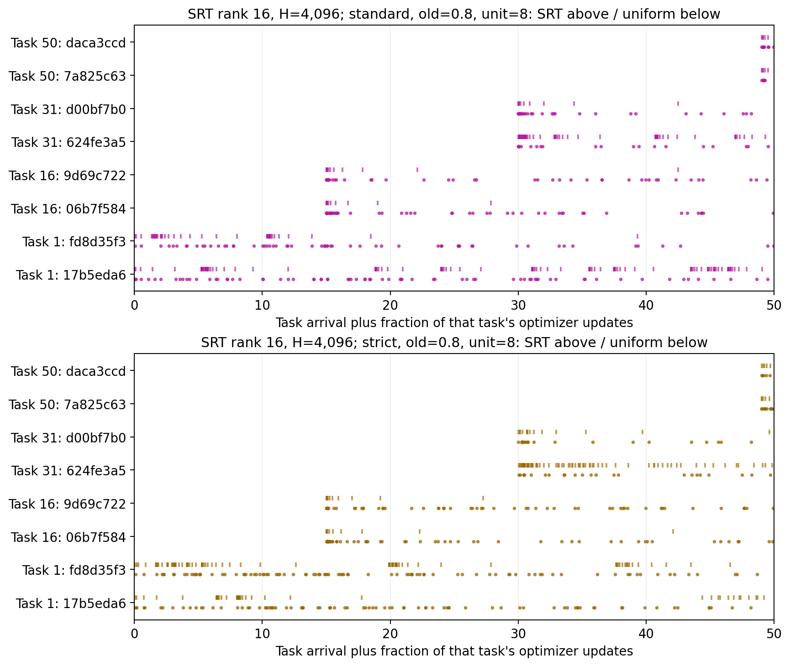

## Task-50 rank-16 joint IID: longer-training reference

Development reached the predeclared validation-plateau rule after 47 epochs. The primary checkpoint is epoch 19, selected by validation accuracy before any new test evaluation. Three cold full-data refits reach 79.172% mean test accuracy (sample SD 0.167 points) and 1.0490 mean NLL (SD 0.0202).

Per-seed primary results: 1993: 79.000% / 1.0677 NLL; 1994: 79.333% / 1.0516 NLL; 1995: 79.183% / 1.0276 NLL.

Relative to the same three seeds' five-epoch endpoints, the selected recipe changes mean accuracy by +0.194 points and NLL by +0.1339. The terminal checkpoint changes mean accuracy by -0.267 points relative to the selected checkpoint.

All endpoints below were defined from development before test evaluation; none is a test-selected winner. The primary reference is the accuracy-selected row. The diamond on the full-stream figures shows its task-50 mean and across-seed sample SD. It is not a new stage-matched curve or a mathematical upper bound. The original 78.867% five-epoch model and its historical curve remain unchanged.

Against uniform replay with H=4,096, old=0.8, and the standard/unit-8 batch schedule, the selected joint mean differs by -1.744 accuracy points and +0.1539 NLL. This compares three joint seeds with one replay seed; it does not measure replay's seed variation.

| Condition | Epoch | Test acc. mean +/- SD | Test NLL mean +/- SD |
| --- | --- | --- | --- |
| Joint IID rank 16, validation accuracy-selected | 19 | 79.172% +/- 0.167 | 1.0490 +/- 0.0202 |
| Joint IID rank 16, five-epoch rerun | 5 | 78.978% +/- 0.280 | 0.9151 +/- 0.0168 |
| Joint IID rank 16, validation NLL-selected | 3 | 78.739% +/- 0.164 | 0.9089 +/- 0.0114 |
| Joint IID rank 16, terminal schedule checkpoint | 47 | 78.906% +/- 0.108 | 1.0715 +/- 0.0053 |

## Joint-IID development convergence and checkpoint selection

The existing 19,200/4,800 training-derived fit/validation partition selects the schedule. The model is the same pinned ViT-B/16, with rank/alpha-16 QKV and fc1 adapters and a 200-way affine head; every class is available jointly from the start. Initial SGD rates, momentum, decay, batch 64, and augmentation match the earlier joint recipe.

An accuracy gain of at least 0.1 point or NLL reduction of at least 0.002 resets patience. Eight plateau epochs reduce both rates by five. After three reductions, twelve plateau epochs and at least thirty total epochs establish the declared validation plateau. Smaller gains accumulate against the last significant anchors. This is a generalization-plateau criterion, not proof of stationary training loss or a globally optimal classifier. Orange markers use raw validation metrics, not the plateau tolerances.

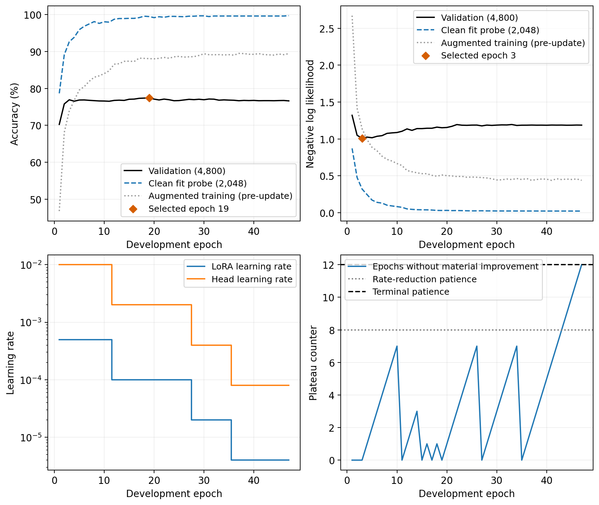

## Full-data refits, work, and interpretation limits

Seeds 1993, 1994, and 1995 each restart from cold adapters and heads on all 24,000 training images. They replay the complete frozen development schedule by epochs. No validation or test metric can change those fits. The dotted vertical marker is the primary selected epoch. These are clean training-probe curves, not held-out estimates.

Development plus the three complete refits used 4,286,400 training forward/backward image pairs and 66,975 optimizer updates. Including development validation, fit probes, and final testing gives 4,969,024 forward image paths in total. Measured training-batch work totals 205.35 minutes; evaluation and epoch artifact work totals 27.89 minutes. Training-batch time includes image loading but excludes step-checkpoint writes, model setup, and between-job overhead. Preflight work is separate.

Transferring the schedule by epochs gives each full-data fit 25% more updates per epoch than development. The three seeds measure variation under one selected recipe, not three independent convergence searches. A validation plateau does not prove this is the best possible optimizer, augmentation, regularization, or accuracy attainable by rank 16. Mean NLL is a predictive-loss measure, not a calibration-error estimate. Every training and evaluation identity is bound to the original dataset manifest; the published test set was previously examined in earlier experiments.

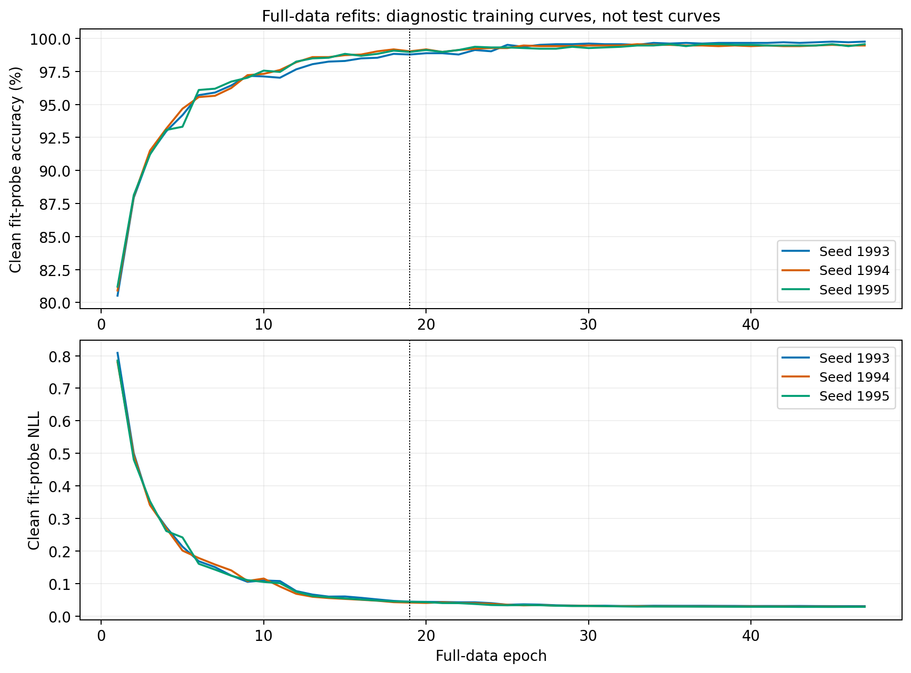

## Offline joint IID with the replay optimizer schedule

This control keeps the rank-16 architecture and copies every batch size from uniform H=4,096, standard/old=0.8/unit=8: 56,243 optimizer updates and 844,640 training-image presentations per seed. From the first update, all 24,000 training images can be sampled and all 200 classifier rows are active. Sampling is uniform over images without replacement within a batch, independent between batches.

The source batch size averages 15.018 images (median 10); only 1,735 of 56,243 updates use a full batch of 64. The model has 1,480,904 trainable adapter/classifier parameters, identical to the replay source.

SGD retains momentum 0.9, weight decay 0.0005, constant LoRA rate 0.0005, and constant head rate 0.01. Each actual batch uses mean cross-entropy and one full update; no gradient accumulation or rate reductions occur. Source work boundaries do not reset weights, change the class set, or select training images. There is no validation search or early stopping in this control.

The fixed final endpoint averages 80.828% test accuracy (sample SD 0.315 points) and 1.0463 NLL (SD 0.0322). All three cold fits completed before any new test evaluation. The hollow blue square on the main figures shows this task-50 endpoint, not a future-informed continual-learning curve.

Relative to the prior validation accuracy-selected joint mean, accuracy changes by +1.656 points and NLL by -0.0027. Against the single-seed matched replay source, the differences are -0.089 accuracy points and +0.1512 NLL. These are observed differences, not significance tests.

Compared with the previous epoch-trained joint fits, batch sizes, update count, learning-rate schedule, and between-batch sampling differ. A gain over that reference cannot be assigned to any one of those changes. The exact schedule match is with the replay source.

| Seed / summary | Task-50 accuracy | Task-50 NLL | Optimizer updates |
| --- | --- | --- | --- |
| 1993 | 81.183% | 1.0138 | 56,243 |
| 1994 | 80.717% | 1.0469 | 56,243 |
| 1995 | 80.583% | 1.0782 | 56,243 |
| Mean +/- sample SD | 80.828% +/- 0.315 | 1.0463 +/- 0.0322 | 56,243 per seed |

## Task-50 comparisons and what this control isolates

All rows use the same test population and rank-16 adapter architecture. Error bars show across-seed sample standard deviation, not a confidence interval. Replay rows are single-seed results, so no seed-variation bar is available. Every previous joint endpoint keeps its original validation selection; no checkpoint was chosen from these test comparisons.

This comparison holds the optimizer schedule fixed while changing the staged class/data curriculum and cumulative image weighting together. It does not isolate those remaining effects from one another. The source schedule itself came from a single seed's SRT partner; three offline seeds do not replicate that replay arm or schedule selection. This follow-up was requested after inspecting earlier test results.

The offline mean is 0.089 accuracy points below the single-seed replay source. Its NLL is 0.1512 higher. Relative to the prior validation accuracy-selected joint mean, accuracy changes by +1.656 points and NLL by -0.0027. Similar top-1 accuracy does not imply similar true-label probabilities. These are observed differences, not an equivalence or significance test.

Averaged across offline seeds, correctly classified images contribute 0.0430 to whole-test NLL, versus 0.0633 for replay. Errors contribute 1.0033, versus 0.8318. These two contributions sum to total NLL. The error sets are not identical; this decomposition is not a paired-error test or a full calibration measurement.

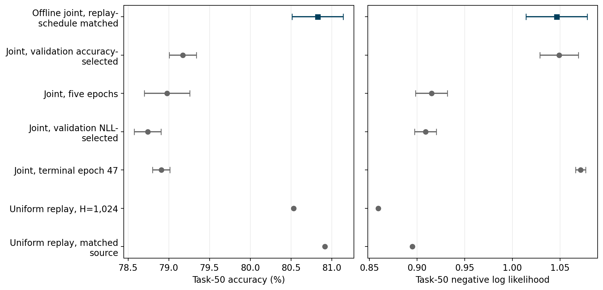

## Offline control training diagnostics and measured work

The same 2,048 hash-selected clean training images are probed at the fifty source work boundaries. These are training-fit diagnostics, not validation or test curves. The horizontal axis is optimizer work: the model already has access to every training class at the left edge. The bottom panel shows the inherited changing batch size, identical across the three seeds.

The three fits total 2,533,920 forward/backward training-image pairs and 168,729 optimizer updates. Including clean probes and final tests gives 2,859,120 forward image paths. Measured training-batch time totals 190.61 minutes; checkpoint writes add 3.16 minutes, and probe/test/model-artifact work adds 16.84 minutes. Batch time includes data loading; setup, source/draw audits, and preflight are separate. Counts are model image paths, not profiled FLOPs.

Every committed draw and augmentation ordinal was reconstructed against the all-training population. Final exposure counts and per-update schedule/rate checks agree. Completed training and prediction artifacts are immutable and reused without optimizer steps.

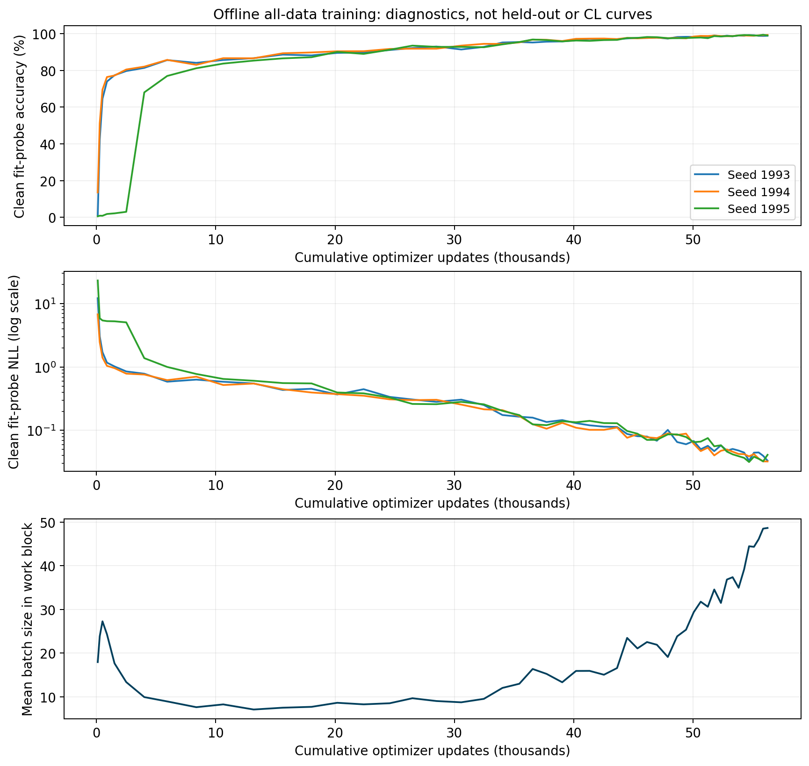

## Early optimization: individual seeds and loss spikes

This diagnostic was added after observing slow early learning in seed 1995, before any new test evaluation. It does not select a checkpoint or alter the fixed training schedule. Each seed changes initialization, sampled images, and augmentation; these observations do not isolate which of those differences caused a different trajectory.

The table summarizes the first source work block. Peak batch NLL is mean pre-update cross-entropy in the worst batch; its actual batch size is shown alongside it. Peak gradient norm is the Euclidean norm over all trainable-parameter gradients before SGD, and can occur at a different update. Fit accuracy uses the same 2,048 clean training images at the indicated update counts. The exact peak-update indices and all batch records are retained in the analysis tables.

These are unmodified finite updates, including very small batches, at the full prescribed learning rates. Large early losses and subsequent poor fitting are consistent with optimization instability, but do not identify a unique failing layer or prove that any particular clipping threshold would repair it. Other seeds can recover despite early spikes. No seed was reset, discarded, or replaced.

All three final test results remain in the main mean and standard deviation. The individual-seed table and training curves are essential when trajectories differ; a mean alone can obscure that difference. A stability intervention such as warm-up, a lower initial rate, or different early batching would require a separate experiment. None was applied here.

| Seed | Peak batch NLL | Batch size at peak loss | Peak gradient norm | Fit acc. after 106 updates | Fit acc. after 1,512 updates | Final fit acc. |
| --- | --- | --- | --- | --- | --- | --- |
| 1993 | 48.412 | 2 | 905.4 | 1.12% | 77.34% | 98.83% |
| 1994 | 22.898 | 1 | 200.7 | 13.57% | 77.20% | 99.27% |
| 1995 | 122.752 | 1 | 1109.5 | 0.59% | 2.20% | 98.97% |

## Checkpoint diagnostic: does confidence scale explain NLL?

These are the already-trained task-50 rank-16 checkpoints, with no further optimizer updates. Offline denotes the three replay-schedule-matched joint-IID seeds. Every SRT/uniform row uses H=4,096, old=0.8, unit=8 and seed 1993; standard and strict identify the original threshold profiles.

Divide every logit by one positive temperature T. This changes probabilities, not the winning class. Five fixed class-stratified folds each contain 1,200 test images. For each checkpoint, fit T on the other 4,800 and score only the held-out 1,200. OOF means the combined out-of-fold scores; the T column spans the five fits.

The offline three-seed mean minus standard uniform NLL is +0.1512 before calibration and +0.0185 after it. The reduction is 87.8% of the raw gap. This tests a global confidence-scale explanation for that NLL difference. All 42,000 predicted classes remain unchanged. The table retains every seed, not a selected winner.

This is a post-hoc diagnosis on a previously inspected test set, not a new benchmark score or an untouched validation study. No image's label fits its own temperature. All original raw results and main accuracy curves remain unchanged.

| Condition | Accuracy | Raw NLL | OOF NLL | Fitted T |
| --- | --- | --- | --- | --- |
| Offline joint IID, seed 1993 | 81.183% | 1.0138 | 0.8207 | 1.673-1.689 |
| Offline joint IID, seed 1994 | 80.717% | 1.0469 | 0.8464 | 1.681-1.696 |
| Offline joint IID, seed 1995 | 80.583% | 1.0782 | 0.8486 | 1.736-1.754 |
| SRT, standard | 73.967% | 1.2682 | 1.1493 | 1.412-1.424 |
| Uniform replay, standard | 80.917% | 0.8951 | 0.8201 | 1.380-1.389 |
| SRT, strict | 75.717% | 1.2217 | 1.0740 | 1.489-1.508 |
| Uniform replay, strict | 80.750% | 0.8974 | 0.8319 | 1.348-1.361 |

## Checkpoint diagnostic: probability reliability

Each point groups predictions into one of fifteen fixed probability intervals. Its horizontal position is the mean probability assigned to the winning class; its vertical position is the fraction correct. The dotted diagonal is agreement between confidence and accuracy. Empty bins are omitted; sparse bins can fluctuate strongly.

A single temperature can correct a common score scale, but cannot change class rankings or repair image-dependent errors. Brier scores, entropy, bin counts, calibration errors, and per-image raw/OOF scores are retained in the matching analysis tables.

Standard SRT still has 1.1493 calibrated NLL versus uniform's 0.8201. Temperature scaling does not explain away the SRT deficit: its worse class predictions remain. Offline seed variation and single-seed replay also limit conclusions about the small residual offline/uniform gap.

Temperatures were constrained only by numerical bounds 0.01-100; 0 of 35 fits reached a bound. Independent float64 log-sum-exp reproduced all original winning classes; the largest per-image NLL difference was 1.1e-06.

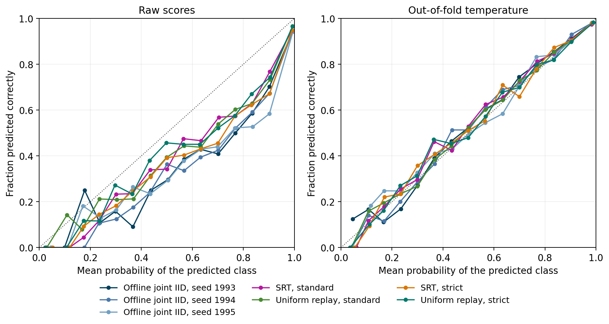

## Checkpoint diagnostic: did neglected training images stay learned?

These are clean-view predictions on all 24,000 training images, not test accuracy. Define every group using SRT's recorded history, then score those exact same images with both SRT and its paired uniform checkpoint. The uniform column is not a separately selected uniform-history group.

Under standard SRT, 6,239 images had no reviews in tasks 40-50 and last recorded p(true) >= 0.9. At the final clean evaluation, SRT misclassifies 569; uniform misclassifies 40 on those same images. Their accuracies are 90.88% and 99.36% respectively.

The broader group with no reviews in tasks 40-50 contains 7,563 images and accounts for 795 of the net 1,020 additional training errors under standard SRT. Its deficit is therefore not solely worse generalization on unseen test images.

The high-exposure group is the top 240 images by SRT presentation count, with ties broken by image ID. Standard-profile accuracy on these repeatedly selected images is 85.00% under SRT and 84.58% under uniform. This is consistent with concentrated effort on persistently difficult images alongside neglected, otherwise learnable images. It does not establish that a particular review was wasted or measure its gradient influence.

Strict SRT is an important qualification: overall training accuracy is 96.91% versus 97.29%, yet test accuracy is 75.72% versus 80.75%. It also learns the most-repeated group better than uniform. Stale confidence does not by itself explain the full held-out deficit; better fitting of selected training cases need not improve generalization.

| Condition | Images | SRT acc. | Uniform acc. | SRT NLL | Uniform NLL |
| --- | --- | --- | --- | --- | --- |
| Standard: All training images | 24,000 | 93.40% | 97.65% | 0.244 | 0.095 |
| Standard: No reviews in tasks 40-50 | 7,563 | 88.73% | 99.25% | 0.427 | 0.032 |
| Standard: No late reviews; last p(true) >= 0.9 | 6,239 | 90.88% | 99.36% | 0.351 | 0.028 |
| Standard: Top 1% SRT presentation count | 240 | 85.00% | 84.58% | 0.476 | 0.528 |
| Strict: All training images | 24,000 | 96.91% | 97.29% | 0.125 | 0.107 |
| Strict: No reviews in tasks 40-50 | 4,734 | 93.51% | 99.56% | 0.228 | 0.020 |
| Strict: No late reviews; last p(true) >= 0.9 | 4,221 | 94.84% | 99.60% | 0.182 | 0.017 |
| Strict: Top 1% SRT presentation count | 240 | 92.08% | 82.50% | 0.277 | 0.570 |

## Checkpoint diagnostic: review age and remaining uncertainty

Both curves in each panel use the same SRT-defined image groups; n is their shared count. Empty groups have no point. A late last review is not a randomized intervention: difficulty, class, task arrival, and past mistakes all affect membership.

The previous confidence came from an augmented presentation before its optimizer update; the new score uses the final model, a clean view, and all 200 classes. Their difference combines later learning, crop changes, competing classes, and the last update. It is not a matched-view measurement of forgetting.

The next causal control should keep realized batches and old/current counts fixed while changing replay selection: compare a maximum review-gap rule with a cap on repeated-image allocation. Neither intervention has run here. Replay endpoints remain single-seed; five calibration folds are not five independent model fits.

Diagnostic work: 138,000 forward image paths, zero optimizer steps; 9.80 measured collection minutes. This time excludes setup, model restoration, report generation, and extra audits. Source identities and every model parameter/buffer are checked; immutable 1,024-image chunks allow completed inference to be reused.

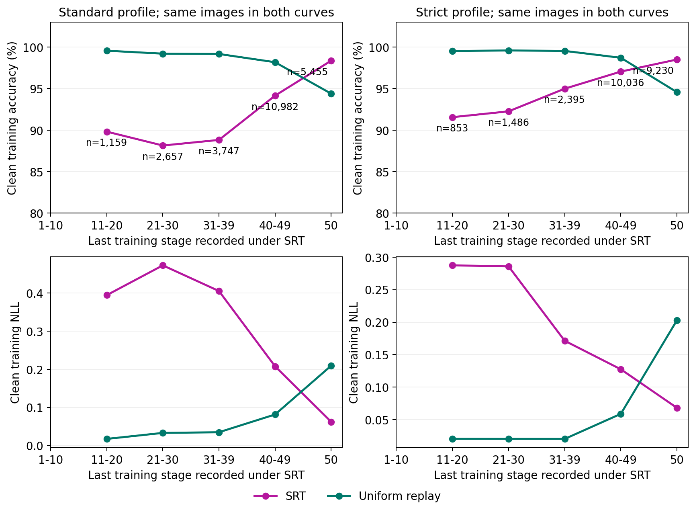
