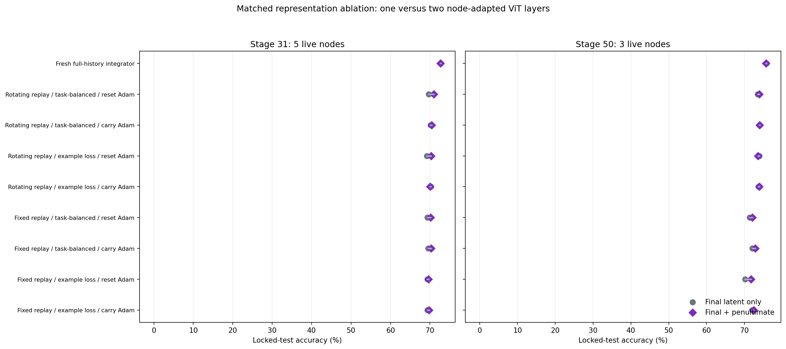
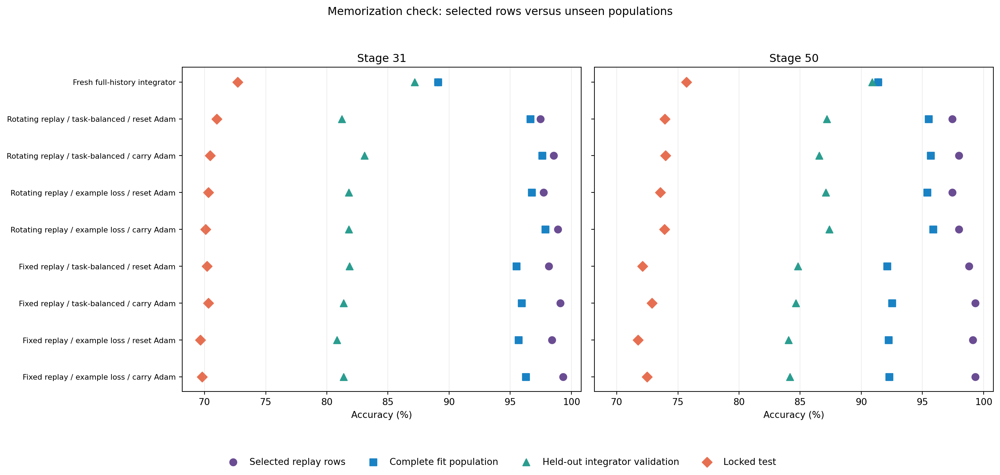
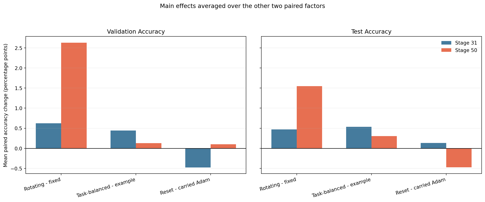

# ImageNet-R-50 two-layer node-latent ablation

## Finding

This run appends each live node's LoRA-adapted penultimate ViT class token to the existing final pre-classifier token. Replay, loss, optimizer policy, hierarchy, and evaluation identities match the single-layer v6 matrix. The validation-selected two-layer condition is **Rotating replay / task-balanced / carry Adam**; the v6 selection was **Rotating replay / example loss / carry Adam**.

| Stage | Single-layer selected | Two-layer selected | Single-layer full history | Two-layer full history | True-node oracle | Joint IID |
| --- | --- | --- | --- | --- | --- | --- |
| 31 | 70.231 | 70.466 | 72.773 | 72.694 | 83.700 | 80.294 |
| 50 | 73.700 | 73.983 | 75.867 | 75.700 | 81.117 | 78.867 |

Across the 16 matched online cells (eight conditions at stages 31 and 50), adding the penultimate latent changes validation accuracy by **+1.680 points** and locked-test accuracy by **+0.524 points** on average. For the original v6-selected condition, the task-31 and task-50 test changes are **-0.157** and **+0.217 points**. These are paired results from one seed, not uncertainty estimates.

## Exact representation change

The added 768 values are the class token after transformer block 11 of 12, before the final block and final backbone normalization, captured while the evaluated node's own LoRA is installed. The existing final token and added penultimate token receive separate per-image layer normalization. Each slot grows from 1,369 to 2,137 values; six slots grow from 8,214 to 12,822. Existing input weights and every downstream parameter use the v6 initialization, while new-latent columns start at zero.

| Stage | Condition | Single val | Two-layer val | Val delta | Single test | Two-layer test | Test delta |
| --- | --- | --- | --- | --- | --- | --- | --- |
| 31 | Fresh full-history integrator | 86.979 | 87.176 | 0.197 | 72.773 | 72.694 | -0.079 |
| 31 | Rotating replay / example loss / carry Adam | 81.076 | 81.797 | 0.722 | 70.231 | 70.073 | -0.157 |
| 31 | Rotating replay / example loss / reset Adam | 78.518 | 81.797 | 3.280 | 69.261 | 70.309 | 1.048 |
| 31 | Rotating replay / task-balanced / carry Adam | 80.485 | 83.076 | 2.591 | 70.178 | 70.466 | 0.288 |
| 31 | Rotating replay / task-balanced / reset Adam | 79.829 | 81.240 | 1.410 | 69.706 | 70.991 | 1.284 |
| 31 | Fixed replay / example loss / carry Adam | 79.731 | 81.371 | 1.640 | 69.340 | 69.785 | 0.445 |
| 31 | Fixed replay / example loss / reset Adam | 79.895 | 80.813 | 0.918 | 69.392 | 69.654 | 0.262 |
| 31 | Fixed replay / task-balanced / carry Adam | 79.731 | 81.371 | 1.640 | 69.575 | 70.309 | 0.734 |
| 31 | Fixed replay / task-balanced / reset Adam | 78.911 | 81.863 | 2.952 | 69.392 | 70.204 | 0.812 |
| 50 | Fresh full-history integrator | 91.167 | 90.896 | -0.271 | 75.867 | 75.700 | -0.167 |
| 50 | Rotating replay / example loss / carry Adam | 85.917 | 87.375 | 1.458 | 73.700 | 73.917 | 0.217 |
| 50 | Rotating replay / example loss / reset Adam | 85.688 | 87.083 | 1.396 | 73.917 | 73.567 | -0.350 |
| 50 | Rotating replay / task-balanced / carry Adam | 85.979 | 86.542 | 0.562 | 74.050 | 73.983 | -0.067 |
| 50 | Rotating replay / task-balanced / reset Adam | 85.854 | 87.187 | 1.333 | 73.550 | 73.933 | 0.383 |
| 50 | Fixed replay / example loss / carry Adam | 83.229 | 84.167 | 0.937 | 72.017 | 72.467 | 0.450 |
| 50 | Fixed replay / example loss / reset Adam | 80.896 | 84.042 | 3.146 | 70.233 | 71.750 | 1.517 |
| 50 | Fixed replay / task-balanced / carry Adam | 83.479 | 84.646 | 1.167 | 72.117 | 72.883 | 0.767 |
| 50 | Fixed replay / task-balanced / reset Adam | 83.083 | 84.812 | 1.729 | 71.367 | 72.117 | 0.750 |

## Two-layer adaptation and generalization

| Stage | Condition | Selected train | Full fit | Validation | Test | Old-task test | Current-task test |
| --- | --- | --- | --- | --- | --- | --- | --- |
| 31 | Fresh full-history integrator | 89.101 | 89.101 | 87.176 | 72.694 | 72.196 | 72.807 |
| 31 | Rotating replay / example loss / carry Adam | 98.890 | 97.868 | 81.797 | 70.073 | 69.521 | 71.930 |
| 31 | Rotating replay / example loss / reset Adam | 97.710 | 96.744 | 81.797 | 70.309 | 70.164 | 68.421 |
| 31 | Rotating replay / task-balanced / carry Adam | 98.551 | 97.605 | 83.076 | 70.466 | 70.059 | 70.175 |
| 31 | Rotating replay / task-balanced / reset Adam | 97.476 | 96.638 | 81.240 | 70.991 | 70.552 | 71.930 |
| 31 | Fixed replay / example loss / carry Adam | 99.311 | 96.269 | 81.371 | 69.785 | 69.062 | 74.561 |
| 31 | Fixed replay / example loss / reset Adam | 98.399 | 95.662 | 80.813 | 69.654 | 69.186 | 71.053 |
| 31 | Fixed replay / task-balanced / carry Adam | 99.089 | 95.941 | 81.371 | 70.309 | 69.948 | 70.175 |
| 31 | Fixed replay / task-balanced / reset Adam | 98.166 | 95.490 | 81.863 | 70.204 | 69.831 | 71.053 |
| 50 | Fresh full-history integrator | 91.359 | 91.359 | 90.896 | 75.700 | 75.003 | 80.909 |
| 50 | Rotating replay / example loss / carry Adam | 97.976 | 95.875 | 87.375 | 73.917 | 73.418 | 77.273 |
| 50 | Rotating replay / example loss / reset Adam | 97.449 | 95.385 | 87.083 | 73.567 | 72.943 | 80.000 |
| 50 | Rotating replay / task-balanced / carry Adam | 97.988 | 95.667 | 86.542 | 73.983 | 73.538 | 79.091 |
| 50 | Rotating replay / task-balanced / reset Adam | 97.449 | 95.516 | 87.187 | 73.933 | 73.487 | 79.091 |
| 50 | Fixed replay / example loss / carry Adam | 99.321 | 92.276 | 84.167 | 72.467 | 71.717 | 80.000 |
| 50 | Fixed replay / example loss / reset Adam | 99.123 | 92.224 | 84.042 | 71.750 | 70.911 | 80.909 |
| 50 | Fixed replay / task-balanced / carry Adam | 99.310 | 92.510 | 84.646 | 72.883 | 72.353 | 80.000 |
| 50 | Fixed replay / task-balanced / reset Adam | 98.807 | 92.120 | 84.812 | 72.117 | 71.451 | 78.182 |

## Within-run replay-factor effects

| Factor | Metric | Mean paired change (pp) |
| --- | --- | --- |
| reset_minus_carried_adam | test_accuracy | -0.170 |
| reset_minus_carried_adam | validation_accuracy | -0.188 |
| rotating_minus_fixed | test_accuracy | 1.009 |
| rotating_minus_fixed | validation_accuracy | 1.627 |
| task_balanced_minus_example | test_accuracy | 0.421 |
| task_balanced_minus_example | validation_accuracy | 0.286 |

## Interpretation boundaries

The representation comparison is nested at initialization and uses identical image identities and schedules, but it has one seed and a previously examined locked test. The full-history conditions retrain only the integrator on all fit identities; they leave the fragmented LoRA nodes frozen and do not satisfy the online effort constraint. The 4,800-image integrator validation partition was seen during upstream node fitting, so it is not an end-to-end clean validation split.

## Reproducibility and work

All online cells retain H=8,192 and four epochs per arrival. Test behavior remained unavailable until all online and three-restart full-history models were sealed. The exact-resume pass performed zero new optimizer steps and left all source and target model artifacts unchanged.

| Condition | Parameters | Image presentations | Optimizer steps | Fit seconds |
| --- | --- | --- | --- | --- |
| Fixed replay / example loss / carry Adam | 13841352 | 1375876 | 2760 | 21.855 |
| Fixed replay / example loss / reset Adam | 13841352 | 1375876 | 2760 | 21.428 |
| Fixed replay / task-balanced / carry Adam | 13841352 | 1375876 | 2760 | 21.767 |
| Fixed replay / task-balanced / reset Adam | 13841352 | 1375876 | 2760 | 21.998 |
| Rotating replay / example loss / carry Adam | 13841352 | 1375876 | 2760 | 21.535 |
| Rotating replay / example loss / reset Adam | 13841352 | 1375876 | 2760 | 20.596 |
| Rotating replay / task-balanced / carry Adam | 13841352 | 1375876 | 2760 | 20.625 |
| Rotating replay / task-balanced / reset Adam | 13841352 | 1375876 | 2760 | 20.746 |
| Fresh full-history integrator | 13841352 | 1895834 | 3744 | 71.430 |

Machine-readable representation, condition, factor, replay-selection, per-task, and resource tables accompany this report in CSV, JSON, and Parquet formats.
