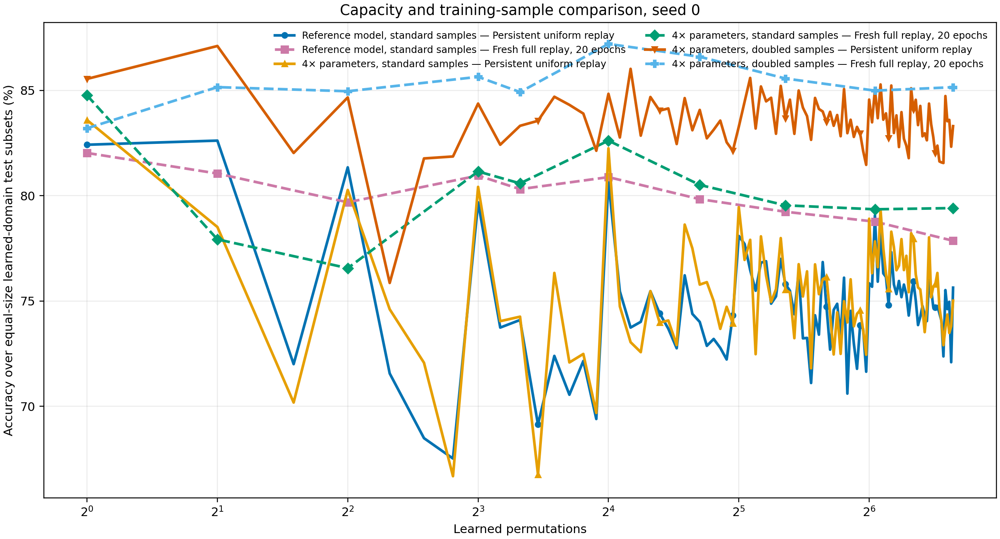
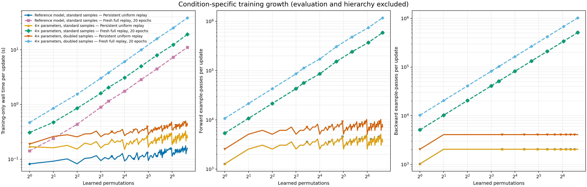
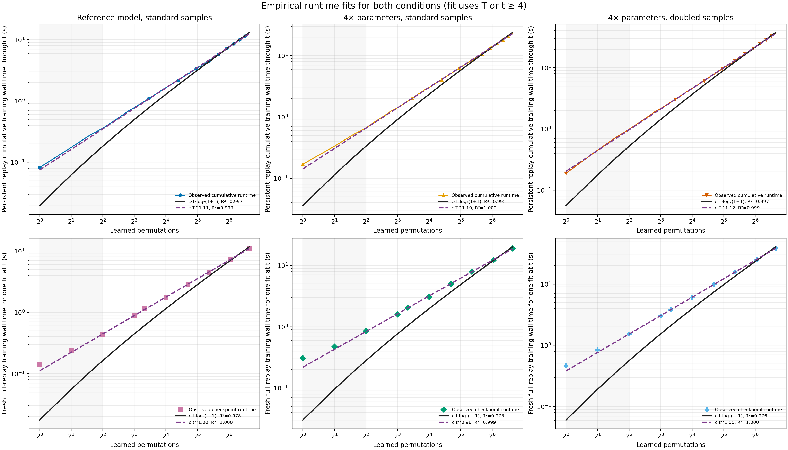
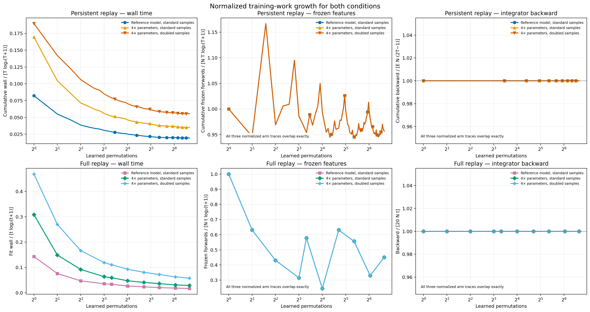
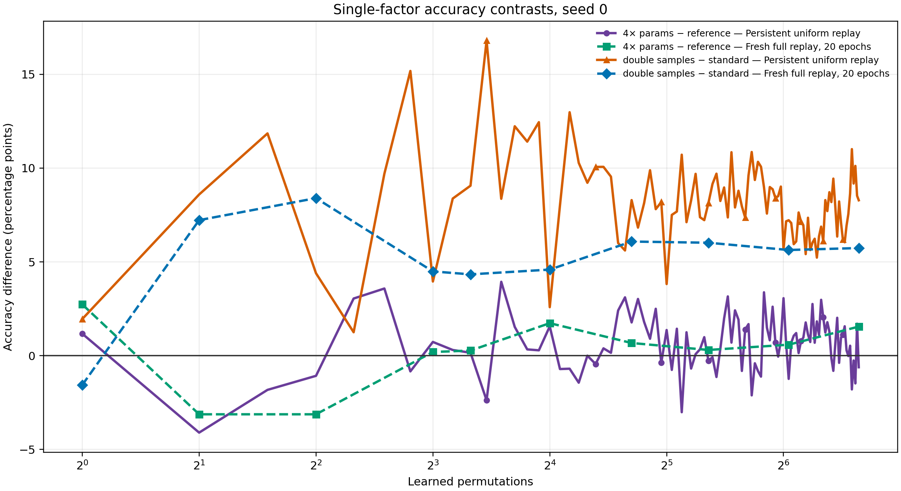

# 100-permutation capacity and sample-count experiment

## Result

The run completed under config hash `26adf88c61114a8cd32e6aa25dcc2c4aa8bc62b7c020db9878a9d42281492dd2` for seed 0. At
permutation 100, the persistent uniform-replay accuracies were
75.64% for the reference,
75.02% for 4×
parameters with the same samples, and
83.30% for 4×
parameters with doubled samples. The isolated capacity contrast was
-0.62 percentage points; the isolated
sample contrast was +8.29 points.

For the fresh 20-epoch full-replay fits at permutation 100, the corresponding
accuracies were 77.86%,
79.41%, and
85.15%. The
capacity contrast was +1.55 points and
the sample contrast was +5.74 points.
The capacity increase did not improve both measured training conditions at step 100. Doubling task samples improved both large-model conditions at step 100. These are observations for one seed and one
fixed domain order, not estimates of mean effects.

The new base stopped after 54 epochs
(`minimum_learning_rate_plateau`), restored epoch
14, reached
98.50% validation
accuracy at that epoch, and reached
98.50% on identity-MNIST
test examples. Test accuracy did not control training or architecture choice.

## What each arm literally changes

| Arm | Base MLP | Base parameters | Integrator MLP | Integrator parameters | Node examples/domain | Observer examples/domain | Historical replay after step 1 |
|---|---|---:|---|---:|---:|---:|---:|
| Reference model, standard samples | 1024/1024/512 | 2,383,370 | 1024/512/256 | 4,411,658 | 256 | 256 | 256 |
| 4× parameters, standard samples | 2272/2272/1136 | 9,541,274 | 1912/956/478 | 17,650,160 | 256 | 256 | 256 |
| 4× parameters, doubled samples | 2272/2272/1136 | 9,541,274 | 1912/956/478 | 17,650,160 | 512 | 512 | 512 |

The base parameter ratio is
4.0033× and the
integrator ratio is
4.0008×.
Reference versus large/standard isolates capacity. Large/standard versus
large/doubled isolates samples. All original training-role rows are retained in
the doubled arm, evaluation rows are identical, and the two large integrators
start from the same weights. Only one node per temporal level is allowed.

`Persistent uniform replay` is one continuing integrator trained four epochs
per domain on the current observer batch and, after step 1, an equally weighted
uniform historical batch. `Fresh full replay, 20 epochs` discards prior
integrator state at each reported checkpoint and trains a new model for exactly
20 epochs on all observer examples seen so far. It has no early stopping and is
not claimed to be converged.

## Reporting correction

The first report version plotted empirical fits only for full replay. That
omitted the requested fit for persistent replay. This revision adds cumulative
persistent wall-time and forward-pass fits over all 100 updates, gives both
conditions equal space in the normalized diagnostics, and leaves every
training measurement unchanged.

## Persistent-replay runtime scaling

Persistent replay runs once at every task, so its end-to-end scaling quantity
is cumulative training work through learned-task count `T`. The table fits all
cumulative observations with `T >= 4`. The `T log T` curve is
`work = c × T × log2(T+1)` through the origin. The power curve is
`work = c × T^p`. R-squared is calculated on the original measurement scale,
including for the power fit.

| Arm | Cumulative wall T-log coefficient | Wall T-log R² | Wall power p | Wall power R² | Cumulative forward-pass T-log R² | Forward-pass power p | Forward-pass power R² |
|---|---:|---:|---:|---:|---:|---:|---:|
| Reference model, standard samples | 0.01963 | 0.997 | 1.111 | 0.999 | 0.992 | 1.119 | 1.000 |
| 4× parameters, standard samples | 0.03577 | 0.995 | 1.103 | 1.000 | 0.992 | 1.119 | 1.000 |
| 4× parameters, doubled samples | 0.05617 | 0.997 | 1.123 | 0.999 | 0.992 | 1.119 | 1.000 |

| Arm | Cumulative wall at T=100 (s) | Wall / T-log | Cumulative frozen features / (N T-log) | Cumulative backward / [E N (2T−1)] |
|---|---:|---:|---:|---:|
| Reference model, standard samples | 12.876 | 0.01934 | 0.957 | 1.000 |
| 4× parameters, standard samples | 23.237 | 0.03490 | 0.957 | 1.000 |
| 4× parameters, doubled samples | 36.913 | 0.05544 | 0.957 | 1.000 |

Here `E=4` persistent-training epochs and `N` is the current-task sample count
for the arm. The backward denominator is exact: step 1 trains on `N` examples,
and each later step trains on `N` current plus `N` replay examples. The
frozen-feature numerator is measured separately from integrator work.

## Full-replay runtime scaling

Full replay was sampled at ten checkpoints. Its plotted quantity is the cost
of one fresh 20-epoch fit at task count `t`, not cumulative full replay through
all preceding task counts. Fits use the sampled checkpoints with
`t >= 4` and the same through-origin `t log2(t+1)` and power
curves.

| Arm | Fit wall t-log coefficient | Wall t-log R² | Wall power p | Wall power R² | Fit forward-pass t-log R² | Forward-pass power p | Forward-pass power R² |
|---|---:|---:|---:|---:|---:|---:|---:|
| Reference model, standard samples | 0.01753 | 0.978 | 0.998 | 1.000 | 0.980 | 1.028 | 0.999 |
| 4× parameters, standard samples | 0.03018 | 0.973 | 0.965 | 0.999 | 0.980 | 1.028 | 0.999 |
| 4× parameters, doubled samples | 0.06060 | 0.976 | 1.000 | 1.000 | 0.980 | 1.028 | 0.999 |

| Arm | Fit wall / t-log at 100 | Frozen features / (N t-log) | Backward / (20 N t) |
|---|---:|---:|---:|
| Reference model, standard samples | 0.01665 | 0.451 | 1.000 |
| 4× parameters, standard samples | 0.02869 | 0.451 | 1.000 |
| 4× parameters, doubled samples | 0.05742 | 0.451 | 1.000 |

The one-node frontier has `popcount(t)` active nodes. After step 1, one
persistent update performs constant integrator work on `2N` examples and
`2N × popcount(t)` frozen-feature forwards. Its integrator-only cumulative
work is therefore linear, while its cumulative frozen-feature work is
`N + 2N × sum(popcount(k), k=2..T)`, which is `Theta(T log T)`. One full-replay
fit performs `20Nt` integrator forwards and backwards plus
`Nt × popcount(t)` frozen-feature forwards. Its integrator component is
exactly linear in `t`; only its frozen-feature term has the logarithmic upper
bound.

Reference seconds came from the preceding GPU process, whereas the two new
arms were measured in this run. Pass-count comparisons are stronger than
cross-session wall-time comparisons.

## Checkpoint measurements

| Learned permutations | Arm | Condition | Accuracy | Training seconds | Forward example-passes | Backward example-passes |
|---:|---|---|---:|---:|---:|---:|
| 1 | Reference model, standard samples | Persistent uniform replay | 82.42% | 0.082 | 1,280 | 1,024 |
| 1 | Reference model, standard samples | Fresh full replay, 20 epochs | 82.03% | 0.142 | 5,376 | 5,120 |
| 1 | 4× parameters, standard samples | Persistent uniform replay | 83.59% | 0.169 | 1,280 | 1,024 |
| 1 | 4× parameters, standard samples | Fresh full replay, 20 epochs | 84.77% | 0.308 | 5,376 | 5,120 |
| 1 | 4× parameters, doubled samples | Persistent uniform replay | 85.55% | 0.190 | 2,560 | 2,048 |
| 1 | 4× parameters, doubled samples | Fresh full replay, 20 epochs | 83.20% | 0.468 | 10,752 | 10,240 |
| 2 | Reference model, standard samples | Persistent uniform replay | 82.62% | 0.092 | 2,560 | 2,048 |
| 2 | Reference model, standard samples | Fresh full replay, 20 epochs | 81.05% | 0.240 | 10,752 | 10,240 |
| 2 | 4× parameters, standard samples | Persistent uniform replay | 78.52% | 0.162 | 2,560 | 2,048 |
| 2 | 4× parameters, standard samples | Fresh full replay, 20 epochs | 77.93% | 0.472 | 10,752 | 10,240 |
| 2 | 4× parameters, doubled samples | Persistent uniform replay | 87.11% | 0.261 | 5,120 | 4,096 |
| 2 | 4× parameters, doubled samples | Fresh full replay, 20 epochs | 85.16% | 0.855 | 21,504 | 20,480 |
| 4 | Reference model, standard samples | Persistent uniform replay | 81.35% | 0.082 | 2,560 | 2,048 |
| 4 | Reference model, standard samples | Fresh full replay, 20 epochs | 79.69% | 0.435 | 21,504 | 20,480 |
| 4 | 4× parameters, standard samples | Persistent uniform replay | 80.27% | 0.153 | 2,560 | 2,048 |
| 4 | 4× parameters, standard samples | Fresh full replay, 20 epochs | 76.56% | 0.854 | 21,504 | 20,480 |
| 4 | 4× parameters, doubled samples | Persistent uniform replay | 84.67% | 0.256 | 5,120 | 4,096 |
| 4 | 4× parameters, doubled samples | Fresh full replay, 20 epochs | 84.96% | 1.543 | 43,008 | 40,960 |
| 8 | Reference model, standard samples | Persistent uniform replay | 79.69% | 0.094 | 2,560 | 2,048 |
| 8 | Reference model, standard samples | Fresh full replay, 20 epochs | 80.96% | 0.891 | 43,008 | 40,960 |
| 8 | 4× parameters, standard samples | Persistent uniform replay | 80.42% | 0.161 | 2,560 | 2,048 |
| 8 | 4× parameters, standard samples | Fresh full replay, 20 epochs | 81.15% | 1.605 | 43,008 | 40,960 |
| 8 | 4× parameters, doubled samples | Persistent uniform replay | 84.38% | 0.259 | 5,120 | 4,096 |
| 8 | 4× parameters, doubled samples | Fresh full replay, 20 epochs | 85.64% | 3.015 | 86,016 | 81,920 |
| 10 | Reference model, standard samples | Persistent uniform replay | 74.10% | 0.101 | 3,072 | 2,048 |
| 10 | Reference model, standard samples | Fresh full replay, 20 epochs | 80.31% | 1.152 | 56,320 | 51,200 |
| 10 | 4× parameters, standard samples | Persistent uniform replay | 74.26% | 0.189 | 3,072 | 2,048 |
| 10 | 4× parameters, standard samples | Fresh full replay, 20 epochs | 80.59% | 2.052 | 56,320 | 51,200 |
| 10 | 4× parameters, doubled samples | Persistent uniform replay | 83.32% | 0.287 | 6,144 | 4,096 |
| 10 | 4× parameters, doubled samples | Fresh full replay, 20 epochs | 84.92% | 3.817 | 112,640 | 102,400 |
| 16 | Reference model, standard samples | Persistent uniform replay | 80.69% | 0.093 | 2,560 | 2,048 |
| 16 | Reference model, standard samples | Fresh full replay, 20 epochs | 80.88% | 1.744 | 86,016 | 81,920 |
| 16 | 4× parameters, standard samples | Persistent uniform replay | 82.25% | 0.152 | 2,560 | 2,048 |
| 16 | 4× parameters, standard samples | Fresh full replay, 20 epochs | 82.62% | 3.086 | 86,016 | 81,920 |
| 16 | 4× parameters, doubled samples | Persistent uniform replay | 84.84% | 0.269 | 5,120 | 4,096 |
| 16 | 4× parameters, doubled samples | Fresh full replay, 20 epochs | 87.21% | 6.067 | 172,032 | 163,840 |
| 26 | Reference model, standard samples | Persistent uniform replay | 74.01% | 0.113 | 3,584 | 2,048 |
| 26 | Reference model, standard samples | Fresh full replay, 20 epochs | 79.84% | 2.863 | 153,088 | 133,120 |
| 26 | 4× parameters, standard samples | Persistent uniform replay | 75.78% | 0.214 | 3,584 | 2,048 |
| 26 | 4× parameters, standard samples | Fresh full replay, 20 epochs | 80.51% | 5.016 | 153,088 | 133,120 |
| 26 | 4× parameters, doubled samples | Persistent uniform replay | 84.07% | 0.328 | 7,168 | 4,096 |
| 26 | 4× parameters, doubled samples | Fresh full replay, 20 epochs | 86.60% | 9.958 | 306,176 | 266,240 |
| 41 | Reference model, standard samples | Persistent uniform replay | 75.80% | 0.114 | 3,584 | 2,048 |
| 41 | Reference model, standard samples | Fresh full replay, 20 epochs | 79.24% | 4.451 | 241,408 | 209,920 |
| 41 | 4× parameters, standard samples | Persistent uniform replay | 75.53% | 0.230 | 3,584 | 2,048 |
| 41 | 4× parameters, standard samples | Fresh full replay, 20 epochs | 79.54% | 7.950 | 241,408 | 209,920 |
| 41 | 4× parameters, doubled samples | Persistent uniform replay | 83.67% | 0.358 | 7,168 | 4,096 |
| 41 | 4× parameters, doubled samples | Fresh full replay, 20 epochs | 85.57% | 15.871 | 482,816 | 419,840 |
| 66 | Reference model, standard samples | Persistent uniform replay | 79.07% | 0.130 | 3,072 | 2,048 |
| 66 | Reference model, standard samples | Fresh full replay, 20 epochs | 78.77% | 7.275 | 371,712 | 337,920 |
| 66 | 4× parameters, standard samples | Persistent uniform replay | 77.83% | 0.195 | 3,072 | 2,048 |
| 66 | 4× parameters, standard samples | Fresh full replay, 20 epochs | 79.36% | 12.294 | 371,712 | 337,920 |
| 66 | 4× parameters, doubled samples | Persistent uniform replay | 85.06% | 0.342 | 6,144 | 4,096 |
| 66 | 4× parameters, doubled samples | Fresh full replay, 20 epochs | 84.99% | 25.040 | 743,424 | 675,840 |
| 100 | Reference model, standard samples | Persistent uniform replay | 75.64% | 0.156 | 3,584 | 2,048 |
| 100 | Reference model, standard samples | Fresh full replay, 20 epochs | 77.86% | 11.086 | 588,800 | 512,000 |
| 100 | 4× parameters, standard samples | Persistent uniform replay | 75.02% | 0.247 | 3,584 | 2,048 |
| 100 | 4× parameters, standard samples | Fresh full replay, 20 epochs | 79.41% | 19.103 | 588,800 | 512,000 |
| 100 | 4× parameters, doubled samples | Persistent uniform replay | 83.30% | 0.418 | 7,168 | 4,096 |
| 100 | 4× parameters, doubled samples | Fresh full replay, 20 epochs | 85.15% | 38.233 | 1,177,600 | 1,024,000 |

## Shared hierarchy work

Temporal-node construction is required by both integrator conditions, so it is
recorded once and excluded from both condition curves.

| New arm | Hierarchy forward example-passes | Hierarchy backward example-passes |
|---|---:|---:|
| 4× parameters, standard samples | 3,338,240 | 3,338,240 |
| 4× parameters, doubled samples | 6,676,480 | 6,676,480 |

## Acceptance checks

| Check | Result |
|---|---|
| all metrics finite | pass |
| base parameter target exact | pass |
| full replay cells exact | pass |
| full replay exactly twenty epochs | pass |
| generated sample counts exact | pass |
| hierarchy cells exact | pass |
| integrator parameter target exact | pass |
| one node per level only | pass |
| reference cells exact | pass |
| single seed exact | pass |
| uniform cells exact | pass |

## Figures

## Limits

This is one seed with one fixed permutation order, so there is no variance
estimate and no order-sensitivity estimate. The reference is authenticated
from the previous run rather than timed in the same process. Accuracy is the
mean over equal 256-example test subsets for learned domains. The 20-epoch
full-replay condition is a fixed-budget comparator, not a converged upper
bound. Doubling samples intentionally doubles node-training and replay work;
the resulting accuracy difference is the effect of that entire data-budget
change under the large architecture.
