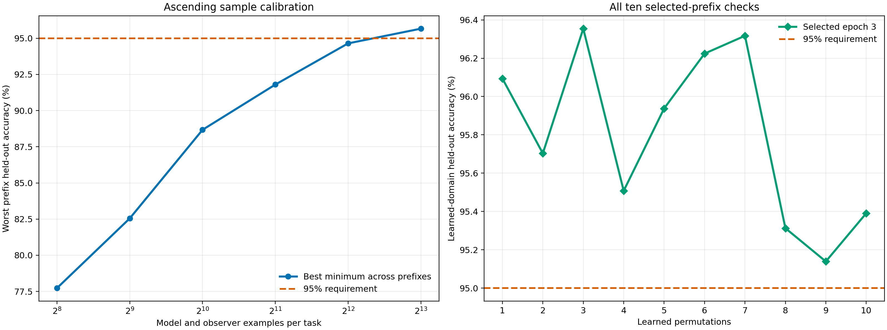
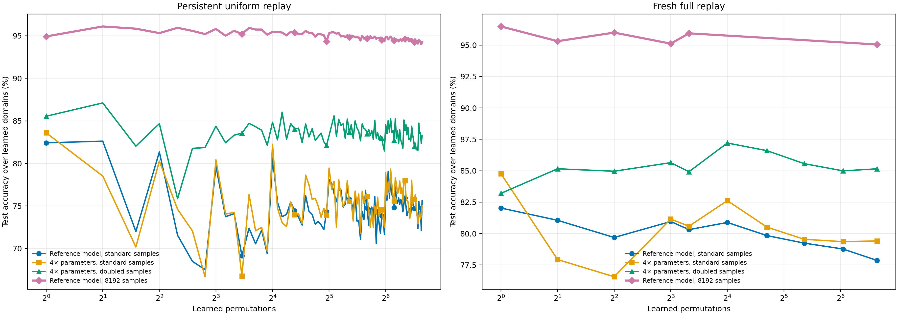
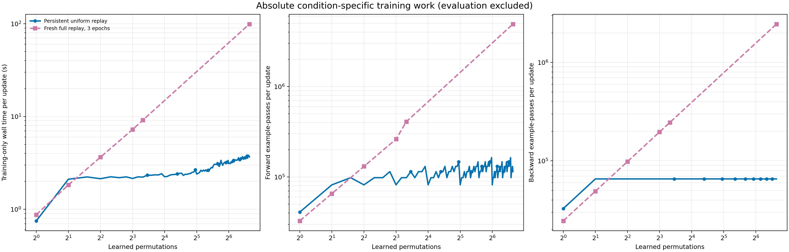
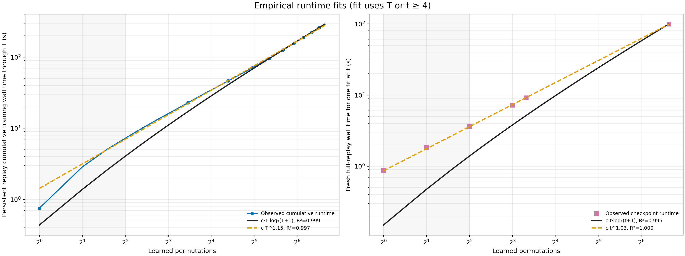
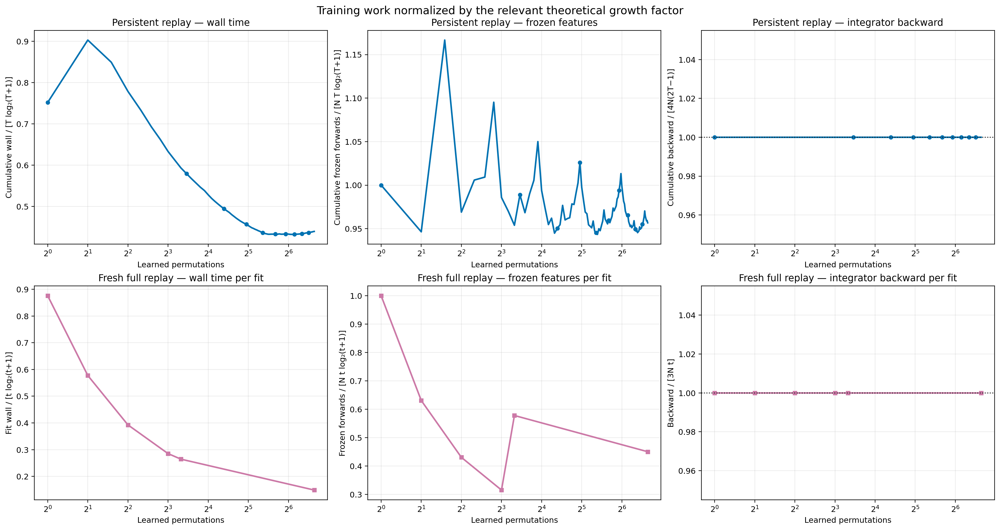
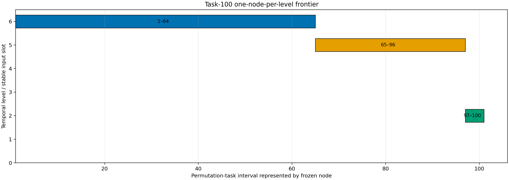

# Sample-calibrated 100-permutation integrator comparison

## Outcome

The reference-sized model passed the calibration with 8192 model
examples and 8192 disjoint observer examples per task. Fresh full
replay first cleared 95% at all ten prefixes after 3 epochs. At
task 100, persistent uniform replay reached
94.26% test accuracy and fresh
full replay reached
95.05%.
This is one fixed-order seed, so the difference is not a variance estimate.

The task-100 full-replay fit ran before persistent training. It took
99.09 training
seconds. By then, calibration, hierarchy construction, and the endpoint fit had
already consumed 3815.34
seconds, which exceeded the 3600-second
limit. The four optional fits themselves were projected to add only
171.07 seconds after the 1.25 safety factor. They were
omitted because
the complete projected total with them was 4618.63 seconds.

| Projection component | Seconds |
|---|---:|
| Calibration and hierarchy already elapsed | 3716.25 |
| Task-100 full-replay endpoint already elapsed | 99.09 |
| Remaining mandatory fits and persistent training, projected with 1.25 safety factor | 332.22 |
| Reporting reserve | 300.00 |
| Required projected total without optional fits | 4447.56 |
| Four optional fits, projected with 1.25 safety factor | 171.07 |
| Projected total with optional fits | 4618.63 |

Two earlier endpoint attempts were killed before producing a checkpoint because
the old implementation simultaneously held the complete image archive and a
roughly 12 GB dense feature matrix. The corrected implementation computed every
frozen feature exactly once into a temporary float32 memory map, retained at
most 8,192 feature
rows in anonymous memory, preserved the original seeded minibatch order, and
deleted the cache after checkpoint publication. This storage-only correction is
authenticated by `protocol-amendment-oom-streaming.json`; the completed sample
calibration and frozen hierarchy were retained unchanged.

## Exact condition definitions

| Report name | What was trained |
|---|---|
| Persistent uniform replay | One integrator continued across all 100 tasks. At each task it trained four epochs on 8192 current observer examples and, after task 1, 8192 examples sampled uniformly from all earlier tasks. Current and historical losses each had weight 0.5. |
| Fresh full replay | A new integrator was initialized at every reported checkpoint and trained 3 epochs on all 8192 observer examples from every task seen by that checkpoint. |

Both conditions used the same frozen reference MLP, permutation order,
one-node-per-level hierarchy, and test subsets. The smaller model was retained
because it met the calibration requirement; the 4x-parameter model was not
rerun.

## Sample and epoch calibration

| Samples per role and task | Best worst-prefix accuracy | Best epoch | Result |
|---:|---:|---:|---|
| 256 | 77.73% | 6 | failed_threshold |
| 512 | 82.55% | 4 | failed_threshold |
| 1024 | 88.67% | 7 | failed_threshold |
| 2048 | 91.80% | 9 | failed_threshold |
| 4096 | 94.64% | 5 | failed_threshold |
| 8192 | 95.66% | 9 | passing |

The selection used 128 held-out training examples per learned domain. It
required every prefix accuracy below to reach 95% at the same epoch. It did
not evaluate final test examples.

| Prefix task | Held-out accuracy at selected epoch |
|---:|---:|
| 1 | 96.09% |
| 2 | 95.70% |
| 3 | 96.35% |
| 4 | 95.51% |
| 5 | 95.94% |
| 6 | 96.22% |
| 7 | 96.32% |
| 8 | 95.31% |
| 9 | 95.14% |
| 10 | 95.39% |

## Accuracy against the earlier experiment

The two panels separate persistent and fresh-full-replay training so four
model/sample arms remain visually distinct. Earlier full-replay arms used 20
epochs; the new purple arm uses the 3-epoch calibrated budget.

| Learned tasks | Persistent uniform accuracy | Fresh full-replay accuracy | Fresh full-replay training seconds |
|---:|---:|---:|---:|
| 1 | 94.92% | 96.48% | 0.88 |
| 2 | 96.09% | 95.31% | 1.83 |
| 4 | 95.31% | 96.00% | 3.65 |
| 8 | 95.80% | 95.12% | 7.23 |
| 10 | 95.59% | 95.94% | 9.15 |
| 100 | 94.26% | 95.05% | 99.09 |

## Training work

The initial calibrated report replaced the established scaling layout with four
unfitted absolute curves. That made the persistent condition's cumulative
`T log T` comparison invisible. This revision restores the absolute, fitted,
and normalized views used by the preceding capacity report. It changes no
training measurement.

The absolute plot restores the earlier report format: each panel shows both
conditions for the same quantity. A persistent point is the cost of that task's
one update. A fresh-full-replay point is the cost of one newly initialized fit
at that checkpoint. Forward counts include frozen-node feature forwards plus
integrator training forwards; backward counts include only integrator training
backwards.

Evaluation is excluded. Validation passes used to select samples and epochs are
retained separately in `sample_calibration_metrics.csv`. Full-replay wall time
includes temporary-cache writes and shuffled reads; the storage correction does
not change the examples, model passes, or optimizer updates.

### Persistent replay: cumulative scaling through task T

Persistent replay performs one update at every task, so its end-to-end cost is
the cumulative sum of all updates through `T`. The table fits observations from
`T >= 4`. The through-origin comparison is
`work = c × T × log2(T+1)`; the empirical alternative is `work = c × T^p`.
R-squared is calculated on the original measurement scale.

| Persistent cumulative series | T-log coefficient c | T-log R² | Power p | Power R² |
|---|---:|---:|---:|---:|
| Cumulative wall seconds | 0.43605 | 0.999 | 1.146 | 0.997 |
| Cumulative total forward example-passes | 18319.4 | 0.992 | 1.119 | 1.000 |

Measured cumulative wall time is slightly better described by `T log T`
(R²=0.999) than by
the fitted power curve
(R²=0.997,
`p=1.146`). Counted forward
passes follow the exact popcount schedule rather than a smooth curve; their
finite-range power fit is numerically tighter, but the schedule's asymptotic
bound remains `Theta(T log T)`.

At `T=100`, cumulative persistent wall time was 292.53
seconds. Dividing by `T log2(T+1)` gives
0.43936 seconds. Cumulative frozen-node
forwards divided by `N T log2(T+1)` equal
0.957. Cumulative integrator backwards divided by
their exact count, `4N(2T-1)`, equal 1.000.

### Fresh full replay: cost of one fit at task t

Fresh full replay was measured only at the six scheduled checkpoints. Its
series is therefore the cost of one independent fresh fit at `t`, not a
cumulative sum of fits at every earlier task. Fits again use
`t >= 4` and the same through-origin `t log2(t+1)` and power
curves.

| Fresh-fit series | t-log coefficient c | t-log R² | Power p | Power R² |
|---|---:|---:|---:|---:|
| Wall seconds for one fresh fit | 0.14938 | 0.995 | 1.029 | 1.000 |
| Total forward example-passes for one fresh fit | 7399.7 | 0.998 | 1.128 | 1.000 |

For wall time, the nearly linear power fit
(`p=1.029`,
R²=1.000) is tighter than the
`t log t` comparison
(R²=0.995). The three
epochs of linear integrator work and memory-map I/O dominate the frozen-feature
term over these tasks. Only four sampled points—tasks 4, 8, 10, and 100—enter
these fits, so the fitted exponent is descriptive rather than a reliable
asymptotic estimate.

At `t=100`, wall time divided by `t log2(t+1)` is
0.14882 seconds. Frozen-node forwards divided by
`N t log2(t+1)` equal 0.451. Integrator backwards
divided by their exact count, `3Nt`, equal
1.000.

The one-node frontier contains `popcount(t)` active frozen nodes. Persistent
replay evaluates a fixed `2N` examples after task 1, so cumulative frozen-node
work is `N + 2N × sum(popcount(k), k=2..T)`, which is `Theta(T log T)`.
Persistent integrator forward/backward work is exactly linear in `T`. One fresh
full-replay fit evaluates `Nt` examples against `popcount(t)` nodes, so its
frozen-node component is `Theta(t log t)` and its integrator component is
linear in `t`. If fresh full replay were actually rerun after every task, its
cumulative cost would instead be `Theta(T² log T)`; this protocol skipped
unsampled fits because they do not affect the independently initialized fits
that were measured.

### Direct endpoint work comparison

The persistent column below is all training accumulated from tasks 1 through
100. The fresh-full-replay column is only the independent task-100 fit. This is
the like-for-purpose endpoint comparison; it is not the cumulative cost of
running fresh full replay at every task.

| Quantity | Persistent cumulative through T=100 | Fresh full replay at t=100 | Fresh / persistent |
|---|---:|---:|---:|
| Wall time (s) | 292.53 | 99.09 | 0.339 |
| Frozen-feature forward example-passes | 5,218,304 | 2,457,600 | 0.471 |
| Integrator forward example-passes | 6,520,832 | 2,457,600 | 0.377 |
| Integrator backward example-passes | 6,520,832 | 2,457,600 | 0.377 |

### Scheduled checkpoint measurements

| Learned tasks | Condition and scope | Training seconds | Forward example-passes | Backward example-passes |
|---:|---|---:|---:|---:|
| 1 | Persistent uniform replay — one update | 0.752 | 40,960 | 32,768 |
| 1 | Fresh full replay — one 3-epoch fit | 0.876 | 32,768 | 24,576 |
| 2 | Persistent uniform replay — one update | 2.111 | 81,920 | 65,536 |
| 2 | Fresh full replay — one 3-epoch fit | 1.830 | 65,536 | 49,152 |
| 4 | Persistent uniform replay — one update | 2.137 | 81,920 | 65,536 |
| 4 | Fresh full replay — one 3-epoch fit | 3.648 | 131,072 | 98,304 |
| 8 | Persistent uniform replay — one update | 2.151 | 81,920 | 65,536 |
| 8 | Fresh full replay — one 3-epoch fit | 7.235 | 262,144 | 196,608 |
| 10 | Persistent uniform replay — one update | 2.223 | 98,304 | 65,536 |
| 10 | Fresh full replay — one 3-epoch fit | 9.149 | 409,600 | 245,760 |
| 100 | Persistent uniform replay — one update | 3.666 | 114,688 | 65,536 |
| 100 | Fresh full replay — one 3-epoch fit | 99.089 | 4,915,200 | 2,457,600 |

## Frozen hierarchy at task 100

Each bar is one active frozen temporal node. Its vertical position is the
stable integrator input slot and its label is the inclusive task interval it
represents.

## Acceptance checks

| Check | Passed |
|---|---|
| all metrics finite | True |
| bounded memory full replay | True |
| calibration passes every prefix | True |
| earlier sample candidates failed | True |
| full replay cells match frozen schedule | True |
| full replay epoch budget exact | True |
| full replay work exact | True |
| hierarchy cells exact | True |
| optional checkpoint decision matches projection | True |
| reference model selected | True |
| sample counts exact | True |
| task 100 endpoint matches final row | True |
| test set sealed during selection | True |
| uniform every permutation | True |
| uniform work exact | True |

The overall status is complete. The resolved config identity is
e22281a78ae6864ac8a4348bec68fad0b208faad3c721b04b928ff21540e9d9a.

## Limits

Calibration on one fixed validation split can overstate how reliably 95% will
hold on other sample draws or permutation orders. Passing tasks 1–10 does not
guarantee 95% at task 100. Fresh full replay is a high-information baseline at
a validation-selected fixed epoch count, not a mathematical best-possible
integrator or a proof of convergence.
