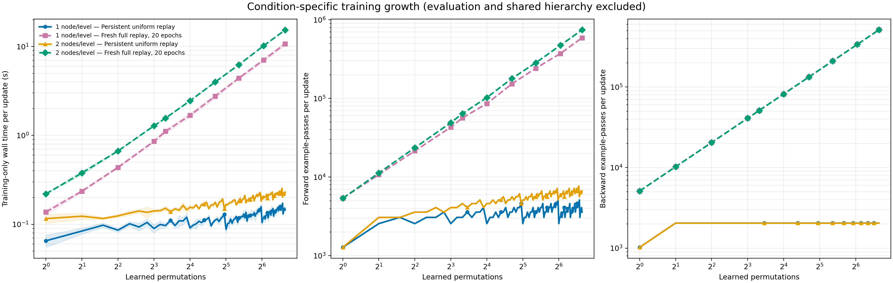
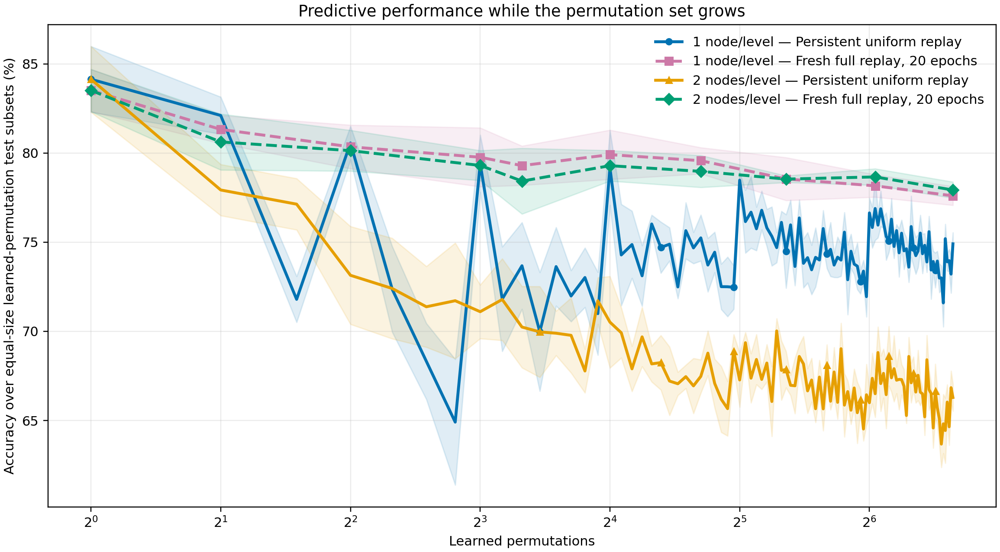
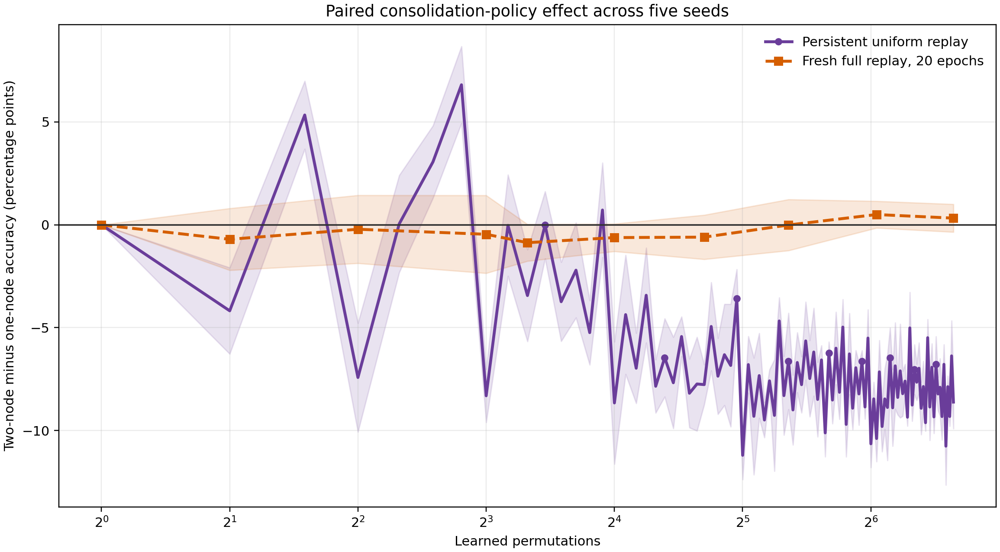
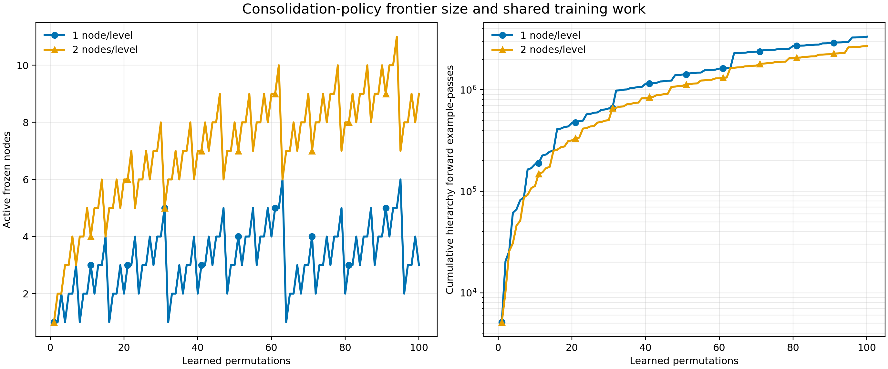

# 100-permutation integrator scaling: five seeds and two consolidation capacities

## Result

The run completed under config hash `81f6d7f10d752f6b68058a254945c10db281d852e13066a49f3d29d7787f344f` with five paired run seeds. At permutation 100, one-node uniform replay reached 74.91% ± 0.63% accuracy; two-node uniform replay reached 66.29% ± 0.76%. The paired two-node-minus-one-node difference was -8.62 ± 1.29 percentage points across seeds.

At the same checkpoint, the fresh 20-epoch full-replay fit reached 77.60% ± 0.53% with one node per level and 77.93% ± 0.46% with two. Its paired policy difference was +0.33 ± 0.68 points. These are sample means and sample standard deviations, not confidence intervals.

The full-replay update's mean wall time grew from 0.137 to 10.728 seconds under one-node consolidation and from 0.220 to 15.369 seconds under two-node consolidation. Example-pass counts, rather than seconds, carry the hardware-independent scaling conclusion.

## Conditions, in literal terms

| Report label | Exactly what was trained |
|---|---|
| Persistent uniform replay | One persistent integrator per policy and seed. At each permutation it trains four epochs on 256 current observer examples plus, after step 1, 256 examples sampled uniformly from all earlier observer examples. Current and historical loss each receive weight 0.5. |
| Fresh full replay, 20 epochs | At each sampled checkpoint and for each policy/seed pair, discard prior integrator state, initialize a fresh integrator, build features for every observer example seen so far, and train exactly 20 epochs. There is no validation, early stopping, restart selection, or convergence claim. |

Both run under one-node-per-level and two-nodes-per-level consolidation. On a two-node overflow, the two older resident nodes merge and the newest remains. Primary slots preserve the predecessor's seven input positions; seven secondary slots are appended with exact-zero input weights. The one-node integrator has 4,411,658 parameters and the two-node integrator has 8,160,522; an integrator example-pass is therefore more expensive under the two-node policy even when the pass count matches.

There are 100 domains total: identity plus 99 independently seeded fixed pixel permutations. Their order is fixed across seeds. Run seeds vary allocated examples, held-out subsets, node training, integrator training, and replay draws, but not the permutation order.

## Training-work boundary

The timed condition total includes state initialization, replay/archive preparation, frozen-node forwards used to construct training features, and integrator optimizer forwards/backwards. It excludes pre/post diagnostics, learned-domain test inference, report generation, artifact I/O, and shared temporal-node construction. Excluded inference counts remain in explicit audit columns.

Let `a_c(k)` be the active-node count at step `k` under capacity `c`. Uniform replay uses `512 a_c(k) + 2,048` forward example-passes and 2,048 backward example-passes after step 1: `O(log k)` forward and `O(1)` backward per update for either fixed capacity. Full replay uses `256k a_c(k) + 20 × 256k` forward and `20 × 256k` backward example-passes: `O(k log k)` forward and `O(k)` backward per sampled fit. If full replay ran every step, its cumulative bounds would be `O(T² log T)` forward and `O(T²)` backward.

At step 100 the one-node frontier has 3 active nodes and the two-node frontier has 9. Shared hierarchy construction used 3,338,240 forward and the same number of backward example-passes per seed for one-node consolidation, versus 2,693,120 each for two-node consolidation. These shared costs are in `hierarchy_work.csv` and are not charged to both integrator conditions.

## Five-seed checkpoint means

| Learned permutations | Nodes per level | Condition | Accuracy mean ± SD | Training seconds mean ± SD | Forward example-passes | Backward example-passes |
|---:|---:|---|---:|---:|---:|---:|
| 1 | 1 | Persistent uniform replay | 84.14% ± 1.84 | 0.065 ± 0.010 | 1,280 | 1,024 |
| 1 | 1 | Fresh full replay, 20 epochs | 83.52% ± 1.18 | 0.137 ± 0.010 | 5,376 | 5,120 |
| 1 | 2 | Persistent uniform replay | 84.14% ± 1.84 | 0.116 ± 0.014 | 1,280 | 1,024 |
| 1 | 2 | Fresh full replay, 20 epochs | 83.52% ± 1.18 | 0.220 ± 0.003 | 5,376 | 5,120 |
| 2 | 1 | Persistent uniform replay | 82.11% ± 1.04 | 0.084 ± 0.006 | 2,560 | 2,048 |
| 2 | 1 | Fresh full replay, 20 epochs | 81.33% ± 0.79 | 0.236 ± 0.009 | 10,752 | 10,240 |
| 2 | 2 | Persistent uniform replay | 77.93% ± 1.44 | 0.123 ± 0.010 | 3,072 | 2,048 |
| 2 | 2 | Fresh full replay, 20 epochs | 80.62% ± 1.57 | 0.378 ± 0.021 | 11,264 | 10,240 |
| 4 | 1 | Persistent uniform replay | 80.57% ± 0.94 | 0.086 ± 0.004 | 2,560 | 2,048 |
| 4 | 1 | Fresh full replay, 20 epochs | 80.35% ± 1.22 | 0.437 ± 0.014 | 21,504 | 20,480 |
| 4 | 2 | Persistent uniform replay | 73.14% ± 2.74 | 0.124 ± 0.005 | 3,584 | 2,048 |
| 4 | 2 | Fresh full replay, 20 epochs | 80.14% ± 1.14 | 0.668 ± 0.009 | 23,552 | 20,480 |
| 8 | 1 | Persistent uniform replay | 79.41% ± 1.60 | 0.090 ± 0.009 | 2,560 | 2,048 |
| 8 | 1 | Fresh full replay, 20 epochs | 79.77% ± 1.65 | 0.857 ± 0.033 | 43,008 | 40,960 |
| 8 | 2 | Persistent uniform replay | 71.10% ± 1.51 | 0.141 ± 0.005 | 4,096 | 2,048 |
| 8 | 2 | Fresh full replay, 20 epochs | 79.31% ± 0.84 | 1.282 ± 0.019 | 49,152 | 40,960 |
| 10 | 1 | Persistent uniform replay | 73.68% ± 2.43 | 0.097 ± 0.005 | 3,072 | 2,048 |
| 10 | 1 | Fresh full replay, 20 epochs | 79.30% ± 1.10 | 1.112 ± 0.063 | 56,320 | 51,200 |
| 10 | 2 | Persistent uniform replay | 70.24% ± 2.28 | 0.152 ± 0.008 | 4,608 | 2,048 |
| 10 | 2 | Fresh full replay, 20 epochs | 78.43% ± 1.84 | 1.568 ± 0.022 | 64,000 | 51,200 |
| 16 | 1 | Persistent uniform replay | 79.17% ± 2.10 | 0.091 ± 0.005 | 2,560 | 2,048 |
| 16 | 1 | Fresh full replay, 20 epochs | 79.91% ± 1.38 | 1.682 ± 0.093 | 86,016 | 81,920 |
| 16 | 2 | Persistent uniform replay | 70.52% ± 2.57 | 0.156 ± 0.010 | 4,608 | 2,048 |
| 16 | 2 | Fresh full replay, 20 epochs | 79.29% ± 0.86 | 2.452 ± 0.029 | 102,400 | 81,920 |
| 26 | 1 | Persistent uniform replay | 75.24% ± 1.29 | 0.111 ± 0.006 | 3,584 | 2,048 |
| 26 | 1 | Fresh full replay, 20 epochs | 79.57% ± 0.74 | 2.762 ± 0.154 | 153,088 | 133,120 |
| 26 | 2 | Persistent uniform replay | 67.48% ± 0.94 | 0.176 ± 0.007 | 5,632 | 2,048 |
| 26 | 2 | Fresh full replay, 20 epochs | 78.98% ± 0.90 | 3.991 ± 0.040 | 179,712 | 133,120 |
| 41 | 1 | Persistent uniform replay | 74.49% ± 2.06 | 0.118 ± 0.008 | 3,584 | 2,048 |
| 41 | 1 | Fresh full replay, 20 epochs | 78.55% ± 1.20 | 4.414 ± 0.121 | 241,408 | 209,920 |
| 41 | 2 | Persistent uniform replay | 67.86% ± 1.02 | 0.182 ± 0.006 | 5,632 | 2,048 |
| 41 | 2 | Fresh full replay, 20 epochs | 78.54% ± 0.19 | 6.243 ± 0.021 | 283,392 | 209,920 |
| 66 | 1 | Persistent uniform replay | 76.89% ± 1.78 | 0.118 ± 0.010 | 3,072 | 2,048 |
| 66 | 1 | Fresh full replay, 20 epochs | 78.16% ± 0.63 | 7.052 ± 0.325 | 371,712 | 337,920 |
| 66 | 2 | Persistent uniform replay | 66.50% ± 1.32 | 0.207 ± 0.009 | 6,144 | 2,048 |
| 66 | 2 | Fresh full replay, 20 epochs | 78.66% ± 0.46 | 10.190 ± 0.065 | 473,088 | 337,920 |
| 100 | 1 | Persistent uniform replay | 74.91% ± 0.63 | 0.145 ± 0.010 | 3,584 | 2,048 |
| 100 | 1 | Fresh full replay, 20 epochs | 77.60% ± 0.53 | 10.728 ± 0.474 | 588,800 | 512,000 |
| 100 | 2 | Persistent uniform replay | 66.29% ± 0.76 | 0.230 ± 0.003 | 6,656 | 2,048 |
| 100 | 2 | Fresh full replay, 20 epochs | 77.93% ± 0.46 | 15.369 ± 0.020 | 742,400 | 512,000 |

## Paired policy differences

Positive values favor two nodes per level.

| Learned permutations | Condition | Accuracy difference, percentage points mean ± SD |
|---:|---|---:|
| 1 | Persistent uniform replay | +0.00 ± 0.00 |
| 1 | Fresh full replay, 20 epochs | +0.00 ± 0.00 |
| 2 | Persistent uniform replay | -4.18 ± 2.10 |
| 2 | Fresh full replay, 20 epochs | -0.70 ± 1.50 |
| 4 | Persistent uniform replay | -7.42 ± 2.64 |
| 4 | Fresh full replay, 20 epochs | -0.21 ± 1.65 |
| 8 | Persistent uniform replay | -8.31 ± 1.29 |
| 8 | Fresh full replay, 20 epochs | -0.46 ± 1.89 |
| 10 | Persistent uniform replay | -3.44 ± 2.23 |
| 10 | Fresh full replay, 20 epochs | -0.87 ± 0.89 |
| 16 | Persistent uniform replay | -8.66 ± 2.97 |
| 16 | Fresh full replay, 20 epochs | -0.62 ± 0.67 |
| 26 | Persistent uniform replay | -7.77 ± 0.97 |
| 26 | Fresh full replay, 20 epochs | -0.60 ± 1.08 |
| 41 | Persistent uniform replay | -6.63 ± 2.34 |
| 41 | Fresh full replay, 20 epochs | -0.01 ± 1.24 |
| 66 | Persistent uniform replay | -10.39 ± 1.12 |
| 66 | Fresh full replay, 20 epochs | +0.50 ± 0.65 |
| 100 | Persistent uniform replay | -8.62 ± 1.29 |
| 100 | Fresh full replay, 20 epochs | +0.33 ± 0.68 |

## Seed-level results at permutation 100

| Seed | Uniform, one node | Uniform, two nodes | Uniform difference | Full, one node | Full, two nodes | Full difference |
|---:|---:|---:|---:|---:|---:|---:|
| 0 | 75.64% | 65.48% | -10.16 | 77.86% | 77.86% | -0.00 |
| 1 | 75.02% | 65.87% | -9.15 | 77.07% | 77.33% | +0.26 |
| 2 | 74.93% | 67.24% | -7.69 | 77.90% | 77.73% | -0.17 |
| 3 | 73.89% | 66.96% | -6.94 | 77.01% | 78.52% | +1.50 |
| 4 | 75.07% | 65.92% | -9.15 | 78.17% | 78.21% | +0.04 |

## Acceptance checks

| Check | Result |
|---|---|
| all metrics finite | pass |
| capacity one seed zero reproduces predecessor | pass |
| evaluation excluded from training work | pass |
| five seeds exact | pass |
| full replay cells exact | pass |
| full replay exactly twenty epochs | pass |
| hierarchy cells exact | pass |
| policy capacities exact | pass |
| uniform cells exact | pass |
| uniform exact replay budget | pass |

## Figures

## Limits

Five seeds provide a first estimate of run-seed variance, but the shared permutation order means they do not estimate order sensitivity. Accuracy uses a fixed 256-example test subset per learned permutation and seed, equally weighted. GPU warm-up, scheduling, and host copies make seconds noisier than pass counts. The fresh full-replay condition is limited to 20 epochs and is not a converged or best-possible ceiling. The two-node policy changes both the frozen frontier and the integrator input parameter count, so its accuracy difference cannot be attributed to retention alone.
