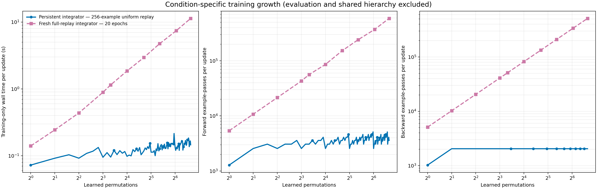
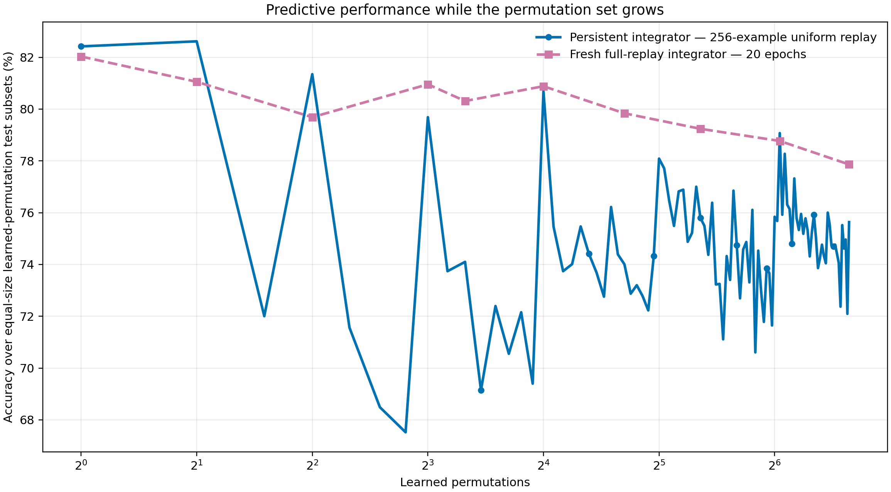

# 100-permutation integrator scaling

## Result

The run completed under config hash `6d4f13fdf7d3aad964b1d8becae3fa7130e05422548576912e6e830506a3710c`. The persistent uniform-replay update averaged 0.102 seconds over permutations 1–10 and 0.165 seconds over permutations 91–100. A fresh full-replay fit grew from 0.140 seconds at one learned permutation to 11.341 seconds at 100 permutations. These are single-run wall-clock observations on the recorded device, not hardware-independent complexity estimates.

The pass counts expose the algorithmic source of that growth. At permutation `k`, the active LogT frontier contains `popcount(k)` frozen nodes. Uniform replay optimizes on at most 512 examples for four epochs, so its integrator backward work is constant after step 1; recomputing current-frontier features costs `512 × popcount(k)` frozen-node forward example-passes. Its per-update work is therefore `O(log k)` forward and `O(1)` backward, and its cumulative condition-specific work through `T` permutations is `O(T log T)` forward and `O(T)` backward.

The fresh full-replay comparator optimizes on `256k` examples for 20 epochs and builds those examples against every active node. Its measured per-fit work is therefore `O(k log k)` forward and `O(k)` backward. Running that fit at every step would cost `O(T² log T)` forward and `O(T²)` backward cumulatively. Only the ten preregistered checkpoints were actually fit here; summing their runtime is the cost of this sampled experiment, not the cost of an every-step ceiling.

## Conditions, in literal terms

| Report label | Exactly what was trained |
|---|---|
| Uniform replay | One persistent integrator. At each permutation it trains four epochs on 256 current observer examples plus, after step 1, 256 examples sampled uniformly from all earlier observer examples. Current and historical sources each receive weight 0.5. |
| Fresh full replay, 20 epochs | At each sampled checkpoint, discard prior integrator state, initialize a fresh integrator, build features for all 256 observer examples from every learned permutation against the current frozen frontier, and train exactly 20 epochs. There is no validation, early stopping, restart selection, or convergence claim. |

The two conditions use the same 1024/1024/512 calibrated base, the same frozen LogT frontier, the same integrator architecture, and seed 0. There are 100 domains total: identity plus 99 independently seeded fixed pixel permutations. Each domain appears once, so “step” and “learned permutations” are identical.

## Training-work boundary

The timed total includes condition-state initialization when required, replay/archive preparation, all frozen-node forwards used to construct training features, and only the integrator forwards/backwards used by optimizer loss construction. Pre/post training diagnostics, learned-domain test inference, report generation, artifact I/O, and the shared temporal-node construction are excluded. Their inference passes are retained in separate `excluded_*` audit columns and never enter a training total. Shared hierarchy construction required 3,338,240 forward and 3,338,240 backward example-passes; it is reported once rather than charged to both conditions.

A forward example-pass is one example traversing one frozen node or the integrator. A backward example-pass is one example contributing gradients through the integrator. Batch-level forward and backward call counts are also in `work_metrics.csv`, so both interpretations remain auditable.

## Sampled results

| Learned permutations | Condition | Accuracy | Training seconds | Forward example-passes | Backward example-passes |
|---:|---|---:|---:|---:|---:|
| 1 | Uniform replay | 82.42% | 0.073 | 1,280 | 1,024 |
| 1 | Fresh full replay, 20 epochs | 82.03% | 0.140 | 5,376 | 5,120 |
| 2 | Uniform replay | 82.62% | 0.092 | 2,560 | 2,048 |
| 2 | Fresh full replay, 20 epochs | 81.05% | 0.244 | 10,752 | 10,240 |
| 4 | Uniform replay | 81.35% | 0.092 | 2,560 | 2,048 |
| 4 | Fresh full replay, 20 epochs | 79.69% | 0.437 | 21,504 | 20,480 |
| 8 | Uniform replay | 79.69% | 0.095 | 2,560 | 2,048 |
| 8 | Fresh full replay, 20 epochs | 80.96% | 0.890 | 43,008 | 40,960 |
| 10 | Uniform replay | 74.10% | 0.096 | 3,072 | 2,048 |
| 10 | Fresh full replay, 20 epochs | 80.31% | 1.149 | 56,320 | 51,200 |
| 16 | Uniform replay | 80.69% | 0.098 | 2,560 | 2,048 |
| 16 | Fresh full replay, 20 epochs | 80.88% | 1.854 | 86,016 | 81,920 |
| 26 | Uniform replay | 74.01% | 0.119 | 3,584 | 2,048 |
| 26 | Fresh full replay, 20 epochs | 79.84% | 2.951 | 153,088 | 133,120 |
| 41 | Uniform replay | 75.80% | 0.128 | 3,584 | 2,048 |
| 41 | Fresh full replay, 20 epochs | 79.24% | 4.755 | 241,408 | 209,920 |
| 66 | Uniform replay | 79.07% | 0.131 | 3,072 | 2,048 |
| 66 | Fresh full replay, 20 epochs | 78.77% | 7.418 | 371,712 | 337,920 |
| 100 | Uniform replay | 75.64% | 0.146 | 3,584 | 2,048 |
| 100 | Fresh full replay, 20 epochs | 77.86% | 11.341 | 588,800 | 512,000 |

## Acceptance checks

| Check | Result |
|---|---|
| all metrics finite | pass |
| ceiling checkpoints exact | pass |
| evaluation excluded from training work | pass |
| full replay exactly twenty epochs | pass |
| single seed | pass |
| uniform every permutation | pass |
| uniform exact replay budget | pass |

## Figures

## Limits

This is one stream seed and one GPU timing run. GPU warm-up, kernel scheduling, and host-side archive copies make seconds noisier than pass counts. Accuracy uses a fixed 256-example test subset per learned permutation, equally weighted. The “full replay ceiling” is a fixed 20-epoch upper comparator for this architecture and feature set; unlike the earlier converged ceiling, it is not trained to a validation stopping rule and is not guaranteed to have converged.
