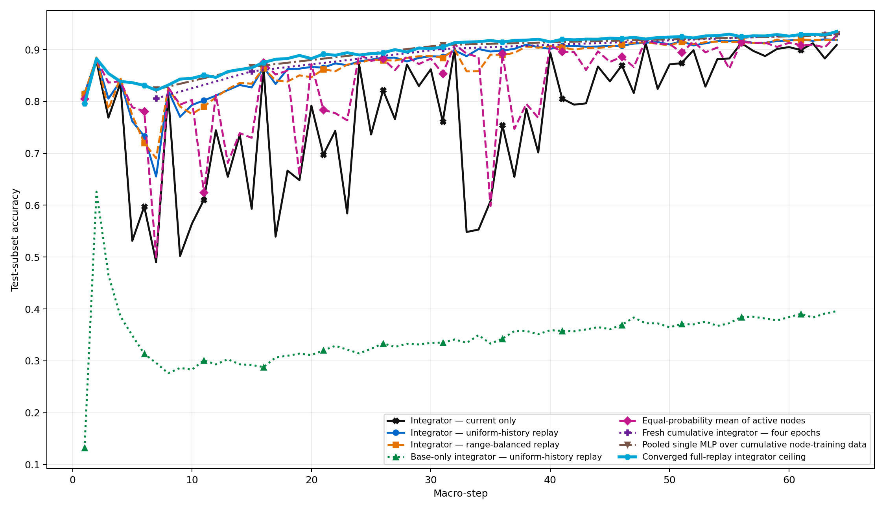
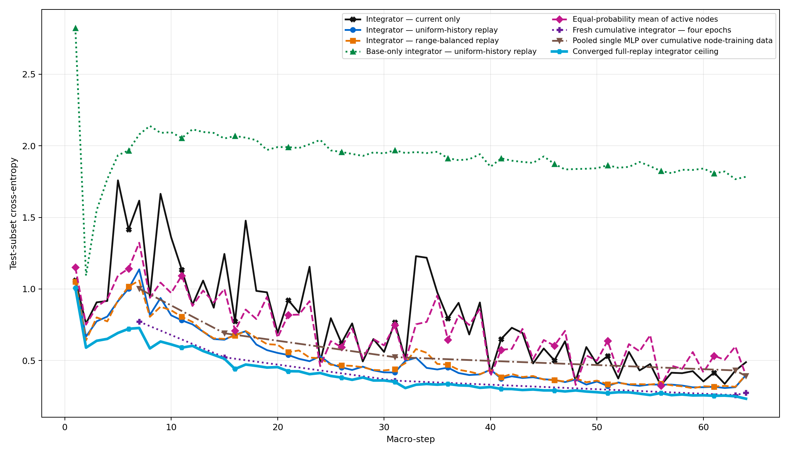
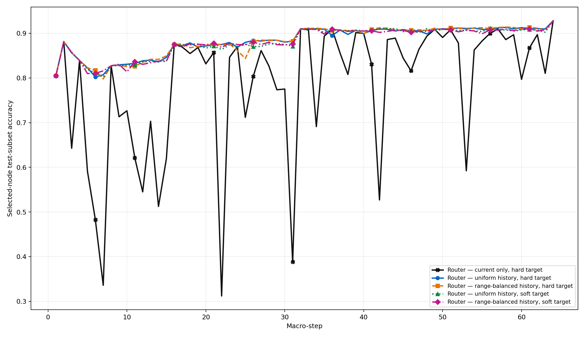
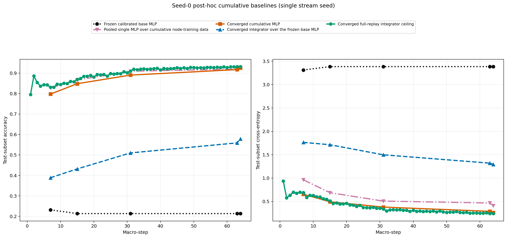

# Dense Permuted-MNIST LogT experiment

Status: **complete**.

## Analysis-set amendment

Primary results use seeds `[0, 1, 2]` (n=3). The run originally declared seeds `[0, 1, 2, 3, 4]`. The seed count was reduced for exploratory compute control while ceiling seed 0 was running at macro-step 63 and before any ceiling seed had completed. Completed online seeds [3, 4] remain in the source artifact but are excluded from every number and plot in this report. Excluded partial ceiling evidence is retained for seed 3: 2 macro-steps and no completed summary.

Recorded reason: User-directed exploratory compute reduction before any ceiling seed completed; extend to five seeds only if the three-seed result is promising.

This successor removes convolution entirely. Every temporal node starts from the same selected three-hidden-layer raw-pixel MLP, adapts all four affine layers, and is then frozen. The router and integrator see only normalized final hidden activations, class log probabilities, and active-slot bits.

The bounded online comparison intentionally preserves the earlier epoch matrix: current-only integration receives 8 optimizer updates per production step, while replay integration receives 16. This is an epoch-matched comparison, not an optimizer-update-matched control.

## Calibration

Selected hidden widths: `[1024, 1024, 512]`; identity test accuracy: `0.9824`. This successor selected the smallest candidate by an explicit post-hoc amendment; accuracy thresholds were non-operative. It imported and authenticated the original calibration evidence rather than rerunning it.

## Three-seed result

Verdict: **Promising under all seven frozen decision rules.**

Each headline value first averages the full-test permutation cells at macro-steps [15, 31, 63] within a seed. Values are mean ± sample standard deviation across the 3 seed means; the standard deviation is descriptive, not a confidence interval.

| Condition | Accuracy | Cross-entropy |
|---|---:|---:|
| Integrator — current only | 74.59 ± 1.19% | 0.8113 ± 0.0312 |
| Integrator — uniform-history replay | 87.84 ± 0.18% | 0.4563 ± 0.0090 |
| Integrator — range-balanced replay | 87.94 ± 0.12% | 0.4647 ± 0.0040 |
| Equal-probability mean ensemble | 82.82 ± 0.58% | 0.7816 ± 0.0134 |
| Base-only integrator — uniform replay | 33.98 ± 0.35% | 1.9275 ± 0.0068 |
| Fresh cumulative integrator — four epochs | 89.55 ± 0.25% | 0.3775 ± 0.0083 |
| Converged full-replay integrator ceiling | 89.94 ± 0.27% | 0.3662 ± 0.0056 |
| Pooled single MLP reference | 90.19 ± 0.21% | 0.5380 ± 0.0083 |
| Best active node (label-aware oracle) | 95.12 ± 0.24% | 0.1686 ± 0.0141 |

### Evolution across the headline checkpoints

Each cell is accuracy / cross-entropy, averaged across the three seeds and all eight test permutations.

| Macro-step | Current only | Uniform replay | Range replay | Fresh four-epoch | Converged ceiling |
|---:|---:|---:|---:|---:|---:|
| 15 | 59.09% / 1.2456 | 82.75% / 0.6478 | 83.22% / 0.6516 | 85.69% / 0.5223 | 86.30% / 0.5068 |
| 31 | 76.10% / 0.7650 | 88.79% / 0.4090 | 88.65% / 0.4278 | 90.12% / 0.3541 | 90.50% / 0.3461 |
| 63 | 88.58% / 0.4234 | 91.98% / 0.3122 | 91.97% / 0.3148 | 92.85% / 0.2561 | 93.02% / 0.2457 |

### Retention on the evaluation archive

| Condition | Current-range accuracy / CE | Older-range accuracy / CE |
|---|---:|---:|
| Integrator — current only | 89.76% / 0.3597 | 74.55% / 0.8143 |
| Integrator — uniform-history replay | 90.45% / 0.3152 | 87.50% / 0.4788 |
| Integrator — range-balanced replay | 90.80% / 0.3368 | 87.70% / 0.4782 |

### Interpretation

- Integrator — uniform-history replay is the replay condition with the lower headline cross-entropy. Relative to current-only training it gains 13.25 accuracy points and reduces cross-entropy by 0.3550.

- Uniform and range-balanced replay are practically tied: range-balanced replay is +0.10 accuracy points relative to uniform replay, while its cross-entropy is +0.0084. With n=3, this does not identify a sampler winner.

- The bounded online replay integrator closes 81.8% of the current-only to fresh-four-epoch cross-entropy gap. It remains 2.10 accuracy points and 0.0901 cross-entropy behind the converged full-replay integrator.

- Frozen temporal-node features matter. The full-node replay integrator beats the base-only replay ablation by 53.86 accuracy points.

- Against the router selected by cross-entropy (Router — range-balanced history, soft target), the replay integrator gains 0.37 accuracy points and reduces cross-entropy by 0.3853. The highest-accuracy router is instead Router — uniform history, hard target at 88.10% accuracy, but with cross-entropy 0.9397.

- The converged trace is an empirical optimization ceiling for this fixed feature representation, integrator architecture, convergence rule, and three-restart search. It is not a mathematical upper bound on every possible integrator. The label-aware best-node oracle is also not deployable; it uses test labels directly.

- The evidence is encouraging but still exploratory: n=3 is too small for a precise uncertainty estimate. Seeds 3 and 4 should be added only as a predeclared extension, without changing the conditions or headline cells.

## Conditions in plain language

| Condition | Family | Persistence | Current data | History | Sampler | Epochs | Validation / restarts |
|---|---|---|---|---|---|---:|---|
| Router — current only, hard target | router | persistent | 256 current | none | none | 4 | no |
| Router — uniform history, hard target | router | persistent | 256 current | 256 history | uniform examples | 4 | no |
| Router — range-balanced history, hard target | router | persistent | 256 current | 256 history | uniform live ranges | 4 | no |
| Router — uniform history, soft target | router | persistent | 256 current | 256 history | uniform examples | 4 | no |
| Router — range-balanced history, soft target | router | persistent | 256 current | 256 history | uniform live ranges | 4 | no |
| Integrator — current only | integrator | persistent | 256 current | none | none | 4 | no |
| Integrator — uniform-history replay | integrator | persistent | 256 current | 256 history | uniform examples | 4 | no |
| Integrator — range-balanced replay | integrator | persistent | 256 current | 256 history | uniform live ranges | 4 | no |
| Base-only integrator — uniform-history replay | integrator control | persistent | 256 current | 256 history | uniform examples | 4 | no |
| Fresh cumulative integrator — four epochs | optimization reference | fresh at checkpoint | all cumulative | all cumulative | full replay | 4 | no |
| Pooled single MLP over cumulative node-training data | model reference | fresh at checkpoint | all cumulative | all cumulative | full replay | 20 | no |
| Frozen calibrated base MLP | post-hoc model diagnostic | frozen | none | none | none | 0 | seed 0 only |
| Converged cumulative MLP | post-hoc model diagnostic | fresh at checkpoint | all cumulative node-training rows | all cumulative | full replay | 20–200 | seed 0; validation; 3 restarts |
| Converged integrator over the frozen base MLP | post-hoc integration diagnostic | fresh at checkpoint | all cumulative observer rows | all cumulative | full replay | 20–200 | seed 0; validation; 3 restarts |
| Converged full-replay integrator ceiling | optimization ceiling | fresh every step | all cumulative | all cumulative | full replay | 20–200 | yes; 3 restarts |
| Equal-probability mean of active nodes | fixed control | none | none | none | none | 0 | no |
| Newest temporal range | fixed control | none | none | none | none | 0 | no |
| Largest temporal range | fixed control | none | none | none | none | 0 | no |
| Uniform random active node | fixed control | none | none | none | none | 0 | no |
| Best active node (label-aware oracle) | offline oracle | none | none | none | none | 0 | uses labels directly |
| Best active node (label-aware router oracle) | offline oracle | none | none | none | none | 0 | uses labels directly |

## Seed-0 cumulative baseline extension

These are post-hoc diagnostics from one stream seed, evaluated only at the five existing full checkpoints. They do not have a run-to-run uncertainty estimate and are not included in the main three-seed decision rules. Each metric equally weights the full 10,000-example test set for every domain seen by that checkpoint. Validation cross-entropy selects epochs and restarts; test labels select nothing.

The converged cumulative MLP starts from the calibrated base and trains all four affine layers on every node-training row seen so far. The converged base-only integrator keeps that calibrated base frozen and trains only an integrator on its hidden activation and class probabilities using every observer row seen so far. The converged all-node integrator remains the comparison that can use every frozen temporal node.

Each cell is accuracy / cross-entropy.

| Macro-step | Frozen base | Fixed 20-epoch cumulative MLP | Converged cumulative MLP | Converged frozen-base integrator | Converged all-node integrator |
|---:|---:|---:|---:|---:|---:|
| 7 | 22.78% / 3.3523 | 82.67% / 0.9663 | 79.45% / 0.6682 | 38.96% / 1.7680 | 82.83% / 0.6944 |
| 15 | 21.11% / 3.4086 | 87.01% / 0.6486 | 85.10% / 0.4758 | 42.96% / 1.7146 | 86.48% / 0.5104 |
| 31 | 21.11% / 3.4086 | 90.92% / 0.5030 | 89.08% / 0.3704 | 51.03% / 1.5055 | 90.84% / 0.3378 |
| 63 | 21.11% / 3.4086 | 92.42% / 0.4343 | 91.92% / 0.2784 | 55.44% / 1.3328 | 93.26% / 0.2372 |
| 64 | 21.11% / 3.4086 | 93.06% / 0.3820 | 92.48% / 0.2663 | 57.33% / 1.3124 | 93.41% / 0.2307 |

### Validation-selected convergence

| Macro-step | Cumulative MLP: epochs / selected restart / validation CE | Frozen-base integrator: epochs / selected restart / validation CE |
|---:|---:|---:|
| 7 | 48 / 2 / 0.7797 | 55 / 1 / 1.8105 |
| 15 | 48 / 2 / 0.5362 | 64 / 0 / 1.7448 |
| 31 | 48 / 2 / 0.3752 | 62 / 1 / 1.5427 |
| 63 | 49 / 2 / 0.2579 | 63 / 2 / 1.3339 |
| 64 | 49 / 2 / 0.2718 | 67 / 0 / 1.3234 |

### What this control establishes

- At checkpoint 7, the fixed 20-epoch MLP reached 82.67% accuracy and 0.9663 cross-entropy. The converged MLP reached 79.45% and 0.6682. More training improved cross-entropy but did not recover 98% accuracy. This checkpoint has only 1,792 cumulative node-training examples spread across 7 seen domains.

- At checkpoint 64, the fixed and converged MLPs reached 93.06% / 0.3820 and 92.48% / 0.2663, respectively. The validation-selected converged fit again traded a small amount of top-1 accuracy for substantially lower cross-entropy.

- The frozen base scored 21.11% at checkpoint 64. A converged nonlinear integrator over that base alone reached 57.33%, versus 93.41% for the converged integrator over all temporal nodes. Most of the usable permutation-specific information is in the frozen temporal nodes, not the calibrated base alone.

- At checkpoint 64, the all-node integrator exceeded the converged cumulative MLP by 0.93 accuracy points and reduced cross-entropy by 0.0357. This comparison uses one stream seed and does not establish run-to-run stability.

## Frozen decisions

- PASS — 1 replay beats current only and mean
- PASS — 2 replay closes 75 percent of four epoch gap
- PASS — 3 retention without more than two point current loss
- PASS — 4 full nodes beat base only without accuracy loss
- PASS — 5 integrator beats matched router on both metrics
- PASS — 6 all structural and accounting gates pass
- PASS — 7 attribution controls present

The cyan ceiling trace is a fresh, three-restart, validation-selected full-replay fit at every step. It is not an online condition and test data never selects its epoch or restart.
