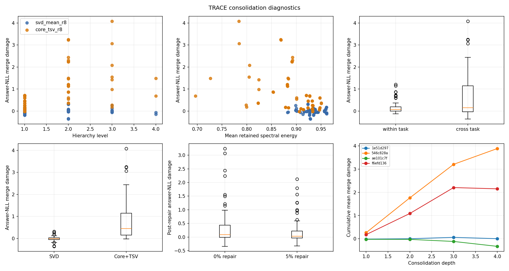
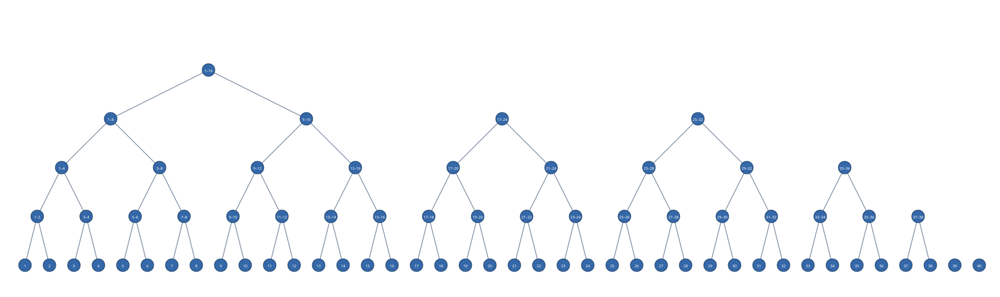

# TRACE Log-t VAMP Interim Report

**PRELIMINARY — RUN PAUSED BEFORE COMPLETION**

Only complete eight-stage matrices receive OP/forgetting/BWT values; partial methods are shown as incomplete.

This report currently contains 70 completed task-stage evaluation rows.

## Required primary result table

| Method | Router | OP | Forgetting | Signed BWT | Negative-only BWT | Training presentations | Replay presentations | Final live LoRAs | Task-free |
|---|---|---:|---:|---:|---:|---:|---:|---:|---:|
| frozen_base | direct | — | — | — | — | 0 | 0 | 0 | yes |
| seq_lora_reference | direct | — | — | — | — | 20,000 | 0 | 1 | yes |
| seq_lora_40 | direct | — | — | — | — | 20,000 | 0 | 1 | yes |
| joint_iid_lora | direct | — | — | — | — | 20,000 | 0 | 1 | yes |
| taskwise_lora | direct | — | — | — | — | 20,000 | 0 | 8 | no |
| vamp_svd_r8_repair000 | prompt_nll | — | — | — | — | 20,000 | 0 | 7 | yes |
| vamp_svd_r8_repair005 | prompt_nll | — | — | — | — | 20,000 | 610 | 7 | yes |
| vamp_core_tsv_r8_scale03_repair000 | prompt_nll | — | — | — | — | 20,000 | 0 | 7 | yes |
| vamp_core_tsv_r8_scale03_repair005 | prompt_nll | — | — | — | — | 20,000 | 610 | 7 | yes |

Task-aware and answer-oracle routing are diagnostics; they are not task-free deployment results.

### VAMP routing and storage diagnostics

| Method | Router | Role | OP | Forgetting | Signed BWT | Negative-only BWT |
|---|---|---|---:|---:|---:|---:|

## Sequential and joint-IID gaps

The registered comparisons are `OP_VAMP − OP_sequential` and `OP_joint − OP_VAMP`.

| VAMP method | Task-free router | VAMP OP | Sequential OP | VAMP − sequential | Joint-IID OP | Joint-IID − VAMP |
|---|---|---:|---:|---:|---:|---:|
| _Pending_ | — | — | — | — | — | — |

## Validation-only policy comparison

Core scale, repair fraction, rank, or repair-optimizer variants are compared here before any test-set interpretation.

| Policy condition | Router | Final validation OP | Best for router |
|---|---|---:|---:|
| _Pending_ | — | — | — |

## Memory accounting

The reproducibility archive currently occupies 1415.65 MiB. This is not the algorithmic live-state claim. A completed 40-arrival VAMP hierarchy contains seven live adapters plus router metadata and the selected repair reservoir.

## Protocol notes

Task-free prompt-NLL and frozen-centroid routers never receive answer tokens. Task-aware and answer-oracle values are diagnostic and are reported separately.

## Consolidation diagnostics

132 completed merge records are available in the merge-diagnostics CSV. Retained spectral energy, child cosine, level, task composition, merge time, and repair work are kept separately from task-stage scores.

### Retrained-parent calibration

| Interval | Task | Candidate | Validation score |
|---|---|---|---:|
| _Pending_ | — | — | — |

## Artifact-reuse acceptance

No derived-policy reuse run has completed yet.

## Runtime and resume

Scheduler state: `{'PENDING': 173, 'RUNNING': 2, 'CHECKPOINTED': 0, 'COMPLETE': 247, 'FAILED': 0, 'PAUSED': 0}`.

Observed GPU worker utilization: 0.0% across 0.00 session-hours; recorded GPU work: 18.16 worker-hours.

Observed training throughput: 23.54 presentations/s, 10316.54 tokens/s, and 2.963 optimizer steps/s.

Observed evaluation throughput: 1.68 candidate cases/s, 462.02 prompt-prefill tokens/s, and 274.53 generated tokens/s.

Per-task candidate throughput: `{'20Minuten': {'candidate_cases_per_second': 1.046953269765432, 'generated_tokens_per_second': 271.9692320396116, 'prompt_prefill_tokens_per_second': 682.8281573073635}, 'C-STANCE': {'candidate_cases_per_second': 2.0906047960679612, 'generated_tokens_per_second': 226.0951212407448, 'prompt_prefill_tokens_per_second': 309.21245748755564}, 'FOMC': {'candidate_cases_per_second': 2.0731293701844895, 'generated_tokens_per_second': 269.6210270077555, 'prompt_prefill_tokens_per_second': 154.8316670122286}, 'MeetingBank': {'candidate_cases_per_second': 1.2831435860428513, 'generated_tokens_per_second': 224.8144713785477, 'prompt_prefill_tokens_per_second': 1039.6394786406345}, 'NumGLUE-cm': {'candidate_cases_per_second': 2.7400236804966984, 'generated_tokens_per_second': 204.4089950765625, 'prompt_prefill_tokens_per_second': 129.34259324574168}, 'NumGLUE-ds': {'candidate_cases_per_second': 1.543641559166737, 'generated_tokens_per_second': 276.08264187673484, 'prompt_prefill_tokens_per_second': 56.48184464991091}, 'Py150': {'candidate_cases_per_second': 0.9252414635947882, 'generated_tokens_per_second': 394.696602375632, 'prompt_prefill_tokens_per_second': 393.65323310103855}, 'ScienceQA': {'candidate_cases_per_second': 4.050666559264241, 'generated_tokens_per_second': 215.87864094269767, 'prompt_prefill_tokens_per_second': 284.05299246840485}}`.

Remaining job families: `{'build_report': 1, 'evaluate_baseline': 72, 'evaluate_final_baseline': 24, 'evaluate_vamp': 74, 'retrained_parent_oracle': 4}`.

ETA: `{'static_expected_hours': [8, 16], 'static_conservative_hours': [16, 22], 'observed_successful_jobs': 247, 'confidence': 'medium', 'measured_hours': 8.12482173231508, 'measured_range_hours': [5.281134126004803, 10.96850933862536]}`.

Resume with `python -m apm.continual.trace.cli resume --run /workspace/vamp-trace/runs/c9743521129b5c35389903eea8e381891a582fe24c54f374395013cf746327e5`.
