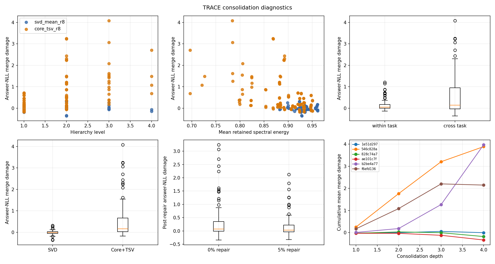

# TRACE Log-t VAMP Primary Report

This report currently contains 312 completed task-stage evaluation rows.

## Required primary result table

| Method | Router | OP | Forgetting | Signed BWT | Negative-only BWT | Training presentations | Replay presentations | Final live LoRAs | Task-free |
|---|---|---:|---:|---:|---:|---:|---:|---:|---:|
| frozen_base | direct | 18.397 | — | — | — | 0 | 0 | 0 | yes |
| seq_lora_reference | direct | 34.096 | 10.732 | -10.732 | -10.982 | 20,000 | 0 | 1 | yes |
| seq_lora_40 | direct | 30.037 | 14.158 | -14.158 | -14.158 | 20,000 | 0 | 1 | yes |
| joint_iid_lora | direct | 47.253 | — | — | — | 20,000 | 0 | 1 | yes |
| taskwise_lora | direct | 45.306 | — | — | — | 20,000 | 0 | 8 | no |
| vamp_svd_r8_repair000 | prompt_nll | 21.236 | -0.960 | 0.960 | -0.282 | 20,000 | 0 | 7 | yes |
| vamp_svd_r8_repair005 | prompt_nll | 20.754 | 0.213 | -0.213 | -1.075 | 20,000 | 610 | 7 | yes |
| vamp_core_tsv_r8_scale03_repair000 | prompt_nll | 19.355 | 5.726 | -5.726 | -6.101 | 20,000 | 0 | 7 | yes |
| vamp_core_tsv_r8_scale03_repair005 | prompt_nll | 23.430 | 0.192 | -0.192 | -1.692 | 20,000 | 610 | 7 | yes |

Task-aware and answer-oracle routing are diagnostics; they are not task-free deployment results.

### VAMP routing and storage diagnostics

| Method | Router | Role | OP | Forgetting | Signed BWT | Negative-only BWT |
|---|---|---|---:|---:|---:|---:|
| vamp_core_tsv_r8_scale03_repair000 | answer_oracle | diagnostic | 26.973 | 23.449 | -23.449 | -23.449 |
| vamp_core_tsv_r8_scale03_repair000 | frozen_prompt_centroid | task-free | 21.443 | 15.424 | -15.424 | -15.424 |
| vamp_core_tsv_r8_scale03_repair000 | prompt_nll | task-free | 19.355 | 5.726 | -5.726 | -6.101 |
| vamp_core_tsv_r8_scale03_repair000 | task_aware | diagnostic | 23.076 | 19.166 | -19.166 | -19.166 |
| vamp_core_tsv_r8_scale03_repair005 | answer_oracle | diagnostic | 32.118 | 18.555 | -18.555 | -18.555 |
| vamp_core_tsv_r8_scale03_repair005 | frozen_prompt_centroid | task-free | 26.633 | 11.595 | -11.595 | -11.595 |
| vamp_core_tsv_r8_scale03_repair005 | prompt_nll | task-free | 23.430 | 0.192 | -0.192 | -1.692 |
| vamp_core_tsv_r8_scale03_repair005 | task_aware | diagnostic | 27.732 | 15.013 | -15.013 | -15.013 |
| vamp_core_tsv_r8_scale05_repair000 | answer_oracle | diagnostic | 29.227 | 22.679 | -22.679 | -22.679 |
| vamp_core_tsv_r8_scale05_repair000 | frozen_prompt_centroid | task-free | 22.062 | 16.464 | -16.464 | -16.464 |
| vamp_core_tsv_r8_scale05_repair000 | prompt_nll | task-free | 19.906 | 1.276 | -1.276 | -2.151 |
| vamp_core_tsv_r8_scale05_repair000 | task_aware | diagnostic | 24.393 | 17.725 | -17.725 | -17.725 |
| vamp_core_tsv_r8_scale05_repair010 | answer_oracle | diagnostic | 38.026 | 15.090 | -15.090 | -15.090 |
| vamp_core_tsv_r8_scale05_repair010 | frozen_prompt_centroid | task-free | 30.212 | 9.845 | -9.845 | -9.845 |
| vamp_core_tsv_r8_scale05_repair010 | prompt_nll | task-free | 20.642 | 1.918 | -1.918 | -2.918 |
| vamp_core_tsv_r8_scale05_repair010 | task_aware | diagnostic | 33.173 | 9.077 | -9.077 | -9.540 |
| vamp_svd_r8_repair000 | answer_oracle | diagnostic | 41.410 | 11.392 | -11.392 | -11.392 |
| vamp_svd_r8_repair000 | frozen_prompt_centroid | task-free | 31.606 | 7.962 | -7.962 | -7.962 |
| vamp_svd_r8_repair000 | prompt_nll | task-free | 21.236 | -0.960 | 0.960 | -0.282 |
| vamp_svd_r8_repair000 | task_aware | diagnostic | 35.548 | 6.021 | -6.021 | -7.146 |
| vamp_svd_r8_repair005 | answer_oracle | diagnostic | 43.864 | 9.724 | -9.724 | -9.724 |
| vamp_svd_r8_repair005 | frozen_prompt_centroid | task-free | 34.217 | 5.401 | -5.401 | -5.526 |
| vamp_svd_r8_repair005 | prompt_nll | task-free | 20.754 | 0.213 | -0.213 | -1.075 |
| vamp_svd_r8_repair005 | task_aware | diagnostic | 38.180 | 5.321 | -5.321 | -5.571 |

## Sequential and joint-IID gaps

The registered comparisons are `OP_VAMP − OP_sequential` and `OP_joint − OP_VAMP`.

| VAMP method | Task-free router | VAMP OP | Sequential OP | VAMP − sequential | Joint-IID OP | Joint-IID − VAMP |
|---|---|---:|---:|---:|---:|---:|
| vamp_core_tsv_r8_scale03_repair000 | frozen_prompt_centroid | 21.443 | 34.096 | -12.654 | 47.253 | 25.810 |
| vamp_core_tsv_r8_scale03_repair000 | prompt_nll | 19.355 | 34.096 | -14.741 | 47.253 | 27.898 |
| vamp_core_tsv_r8_scale03_repair005 | frozen_prompt_centroid | 26.633 | 34.096 | -7.463 | 47.253 | 20.619 |
| vamp_core_tsv_r8_scale03_repair005 | prompt_nll | 23.430 | 34.096 | -10.666 | 47.253 | 23.822 |
| vamp_core_tsv_r8_scale05_repair000 | frozen_prompt_centroid | 22.062 | 34.096 | -12.034 | 47.253 | 25.190 |
| vamp_core_tsv_r8_scale05_repair000 | prompt_nll | 19.906 | 34.096 | -14.190 | 47.253 | 27.346 |
| vamp_core_tsv_r8_scale05_repair010 | frozen_prompt_centroid | 30.212 | 34.096 | -3.885 | 47.253 | 17.041 |
| vamp_core_tsv_r8_scale05_repair010 | prompt_nll | 20.642 | 34.096 | -13.455 | 47.253 | 26.611 |
| vamp_svd_r8_repair000 | frozen_prompt_centroid | 31.606 | 34.096 | -2.491 | 47.253 | 15.647 |
| vamp_svd_r8_repair000 | prompt_nll | 21.236 | 34.096 | -12.861 | 47.253 | 26.017 |
| vamp_svd_r8_repair005 | frozen_prompt_centroid | 34.217 | 34.096 | 0.120 | 47.253 | 13.036 |
| vamp_svd_r8_repair005 | prompt_nll | 20.754 | 34.096 | -13.343 | 47.253 | 26.499 |

## Validation-only policy comparison

Core scale, repair fraction, rank, or repair-optimizer variants are compared here before any test-set interpretation.

| Policy condition | Router | Final validation OP | Best for router |
|---|---|---:|---:|
| vamp_core_tsv_r8_scale03_repair000 | answer_oracle | 26.696 | no |
| vamp_core_tsv_r8_scale03_repair000 | frozen_prompt_centroid | 21.148 | no |
| vamp_core_tsv_r8_scale03_repair000 | prompt_nll | 19.961 | no |
| vamp_core_tsv_r8_scale03_repair000 | task_aware | 22.964 | no |
| vamp_core_tsv_r8_scale03_repair005 | answer_oracle | 33.640 | no |
| vamp_core_tsv_r8_scale03_repair005 | frozen_prompt_centroid | 26.228 | no |
| vamp_core_tsv_r8_scale03_repair005 | prompt_nll | 23.028 | yes |
| vamp_core_tsv_r8_scale03_repair005 | task_aware | 28.875 | no |
| vamp_core_tsv_r8_scale05_repair000 | answer_oracle | 29.595 | no |
| vamp_core_tsv_r8_scale05_repair000 | frozen_prompt_centroid | 23.564 | no |
| vamp_core_tsv_r8_scale05_repair000 | prompt_nll | 20.345 | no |
| vamp_core_tsv_r8_scale05_repair000 | task_aware | 25.104 | no |
| vamp_core_tsv_r8_scale05_repair010 | answer_oracle | 38.331 | no |
| vamp_core_tsv_r8_scale05_repair010 | frozen_prompt_centroid | 28.835 | no |
| vamp_core_tsv_r8_scale05_repair010 | prompt_nll | 20.564 | no |
| vamp_core_tsv_r8_scale05_repair010 | task_aware | 31.813 | no |
| vamp_svd_r8_repair000 | answer_oracle | 41.842 | no |
| vamp_svd_r8_repair000 | frozen_prompt_centroid | 32.005 | no |
| vamp_svd_r8_repair000 | prompt_nll | 20.823 | no |
| vamp_svd_r8_repair000 | task_aware | 35.181 | no |
| vamp_svd_r8_repair005 | answer_oracle | 44.653 | yes |
| vamp_svd_r8_repair005 | frozen_prompt_centroid | 33.753 | yes |
| vamp_svd_r8_repair005 | prompt_nll | 20.851 | no |
| vamp_svd_r8_repair005 | task_aware | 37.447 | yes |

## Memory accounting

The reproducibility archive currently occupies 2147.80 MiB. This is not the algorithmic live-state claim. A completed 40-arrival VAMP hierarchy contains seven live adapters plus router metadata and the selected repair reservoir.

## Protocol notes

Task-free prompt-NLL and frozen-centroid routers never receive answer tokens. Task-aware and answer-oracle values are diagnostic and are reported separately.

## Consolidation diagnostics

198 completed merge records are available in the merge-diagnostics CSV. Retained spectral energy, child cosine, level, task composition, merge time, and repair work are kept separately from task-stage scores.

### Retrained-parent calibration

| Interval | Task | Candidate | Validation score |
|---|---|---|---:|
| 1–2 | C-STANCE | 1e51d2973353ad68f99979f822cde7713401e16b4f79106bc90c540e0e18c8c7 | 39.000 |
| 1–2 | C-STANCE | 546c828af41198edfcc3520d8c0f283eb2555357e275e50fddef434791470b03 | 37.000 |
| 1–2 | C-STANCE | ae101c7f8b800eed7ae750626b2d1db93697b662160356b34e2df60989a3489e | 45.000 |
| 1–2 | C-STANCE | f6efd136ccfdc34cc5e3b54607f1802f063a986aa0c678d5c8b92e7da2d34457 | 38.000 |
| 1–2 | C-STANCE | retrained_parent | 38.000 |
| 1–4 | C-STANCE | 1e51d2973353ad68f99979f822cde7713401e16b4f79106bc90c540e0e18c8c7 | 40.000 |
| 1–4 | C-STANCE | 546c828af41198edfcc3520d8c0f283eb2555357e275e50fddef434791470b03 | 37.000 |
| 1–4 | C-STANCE | ae101c7f8b800eed7ae750626b2d1db93697b662160356b34e2df60989a3489e | 41.000 |
| 1–4 | C-STANCE | f6efd136ccfdc34cc5e3b54607f1802f063a986aa0c678d5c8b92e7da2d34457 | 30.000 |
| 1–4 | C-STANCE | retrained_parent | 44.000 |
| 1–16 | C-STANCE | 1e51d2973353ad68f99979f822cde7713401e16b4f79106bc90c540e0e18c8c7 | 35.000 |
| 1–16 | C-STANCE | 546c828af41198edfcc3520d8c0f283eb2555357e275e50fddef434791470b03 | 1.000 |
| 1–16 | C-STANCE | ae101c7f8b800eed7ae750626b2d1db93697b662160356b34e2df60989a3489e | 36.000 |
| 1–16 | C-STANCE | f6efd136ccfdc34cc5e3b54607f1802f063a986aa0c678d5c8b92e7da2d34457 | 33.000 |
| 1–16 | C-STANCE | retrained_parent | 14.000 |
| 1–16 | FOMC | 1e51d2973353ad68f99979f822cde7713401e16b4f79106bc90c540e0e18c8c7 | 25.000 |
| 1–16 | FOMC | 546c828af41198edfcc3520d8c0f283eb2555357e275e50fddef434791470b03 | 0.000 |
| 1–16 | FOMC | ae101c7f8b800eed7ae750626b2d1db93697b662160356b34e2df60989a3489e | 34.000 |
| 1–16 | FOMC | f6efd136ccfdc34cc5e3b54607f1802f063a986aa0c678d5c8b92e7da2d34457 | 15.000 |
| 1–16 | FOMC | retrained_parent | 1.000 |
| 1–16 | MeetingBank | 1e51d2973353ad68f99979f822cde7713401e16b4f79106bc90c540e0e18c8c7 | 18.902 |
| 1–16 | MeetingBank | 546c828af41198edfcc3520d8c0f283eb2555357e275e50fddef434791470b03 | 17.262 |
| 1–16 | MeetingBank | ae101c7f8b800eed7ae750626b2d1db93697b662160356b34e2df60989a3489e | 20.757 |
| 1–16 | MeetingBank | f6efd136ccfdc34cc5e3b54607f1802f063a986aa0c678d5c8b92e7da2d34457 | 17.013 |
| 1–16 | MeetingBank | retrained_parent | 26.941 |
| 1–16 | Py150 | 1e51d2973353ad68f99979f822cde7713401e16b4f79106bc90c540e0e18c8c7 | 4.070 |
| 1–16 | Py150 | 546c828af41198edfcc3520d8c0f283eb2555357e275e50fddef434791470b03 | 3.910 |
| 1–16 | Py150 | ae101c7f8b800eed7ae750626b2d1db93697b662160356b34e2df60989a3489e | 5.020 |
| 1–16 | Py150 | f6efd136ccfdc34cc5e3b54607f1802f063a986aa0c678d5c8b92e7da2d34457 | 3.920 |
| 1–16 | Py150 | retrained_parent | 54.190 |
| 5–6 | C-STANCE | 1e51d2973353ad68f99979f822cde7713401e16b4f79106bc90c540e0e18c8c7 | 37.000 |
| 5–6 | C-STANCE | 546c828af41198edfcc3520d8c0f283eb2555357e275e50fddef434791470b03 | 32.000 |
| 5–6 | C-STANCE | ae101c7f8b800eed7ae750626b2d1db93697b662160356b34e2df60989a3489e | 35.000 |
| 5–6 | C-STANCE | f6efd136ccfdc34cc5e3b54607f1802f063a986aa0c678d5c8b92e7da2d34457 | 35.000 |
| 5–6 | C-STANCE | retrained_parent | 15.000 |
| 5–6 | FOMC | 1e51d2973353ad68f99979f822cde7713401e16b4f79106bc90c540e0e18c8c7 | 32.000 |
| 5–6 | FOMC | 546c828af41198edfcc3520d8c0f283eb2555357e275e50fddef434791470b03 | 32.000 |
| 5–6 | FOMC | ae101c7f8b800eed7ae750626b2d1db93697b662160356b34e2df60989a3489e | 29.000 |
| 5–6 | FOMC | f6efd136ccfdc34cc5e3b54607f1802f063a986aa0c678d5c8b92e7da2d34457 | 31.000 |
| 5–6 | FOMC | retrained_parent | 2.000 |

## Artifact-reuse acceptance

Policy `828c74a74e3d66a2cfc9d94f28364e1c66a68299ff34912bbb000bfb137ccfed`: leaf training steps reused 100%; leaf hashes unchanged `true`; new gradient work `repair_only`.
Policy `b2be4a776959c3c511e2b5faf99712d69b9df713bfcf53e538c4bc9786fe5e18`: leaf training steps reused 100%; leaf hashes unchanged `true`; new gradient work `none`.

## Runtime and resume

Scheduler state: `{'PENDING': 0, 'RUNNING': 0, 'CHECKPOINTED': 0, 'COMPLETE': 562, 'FAILED': 0, 'PAUSED': 0}`.

Observed GPU worker utilization: 100.0% across 27.43 session-hours; recorded GPU work: 62.71 worker-hours.

Observed training throughput: 23.57 presentations/s, 10261.44 tokens/s, and 2.966 optimizer steps/s.

Observed evaluation throughput: 1.49 candidate cases/s, 419.75 prompt-prefill tokens/s, and 265.90 generated tokens/s.

Per-task candidate throughput: `{'20Minuten': {'candidate_cases_per_second': 1.039424615754743, 'generated_tokens_per_second': 257.1113525597952, 'prompt_prefill_tokens_per_second': 676.6235391317227}, 'C-STANCE': {'candidate_cases_per_second': 2.2254125938814204, 'generated_tokens_per_second': 208.530160604291, 'prompt_prefill_tokens_per_second': 329.12889566502633}, 'FOMC': {'candidate_cases_per_second': 1.6228300761330858, 'generated_tokens_per_second': 246.12062589474047, 'prompt_prefill_tokens_per_second': 121.22960229660664}, 'MeetingBank': {'candidate_cases_per_second': 1.2482563827856368, 'generated_tokens_per_second': 218.8304058758636, 'prompt_prefill_tokens_per_second': 1011.2360868087444}, 'NumGLUE-cm': {'candidate_cases_per_second': 1.8218808195376899, 'generated_tokens_per_second': 219.650201364265, 'prompt_prefill_tokens_per_second': 86.04600622211036}, 'NumGLUE-ds': {'candidate_cases_per_second': 1.4347011924497146, 'generated_tokens_per_second': 262.71649804625747, 'prompt_prefill_tokens_per_second': 52.54673675435426}, 'Py150': {'candidate_cases_per_second': 0.8540116096749643, 'generated_tokens_per_second': 373.896282218724, 'prompt_prefill_tokens_per_second': 363.08083776435785}, 'ScienceQA': {'candidate_cases_per_second': 3.0710629035098522, 'generated_tokens_per_second': 194.44831686402196, 'prompt_prefill_tokens_per_second': 215.211428361689}}`.

Remaining job families: `{}`.

ETA: `{'static_expected_hours': [8, 16], 'static_conservative_hours': [16, 22], 'observed_successful_jobs': 562, 'confidence': 'medium', 'measured_hours': 0.0, 'measured_range_hours': [0.0, 0.0]}`.

Resume with `python -m apm.continual.trace.cli resume --run /workspace/vamp-trace/runs/c9743521129b5c35389903eea8e381891a582fe24c54f374395013cf746327e5`.
