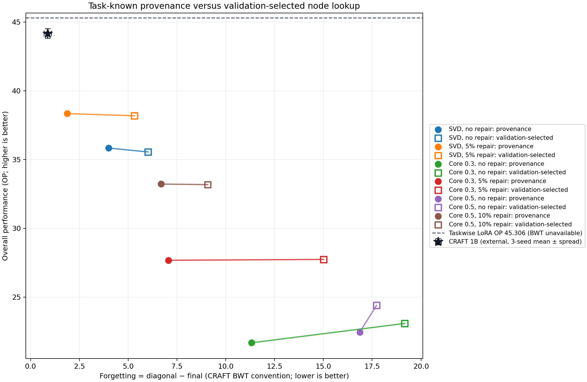
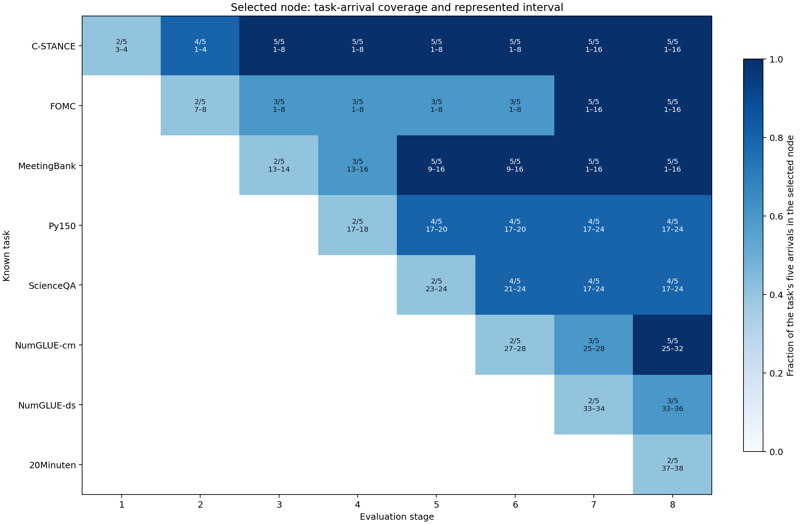

# TRACE task-known provenance follow-up

This CPU-only follow-up re-scores the sealed TRACE Log-t VAMP generations with a task-known provenance router. Given task identity, the router selects the live node containing the most arrivals from that task; ties prefer greater node purity and then the most recent node. It never uses prompts, answers, validation scores, or test scores to choose a node.

## Finding

The strongest provenance-routed condition is SVD, 5% repair at 38.340 OP with 1.878 points of forgetting. For the predeclared focus condition, SVD, 5% repair, provenance routing reaches 38.340 OP versus 38.180 for validation-selected lookup (+0.159 points); both routers choose the same final node for 6/8 tasks.

At the final stage, lineage provenance therefore approximates the validation lookup for this SVD condition. Its lower forgetting value must not be read as cleaner retention: forgetting is 3.444 points lower while its mean diagonal starting score is 3.284 points lower. Because each router can choose a different node at each stage, diagonal−final mixes routing quality with retention.

| Condition | Provenance OP | Provenance forgetting | Validation-selected OP | Validation-selected forgetting | OP delta | Same final node |
|---|---|---|---|---|---|---|
| SVD, no repair | 35.831 | 4.001 | 35.548 | 6.021 | +0.282 | 6/8 |
| SVD, 5% repair | 38.340 | 1.878 | 38.180 | 5.321 | +0.159 | 6/8 |
| Core 0.3, no repair | 21.668 | 11.320 | 23.076 | 19.166 | -1.408 | 1/8 |
| Core 0.3, 5% repair | 27.671 | 7.069 | 27.732 | 15.013 | -0.061 | 4/8 |
| Core 0.5, no repair | 22.440 | 16.863 | 24.393 | 17.725 | -1.952 | 4/8 |
| Core 0.5, 10% repair | 33.213 | 6.692 | 33.173 | 9.077 | +0.040 | 6/8 |

## What the comparison means

`task_known_provenance` is the fixed lineage rule tested here. `task_known_validation` is the existing result key `task_aware`, renamed in this report because it chooses one validation-best node per known task. Both are task-known controls and require an O(number of tasks) lookup table; neither supports the task-free or O(log T) addressing claim.

Forgetting is meaningful within a fixed router, but its absolute value is not a clean router comparison here. Changing the router changes both the diagonal starting scores and the final scores. The final OP and per-task final deltas are the direct addressing comparison.

The independent taskwise-LoRA reference reaches **45.306 OP**. Published CRAFT Llama-3.2-1B reports **44.17 ± 0.35 OP** and **0.87 ± 0.19 BWT** across three seeds ([CRAFT arXiv v2](https://arxiv.org/html/2605.05732v2)). CRAFT's positive BWT quantity corresponds to this report's `forgetting = diagonal − final`, not the native signed BWT. These are contextual values, not a controlled head-to-head: CRAFT uses LoReFT, different task epochs, a 2e-4 learning rate, zero dropout, effective batch four, and three seeds; this TRACE run uses LoRA/VAMP, different epochs, 1e-4, 0.1 dropout, effective batch eight, and one seed/order.

## Predeclared focus: SVD with 5% repair

This condition was fixed before the new scores were computed because it had the highest pre-existing final validation OP under `task_aware`. It was not selected from the provenance test results.

At stage 8 the routers differ only for ScienceQA and 20Minuten: the provenance-minus-validation final deltas are ScienceQA +2.000, 20Minuten -0.725 points. The other six final task scores are identical.

| Task | Prov. diagonal | Valid. diagonal | Prov. final | Valid. final | Final delta | Prov. forgetting | Same final node | Final node | Coverage | Purity |
|---|---|---|---|---|---|---|---|---|---|---|
| C-STANCE | 51.000 | 57.000 | 54.000 | 54.000 | +0.000 | -3.000 | yes | 1–16 | 5/5 | 0.312 |
| FOMC | 5.000 | 23.000 | 25.000 | 25.000 | +0.000 | -20.000 | yes | 1–16 | 5/5 | 0.312 |
| MeetingBank | 32.283 | 32.283 | 20.717 | 20.717 | +0.000 | 11.566 | yes | 1–16 | 5/5 | 0.312 |
| Py150 | 53.840 | 55.390 | 37.090 | 37.090 | +0.000 | 16.750 | yes | 17–24 | 4/5 | 0.500 |
| ScienceQA | 71.000 | 71.000 | 68.000 | 66.000 | +2.000 | 3.000 | no | 17–24 | 4/5 | 0.500 |
| NumGLUE-cm | 23.457 | 23.457 | 19.753 | 19.753 | +0.000 | 3.704 | yes | 25–32 | 5/5 | 0.625 |
| NumGLUE-ds | 47.000 | 47.000 | 44.000 | 44.000 | +0.000 | 3.000 | yes | 33–36 | 3/5 | 0.750 |
| 20Minuten | 38.158 | 38.883 | 38.158 | 38.883 | -0.725 | 0.000 | no | 37–38 | 2/5 | 1.000 |

## Route structure

All six VAMP policies share the same logical lineage, so the 36 stage/task decisions below are policy-independent. Coverage is the fraction of a task's five training arrivals represented by the selected node. Purity is the fraction of the selected node's arrivals belonging to that task.

Complete 36-route audit

| Stage | Task | Node interval | Candidate ID | Coverage | Coverage fraction | Purity |
|---|---|---|---|---|---|---|
| 1 | C-STANCE | 3–4 | 43132f6a2dbb904542b9be65f7f3134e43f57b3b88035b83885dea7243114432 | 2/5 | 0.400 | 1.000 |
| 2 | C-STANCE | 1–4 | dc4958ca640784e24adedf85bf25fbc4472926133226bba116da1a21e53f73eb | 4/5 | 0.800 | 1.000 |
| 2 | FOMC | 7–8 | 31f32c9500cad0c67c045dd5ee862d32d65a71ae6f1f6b49cbbdc542e1a65f11 | 2/5 | 0.400 | 1.000 |
| 3 | C-STANCE | 1–8 | f1e03f4b15e3ddefa5c719f442675bd70eb496603cccd94be5415b26d708f88a | 5/5 | 1.000 | 0.625 |
| 3 | FOMC | 1–8 | f1e03f4b15e3ddefa5c719f442675bd70eb496603cccd94be5415b26d708f88a | 3/5 | 0.600 | 0.375 |
| 3 | MeetingBank | 13–14 | c68ad33b3997eab723aab56e71bc046d278b975179df40ce2414b056a355dbd3 | 2/5 | 0.400 | 1.000 |
| 4 | C-STANCE | 1–8 | f1e03f4b15e3ddefa5c719f442675bd70eb496603cccd94be5415b26d708f88a | 5/5 | 1.000 | 0.625 |
| 4 | FOMC | 1–8 | f1e03f4b15e3ddefa5c719f442675bd70eb496603cccd94be5415b26d708f88a | 3/5 | 0.600 | 0.375 |
| 4 | MeetingBank | 13–16 | 41b93a772df39c1f62c5102bd843077e53a00f6455f9e6a8e076d8e41cf9dbf0 | 3/5 | 0.600 | 0.750 |
| 4 | Py150 | 17–18 | 47a1b0022fc1f6941637d400a3dfc547e7aca79629a175bd136aae7439b89537 | 2/5 | 0.400 | 1.000 |
| 5 | C-STANCE | 1–8 | f1e03f4b15e3ddefa5c719f442675bd70eb496603cccd94be5415b26d708f88a | 5/5 | 1.000 | 0.625 |
| 5 | FOMC | 1–8 | f1e03f4b15e3ddefa5c719f442675bd70eb496603cccd94be5415b26d708f88a | 3/5 | 0.600 | 0.375 |
| 5 | MeetingBank | 9–16 | 17903bc836d8ba50b43430c97fedaa2cc578e7cc2f448a227d5cfc5bb0581fcd | 5/5 | 1.000 | 0.625 |
| 5 | Py150 | 17–20 | 0120004419d6d9182c9bf7dc7d01fcc89c2fab04eb0e2f667a4a1c256ada759f | 4/5 | 0.800 | 1.000 |
| 5 | ScienceQA | 23–24 | 77274d05894a0c90f13f165e9ee95a1960266c36a5cd296b19fecefdeba8c249 | 2/5 | 0.400 | 1.000 |
| 6 | C-STANCE | 1–8 | f1e03f4b15e3ddefa5c719f442675bd70eb496603cccd94be5415b26d708f88a | 5/5 | 1.000 | 0.625 |
| 6 | FOMC | 1–8 | f1e03f4b15e3ddefa5c719f442675bd70eb496603cccd94be5415b26d708f88a | 3/5 | 0.600 | 0.375 |
| 6 | MeetingBank | 9–16 | 17903bc836d8ba50b43430c97fedaa2cc578e7cc2f448a227d5cfc5bb0581fcd | 5/5 | 1.000 | 0.625 |
| 6 | Py150 | 17–20 | 0120004419d6d9182c9bf7dc7d01fcc89c2fab04eb0e2f667a4a1c256ada759f | 4/5 | 0.800 | 1.000 |
| 6 | ScienceQA | 21–24 | dd802562e95d2e17cbf51e08bd92c703cc4d96dfd390f0e59d95b4c5b59733c3 | 4/5 | 0.800 | 1.000 |
| 6 | NumGLUE-cm | 27–28 | 1d39607e63fa78261f1d172ed38d6a6e84d7e36aa538509899460baa5df69d23 | 2/5 | 0.400 | 1.000 |
| 7 | C-STANCE | 1–16 | 831233efcb2e15eb68f4557a896c6a070376753dd087167ddd296d59281dee3e | 5/5 | 1.000 | 0.312 |
| 7 | FOMC | 1–16 | 831233efcb2e15eb68f4557a896c6a070376753dd087167ddd296d59281dee3e | 5/5 | 1.000 | 0.312 |
| 7 | MeetingBank | 1–16 | 831233efcb2e15eb68f4557a896c6a070376753dd087167ddd296d59281dee3e | 5/5 | 1.000 | 0.312 |
| 7 | Py150 | 17–24 | 650f23a261ea23e511b3153fb6e2d826b06ebea231f131c64b9a38355791bd2c | 4/5 | 0.800 | 0.500 |
| 7 | ScienceQA | 17–24 | 650f23a261ea23e511b3153fb6e2d826b06ebea231f131c64b9a38355791bd2c | 4/5 | 0.800 | 0.500 |
| 7 | NumGLUE-cm | 25–28 | 2c6db93757974a4ef9066ede8feb683f1c5e222d74e317979a3a151f045992b6 | 3/5 | 0.600 | 0.750 |
| 7 | NumGLUE-ds | 33–34 | 619dd99f9be6af638bc99c9d6ac7b095d81e6822159cdce7c3c50ecba2e189ef | 2/5 | 0.400 | 1.000 |
| 8 | C-STANCE | 1–16 | 831233efcb2e15eb68f4557a896c6a070376753dd087167ddd296d59281dee3e | 5/5 | 1.000 | 0.312 |
| 8 | FOMC | 1–16 | 831233efcb2e15eb68f4557a896c6a070376753dd087167ddd296d59281dee3e | 5/5 | 1.000 | 0.312 |
| 8 | MeetingBank | 1–16 | 831233efcb2e15eb68f4557a896c6a070376753dd087167ddd296d59281dee3e | 5/5 | 1.000 | 0.312 |
| 8 | Py150 | 17–24 | 650f23a261ea23e511b3153fb6e2d826b06ebea231f131c64b9a38355791bd2c | 4/5 | 0.800 | 0.500 |
| 8 | ScienceQA | 17–24 | 650f23a261ea23e511b3153fb6e2d826b06ebea231f131c64b9a38355791bd2c | 4/5 | 0.800 | 0.500 |
| 8 | NumGLUE-cm | 25–32 | d05fcbfaa1c7f3d9d2321ceacda63a16df1ea8715457f64da340d3ec70d270b7 | 5/5 | 1.000 | 0.625 |
| 8 | NumGLUE-ds | 33–36 | 9b12f10fa73d981a4308fc651241f0e93bf33411beae1c110cf310bca0776dd4 | 3/5 | 0.600 | 0.750 |
| 8 | 20Minuten | 37–38 | 9efb562b2ebd0a8a69e887dd9091ffaee44ff091a80f3340e28ec08673872bb6 | 2/5 | 0.400 | 1.000 |

## Verification and limits

- The analysis hash-verified all 1,798 evidence files and cross-checked 432 VAMP candidate JSONLs containing 301,968 candidate/example rows.
- It reconstructed `prompt_nll`, `task_aware`, and `answer_oracle` for every condition, triangular cell, and split: **1,296 aggregate checks**, maximum absolute error **0**, acceptance tolerance **1e-08**.
- The frozen-centroid router cannot be reconstructed because prompt embeddings were deliberately excluded from the reviewer bundle.
- This follow-up reuses one completed run, one task order, and the same test generations. It estimates the effect of changing only the lookup rule; it does not estimate seed variation or establish statistical significance.
- No model weights were loaded, no generations were added, and no GPU work was performed.

Machine-readable details are in `scores.csv`, `routes.csv`, `summary.csv`, and `manifest.json`.
