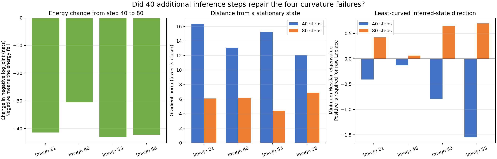

# PC settling diagnostic: 40 versus 80 steps

This post-hoc diagnostic uses the exact four held-out images that had one negative Hessian eigenvalue after the canonical 40 inference steps. It uses the same saved model, zero initialization, and inference step size of 0.01. The only change is increasing inference from 40 to 80 total steps.

The energy is the complete negative log joint; lower is better. The gradient norm measures how far the inferred state remains from a stationary point; zero would mean no first-order pressure to move. The minimum Hessian eigenvalue measures the least-curved local direction; it must be positive for the unshifted Laplace calculation.

| Audit image | Energy at 40 | Energy at 80 | Gradient at 40 | Gradient at 80 | Minimum eigenvalue at 40 | Minimum eigenvalue at 80 | Negative eigenvalues at 80 |
|---:|---:|---:|---:|---:|---:|---:|---:|
| 21 | -525.541748 | -566.955078 | 16.380419 | 6.104316 | -0.410284 | 0.423893 | 0 |
| 46 | -290.346069 | -320.864014 | 13.075900 | 6.198429 | -0.129230 | 0.062524 | 0 |
| 53 | -620.287354 | -663.286072 | 15.234770 | 4.421917 | -0.791589 | 0.645231 | 0 |
| 58 | -477.231323 | -519.450134 | 12.078953 | 6.882262 | -1.546588 | 0.696809 | 0 |

At 80 steps, all four images have positive curvature in all 160 inferred-state directions. Thus 80 steps repaired the curvature failure on this exact four-image subset. The states are not stationary: their gradient norms remain between 4.42 and 6.88. Because the protocol did not define an absolute gradient threshold, this diagnostic does not invent one and call them fully converged.

The canonical 40-step result remains unchanged. This is a separate diagnostic run.
