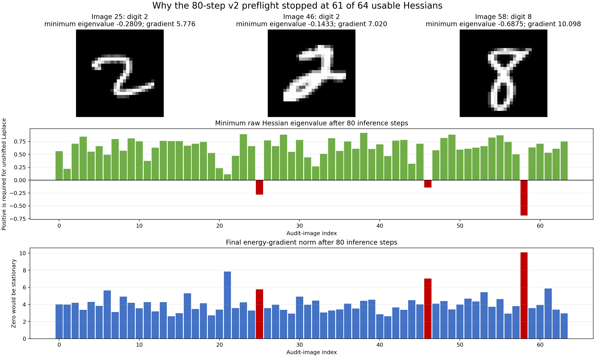

# Generative-PC v2 curvature audit

The sealed `generative-pc-v2` run retrained every candidate with 80 latent-inference steps and then evaluated the winning training candidate on 64 held-out images. Sixty-one images had positive-definite raw Hessians. Three images did not. Because the registered success threshold is at least 99%, and 63 of 64 would be only 98.4375%, this 64-image gate requires 64 of 64 successes.

| Audit image | True digit | Classifier prediction | Correctly classified | Final gradient norm | Minimum Hessian eigenvalue | Negative eigenvalues | Shift needed merely to reach zero |
|---:|---:|---:|:---:|---:|---:|---:|---:|
| 25 | 2 | 1 | no | 5.775781 | -0.280943 | 1 | 0.280943 |
| 46 | 2 | 2 | yes | 7.019910 | -0.143258 | 1 | 0.143258 |
| 58 | 8 | 8 | yes | 10.098268 | -0.687548 | 1 | 0.687548 |

The minimum Hessian eigenvalue is measured from the complete negative log joint with the image and model weights fixed. A negative value means that the 80-step inferred state still bends downward along at least one Hessian eigenvector. The final gradient norm is reported separately because positive curvature and convergence are different requirements.

The three permitted diagonal Hessian shifts—`1e-8`, `1e-6`, and `1e-4`—all left the same three cases invalid. The table's final column reports the much larger shift that would merely move each smallest eigenvalue to zero; strict positive definiteness would require slightly more. The workflow correctly stopped before static routing.

This is a post-hoc explanation of the sealed preflight result. It does not change the run or its gate.
