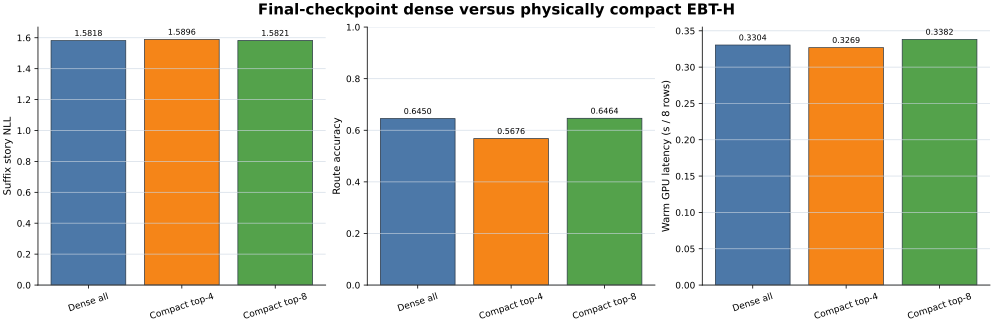
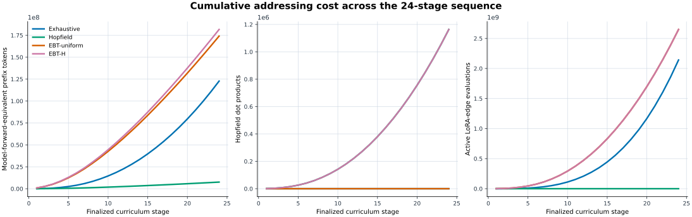
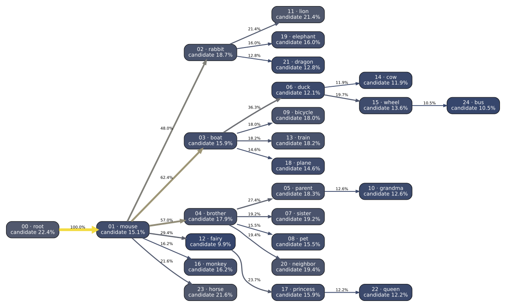
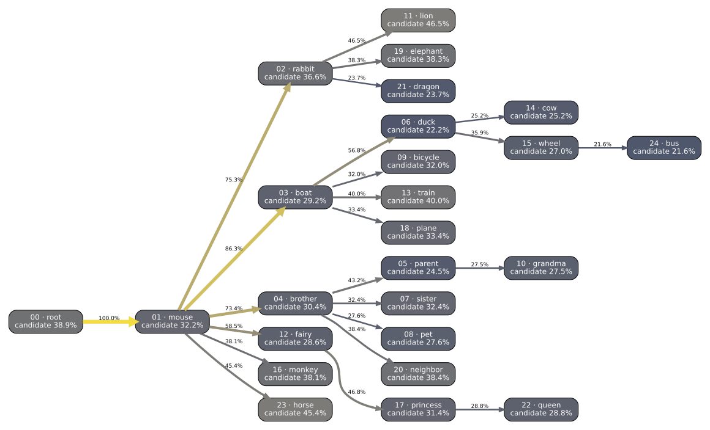

# TinyWorlds Nouns-v2 bounded addressing study

This is a frozen final-checkpoint study. It did not retrain the base, alter a VAMP edge, or replace any canonical nouns-v1/v2 artifact.

## Result

Compact top-8 passed both preregistered non-inferiority margins. Its story-NLL change versus dense-all was +0.0003 (allowed ≤ 0.02); its route-accuracy loss was -0.14% (allowed ≤ 2%). The result is reported regardless of that verdict.

### Experiment 1 — dense versus physically compact EBT-H

| method | route accuracy | true-node recall@4 | true-node recall@8 | story NLL | token NLL | oracle regret | active path edges | gathered bank edges | warm GPU latency / 8 rows | throughput |
|---|---:|---:|---:|---:|---:|---:|---:|---:|---:|---:|
| Dense all-node EBT-H | 64.50% | 64.08% | 78.09% | 1.5818 | 1.6185 | +0.0426 | 2.62 | 24.00 | 0.3304 s | 24.2/s |
| Compact top-4 EBT-H | 56.76% | 64.08% | 78.09% | 1.5896 | 1.6248 | +0.0504 | 2.48 | 6.19 | 0.3269 s | 24.5/s |
| Compact top-8 EBT-H | 64.64% | 64.08% | 78.09% | 1.5821 | 1.6179 | +0.0429 | 2.54 | 10.47 | 0.3382 s | 23.7/s |

### Experiment 2 — frozen key schemes

Recall@8 is primary; compact top-8 suffix NLL is secondary.

| key scheme | recall@1 | recall@4 | recall@8 | retrieval entropy | margin | compact top-8 accuracy | compact top-8 story NLL |
|---|---:|---:|---:|---:|---:|---:|---:|
| canonical_full_centroid | 37.45% | 64.08% | 78.09% | 2.900 | 0.0431 | 64.64% | 1.5821 |
| midpoint_content_centroid | 38.20% | 64.84% | 79.55% | 2.909 | 0.0450 | 65.43% | 1.5816 |
| midpoint_content_prototype | 30.61% | 58.27% | 75.07% | 2.946 | 0.0372 | 62.59% | 1.5830 |
| midpoint_content_residual_centroid | 37.23% | 65.00% | 79.32% | 2.894 | 0.0372 | 65.20% | 1.5820 |
| midpoint_content_residual_prototype | 28.42% | 56.10% | 73.65% | 3.007 | 0.0328 | 61.62% | 1.5842 |

Method and interpretation

Frozen-base keys can work because the base's final hidden states already carry lexical and topical information; a centroid or nearest prototype can therefore retrieve a task without a learned router. They are suspect here because the canonical keys summarize complete probe stories while every real query stops at the midpoint, and the frozen base was never optimized to separate these 24 disjoint noun memories.

For active prefix transition `t`, the residual signature is computed exactly as `g_t = softmax(logits_t) @ token_embedding - token_embedding[target_t]`. The study masked-means those gradients, L2-normalizes the result, and fuses it with unit content as `[content / sqrt(2), residual / sqrt(2)]`. No validation example contributes to a key. Router inputs contain only prefix transitions; task identity and suffix tokens remain evaluator metadata.

Every scheme uses all 36 registered probes for every node, including the root. All EBT runs use 20 Adam steps, learning rate 0.1, temperature 1, entropy penalty 0.01, and Hopfield beta 10.

Logical masking keeps a dense 24-edge bank resident and assigns zero coefficients outside a shortlist. Physical compaction instead gathers each row's insertion-ordered union of shortlisted root-to-node edges and executes only those factors in a 4/8/12/16/20/24 capacity bucket. Both optimize the same four or eight candidate logits.

Paired seed-zero bootstrap intervals

| metric | scheme | paired difference vs canonical keys | 95% interval |
|---|---|---:|---:|
| top_8_recall | canonical_full_centroid | +0.00000 | [+0.00000, +0.00000] |
| top_8_recall | midpoint_content_centroid | +0.01464 | [+0.00811, +0.02117] |
| top_8_recall | midpoint_content_prototype | -0.03018 | [-0.04369, -0.01667] |
| top_8_recall | midpoint_content_residual_centroid | +0.01239 | [+0.00113, +0.02365] |
| top_8_recall | midpoint_content_residual_prototype | -0.04437 | [-0.05856, -0.03041] |
| compact_top_8_story_nll | canonical_full_centroid | +0.00000 | [+0.00000, +0.00000] |
| compact_top_8_story_nll | midpoint_content_centroid | -0.00053 | [-0.00165, +0.00060] |
| compact_top_8_story_nll | midpoint_content_prototype | +0.00082 | [-0.00165, +0.00327] |
| compact_top_8_story_nll | midpoint_content_residual_centroid | -0.00011 | [-0.00233, +0.00213] |
| compact_top_8_story_nll | midpoint_content_residual_prototype | +0.00202 | [-0.00042, +0.00444] |

Each interval uses 10,000 paired resamples with seed 0.

Per-task results and confusion

The machine-readable per-task table includes a 25-node confusion-count object plus retrieval/final entropy and margin for every task/method cell: [per-task.csv](per-task.csv).

| task | scheme | mode | width | recall@8 | route accuracy | story NLL |
|---|---|---|---:|---:|---:|---:|
| mouse | canonical_full_centroid | compact | 8 | 77.97% | 60.89% | 1.4976 |
| mouse | midpoint_content_centroid | compact | 8 | 75.99% | 60.40% | 1.4964 |
| mouse | midpoint_content_prototype | compact | 8 | 76.49% | 61.63% | 1.4983 |
| mouse | midpoint_content_residual_centroid | compact | 8 | 75.50% | 58.66% | 1.5040 |
| mouse | midpoint_content_residual_prototype | compact | 8 | 76.98% | 61.14% | 1.4989 |
| rabbit | canonical_full_centroid | compact | 8 | 84.75% | 69.49% | 1.6299 |
| rabbit | midpoint_content_centroid | compact | 8 | 83.78% | 68.77% | 1.6309 |
| rabbit | midpoint_content_prototype | compact | 8 | 75.79% | 61.74% | 1.6292 |
| rabbit | midpoint_content_residual_centroid | compact | 8 | 86.20% | 71.19% | 1.6294 |
| rabbit | midpoint_content_residual_prototype | compact | 8 | 76.03% | 59.81% | 1.6321 |
| boat | canonical_full_centroid | compact | 8 | 73.76% | 70.26% | 1.6514 |
| boat | midpoint_content_centroid | compact | 8 | 77.26% | 73.18% | 1.6505 |
| boat | midpoint_content_prototype | compact | 8 | 83.38% | 76.68% | 1.6425 |
| boat | midpoint_content_residual_centroid | compact | 8 | 84.55% | 78.72% | 1.6409 |
| boat | midpoint_content_residual_prototype | compact | 8 | 85.42% | 79.30% | 1.6389 |
| brother | canonical_full_centroid | compact | 8 | 79.33% | 51.37% | 1.5061 |
| brother | midpoint_content_centroid | compact | 8 | 80.85% | 56.53% | 1.5018 |
| brother | midpoint_content_prototype | compact | 8 | 72.34% | 50.15% | 1.5125 |
| brother | midpoint_content_residual_centroid | compact | 8 | 74.77% | 51.67% | 1.5115 |
| brother | midpoint_content_residual_prototype | compact | 8 | 61.40% | 45.59% | 1.5183 |
| parent | canonical_full_centroid | compact | 8 | 66.20% | 54.01% | 1.9423 |
| parent | midpoint_content_centroid | compact | 8 | 67.25% | 54.70% | 1.9424 |
| parent | midpoint_content_prototype | compact | 8 | 65.85% | 49.13% | 1.9543 |
| parent | midpoint_content_residual_centroid | compact | 8 | 70.03% | 54.36% | 1.9437 |
| parent | midpoint_content_residual_prototype | compact | 8 | 64.11% | 47.39% | 1.9511 |
| duck | canonical_full_centroid | compact | 8 | 83.46% | 77.57% | 1.3857 |
| duck | midpoint_content_centroid | compact | 8 | 80.88% | 74.63% | 1.3887 |
| duck | midpoint_content_prototype | compact | 8 | 83.82% | 76.84% | 1.3855 |
| duck | midpoint_content_residual_centroid | compact | 8 | 69.12% | 62.50% | 1.4050 |
| duck | midpoint_content_residual_prototype | compact | 8 | 80.15% | 74.63% | 1.3957 |
| sister | canonical_full_centroid | compact | 8 | 83.39% | 66.06% | 1.3991 |
| sister | midpoint_content_centroid | compact | 8 | 83.39% | 66.06% | 1.3990 |
| sister | midpoint_content_prototype | compact | 8 | 70.76% | 59.21% | 1.4039 |
| sister | midpoint_content_residual_centroid | compact | 8 | 79.78% | 62.45% | 1.3993 |
| sister | midpoint_content_residual_prototype | compact | 8 | 52.35% | 42.60% | 1.4207 |
| pet | canonical_full_centroid | compact | 8 | 80.15% | 67.56% | 1.4947 |
| pet | midpoint_content_centroid | compact | 8 | 81.68% | 67.18% | 1.4981 |
| pet | midpoint_content_prototype | compact | 8 | 78.24% | 67.94% | 1.4934 |
| pet | midpoint_content_residual_centroid | compact | 8 | 90.46% | 76.34% | 1.4806 |
| pet | midpoint_content_residual_prototype | compact | 8 | 77.48% | 66.79% | 1.4964 |
| bicycle | canonical_full_centroid | compact | 8 | 77.33% | 70.93% | 1.5837 |
| bicycle | midpoint_content_centroid | compact | 8 | 74.42% | 67.44% | 1.5878 |
| bicycle | midpoint_content_prototype | compact | 8 | 76.74% | 67.44% | 1.5860 |
| bicycle | midpoint_content_residual_centroid | compact | 8 | 81.98% | 76.16% | 1.5753 |
| bicycle | midpoint_content_residual_prototype | compact | 8 | 82.56% | 76.16% | 1.5722 |
| grandma | canonical_full_centroid | compact | 8 | 78.70% | 66.86% | 1.7303 |
| grandma | midpoint_content_centroid | compact | 8 | 81.07% | 70.41% | 1.7220 |
| grandma | midpoint_content_prototype | compact | 8 | 64.50% | 57.99% | 1.7424 |
| grandma | midpoint_content_residual_centroid | compact | 8 | 71.60% | 63.31% | 1.7438 |
| grandma | midpoint_content_residual_prototype | compact | 8 | 74.56% | 64.50% | 1.7249 |
| lion | canonical_full_centroid | compact | 8 | 71.25% | 63.12% | 1.6902 |
| lion | midpoint_content_centroid | compact | 8 | 75.00% | 65.62% | 1.6842 |
| lion | midpoint_content_prototype | compact | 8 | 70.00% | 61.88% | 1.6908 |
| lion | midpoint_content_residual_centroid | compact | 8 | 76.88% | 69.38% | 1.6820 |
| lion | midpoint_content_residual_prototype | compact | 8 | 75.00% | 66.25% | 1.6847 |
| fairy | canonical_full_centroid | compact | 8 | 62.13% | 40.83% | 1.7104 |
| fairy | midpoint_content_centroid | compact | 8 | 78.11% | 47.34% | 1.6977 |
| fairy | midpoint_content_prototype | compact | 8 | 59.76% | 39.64% | 1.6976 |
| fairy | midpoint_content_residual_centroid | compact | 8 | 66.86% | 28.40% | 1.7233 |
| fairy | midpoint_content_residual_prototype | compact | 8 | 46.15% | 24.85% | 1.7288 |
| train | canonical_full_centroid | compact | 8 | 76.60% | 68.79% | 1.7049 |
| train | midpoint_content_centroid | compact | 8 | 87.23% | 75.89% | 1.7031 |
| train | midpoint_content_prototype | compact | 8 | 79.43% | 70.92% | 1.7073 |
| train | midpoint_content_residual_centroid | compact | 8 | 86.52% | 81.56% | 1.7007 |
| train | midpoint_content_residual_prototype | compact | 8 | 87.94% | 80.14% | 1.7044 |
| cow | canonical_full_centroid | compact | 8 | 80.34% | 79.49% | 1.3779 |
| cow | midpoint_content_centroid | compact | 8 | 78.63% | 77.78% | 1.3824 |
| cow | midpoint_content_prototype | compact | 8 | 88.89% | 86.32% | 1.3512 |
| cow | midpoint_content_residual_centroid | compact | 8 | 85.47% | 85.47% | 1.3544 |
| cow | midpoint_content_residual_prototype | compact | 8 | 86.32% | 85.47% | 1.3576 |
| wheel | canonical_full_centroid | compact | 8 | 86.96% | 76.09% | 1.4415 |
| wheel | midpoint_content_centroid | compact | 8 | 85.51% | 74.64% | 1.4475 |
| wheel | midpoint_content_prototype | compact | 8 | 86.23% | 75.36% | 1.4403 |
| wheel | midpoint_content_residual_centroid | compact | 8 | 79.71% | 68.84% | 1.4421 |
| wheel | midpoint_content_residual_prototype | compact | 8 | 82.61% | 72.46% | 1.4356 |
| monkey | canonical_full_centroid | compact | 8 | 85.22% | 70.43% | 1.4476 |
| monkey | midpoint_content_centroid | compact | 8 | 88.70% | 73.04% | 1.4458 |
| monkey | midpoint_content_prototype | compact | 8 | 67.83% | 57.39% | 1.4502 |
| monkey | midpoint_content_residual_centroid | compact | 8 | 86.96% | 71.30% | 1.4460 |
| monkey | midpoint_content_residual_prototype | compact | 8 | 71.30% | 62.61% | 1.4452 |
| princess | canonical_full_centroid | compact | 8 | 92.68% | 65.85% | 1.7569 |
| princess | midpoint_content_centroid | compact | 8 | 90.24% | 59.76% | 1.7583 |
| princess | midpoint_content_prototype | compact | 8 | 82.93% | 57.32% | 1.7621 |
| princess | midpoint_content_residual_centroid | compact | 8 | 90.24% | 62.20% | 1.7526 |
| princess | midpoint_content_residual_prototype | compact | 8 | 90.24% | 59.76% | 1.7548 |
| plane | canonical_full_centroid | compact | 8 | 89.36% | 80.85% | 1.7026 |
| plane | midpoint_content_centroid | compact | 8 | 91.49% | 79.79% | 1.7038 |
| plane | midpoint_content_prototype | compact | 8 | 88.30% | 78.72% | 1.7030 |
| plane | midpoint_content_residual_centroid | compact | 8 | 90.43% | 79.79% | 1.7091 |
| plane | midpoint_content_residual_prototype | compact | 8 | 88.30% | 74.47% | 1.7076 |
| elephant | canonical_full_centroid | compact | 8 | 73.20% | 47.42% | 1.5137 |
| elephant | midpoint_content_centroid | compact | 8 | 81.44% | 52.58% | 1.5122 |
| elephant | midpoint_content_prototype | compact | 8 | 78.35% | 56.70% | 1.4968 |
| elephant | midpoint_content_residual_centroid | compact | 8 | 77.32% | 53.61% | 1.5169 |
| elephant | midpoint_content_residual_prototype | compact | 8 | 71.13% | 51.55% | 1.5111 |
| neighbor | canonical_full_centroid | compact | 8 | 60.23% | 38.64% | 1.5992 |
| neighbor | midpoint_content_centroid | compact | 8 | 71.59% | 40.91% | 1.5966 |
| neighbor | midpoint_content_prototype | compact | 8 | 56.82% | 35.23% | 1.6025 |
| neighbor | midpoint_content_residual_centroid | compact | 8 | 72.73% | 46.59% | 1.5906 |
| neighbor | midpoint_content_residual_prototype | compact | 8 | 61.36% | 42.05% | 1.6141 |
| dragon | canonical_full_centroid | compact | 8 | 67.86% | 59.52% | 1.6460 |
| dragon | midpoint_content_centroid | compact | 8 | 67.86% | 60.71% | 1.6473 |
| dragon | midpoint_content_prototype | compact | 8 | 61.90% | 55.95% | 1.6589 |
| dragon | midpoint_content_residual_centroid | compact | 8 | 75.00% | 63.10% | 1.6333 |
| dragon | midpoint_content_residual_prototype | compact | 8 | 72.62% | 65.48% | 1.6359 |
| queen | canonical_full_centroid | compact | 8 | 77.78% | 60.49% | 1.5852 |
| queen | midpoint_content_centroid | compact | 8 | 75.31% | 59.26% | 1.5901 |
| queen | midpoint_content_prototype | compact | 8 | 71.60% | 60.49% | 1.5816 |
| queen | midpoint_content_residual_centroid | compact | 8 | 75.31% | 62.96% | 1.5927 |
| queen | midpoint_content_residual_prototype | compact | 8 | 70.37% | 61.73% | 1.5878 |
| horse | canonical_full_centroid | compact | 8 | 72.15% | 62.03% | 1.5298 |
| horse | midpoint_content_centroid | compact | 8 | 68.35% | 56.96% | 1.5323 |
| horse | midpoint_content_prototype | compact | 8 | 75.95% | 60.76% | 1.5370 |
| horse | midpoint_content_residual_centroid | compact | 8 | 82.28% | 68.35% | 1.5396 |
| horse | midpoint_content_residual_prototype | compact | 8 | 67.09% | 54.43% | 1.5355 |
| bus | canonical_full_centroid | compact | 8 | 95.52% | 92.54% | 1.5016 |
| bus | midpoint_content_centroid | compact | 8 | 95.52% | 91.04% | 1.5016 |
| bus | midpoint_content_prototype | compact | 8 | 82.09% | 79.10% | 1.5318 |
| bus | midpoint_content_residual_centroid | compact | 8 | 91.04% | 88.06% | 1.4802 |
| bus | midpoint_content_residual_prototype | compact | 8 | 92.54% | 91.04% | 1.4889 |

Timing and operation accounting

Five synchronized warm repetitions were measured for every observed prefix-width/physical-edge shape; cold compilation is separate in [timing.csv](timing.csv). GPU kernel latency, end-to-end wall time, model-forward-equivalent prefix tokens, Hopfield dot products, and active LoRA-edge evaluations are not conflated.

End-to-end evaluation wall time: 4308.3 s. Observed allocator peak: 5.23 GiB against the 12 GiB gate.

The cumulative plot keeps incomparable operation units in separate panels. Detailed values are in [cost.csv](cost.csv) and aggregates in [aggregate.csv](aggregate.csv).

Top-4 and top-8 VAMP dependency graphs

Nodes are colored by candidate-inclusion frequency across all five schemes; edges are colored and weighted by compact union-path activation.

Provenance and numerical gates

Real-checkpoint compact/dense parity used tolerance `0.001`; maximum differences: `{"top_4_candidate_probabilities": 0.00020107626914978027, "top_4_edge_coefficients": 0.000244140625, "top_4_hard_nll": 0.00015616416931152344, "top_4_objective_trace": 0.0005128383636474609, "top_4_soft_nll": 0.00025081634521484375, "top_8_candidate_probabilities": 0.00021848082542419434, "top_8_edge_coefficients": 0.000244140625, "top_8_hard_nll": 5.53131103515625e-05, "top_8_objective_trace": 0.0004975795745849609, "top_8_soft_nll": 0.00028395652770996094}`.

Canonical run: `7d435f5bdfaddeac799e22b2235800d186340e80be374600760c8aceeb519911`  
Key artifact: `9036d673332303a6f949b853b3f4e4d90e89b2340901b27db9a8c4d90e53ce43`  
Retrieval contract: `0b9481d422175fd5492bd2d0098237e4ab0b544d04da2eba387931c6c8201cdb`  
EBT contract: `040eff168d2e6a9b02d359ed7eca43107ea3a075bcaec972bcb09d102213a4bc`  
Partition: `210c4e2d067077fe774782024a594ade7e7472a986d554f186453549cf910f1b`  
Selected base: `fff309bfbfcee8d59c5c3fc04152cc37be2142201f3bf9116b7b024e81a24f3c`  
Final VAMP tensors: `97414ac3d8656ab083b2e570a4162dc69b024f90cf819b80b1cab94213553e63`

Every source ledger, contract, result row, key tensor, and report projection is independently content-addressed. Canonical hashes were checked again after publication.

