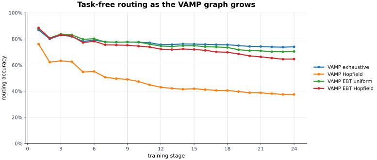

# TinyWorlds nouns-v2 disjoint benchmark

This report covers nouns-v2 only. Base and task training stories cannot overlap: zero selected noun families means base, exactly one means that single task, and two or more means permanent exclusion from every update.

## Dataset construction

The clean base universe contains 2,210,934 stories (81.36% of original training). After the deterministic 2% internal holdout, 2,166,648 stories are optimizer-visible (79.73% of the original archive).

The 24 tasks contain 429,199 pure training stories and 4,440 official-validation pairs. The audit permanently excludes 77,361 training and 776 validation stories that mention multiple selected task families.

## Learned VAMP graph

Complete parent-to-child edge list

- `root` attached to `none (root)` at depth 0.
- `mouse` attached to `root` at depth 1.
- `rabbit` attached to `mouse` at depth 2.
- `boat` attached to `mouse` at depth 2.
- `brother` attached to `mouse` at depth 2.
- `parent` attached to `brother` at depth 3.
- `duck` attached to `boat` at depth 3.
- `sister` attached to `brother` at depth 3.
- `pet` attached to `brother` at depth 3.
- `bicycle` attached to `boat` at depth 3.
- `grandma` attached to `parent` at depth 4.
- `lion` attached to `rabbit` at depth 3.
- `fairy` attached to `mouse` at depth 2.
- `train` attached to `boat` at depth 3.
- `cow` attached to `duck` at depth 4.
- `wheel` attached to `duck` at depth 4.
- `monkey` attached to `mouse` at depth 2.
- `princess` attached to `fairy` at depth 3.
- `plane` attached to `boat` at depth 3.
- `elephant` attached to `rabbit` at depth 3.
- `neighbor` attached to `brother` at depth 3.
- `dragon` attached to `rabbit` at depth 3.
- `queen` attached to `princess` at depth 4.
- `horse` attached to `mouse` at depth 2.
- `bus` attached to `wheel` at depth 5.

## Sequential controls, independent adapters, and VAMP

The sequential control is one rank-eight LoRA that is updated in place for all 24 tasks; it receives no task identity at evaluation. The independent control trains one fresh root LoRA per task and evaluates with the correct task adapter, so it is a task-aware isolation ceiling rather than a deployable task-free router. The full-finetune control updates every GPT-Neo parameter sequentially and also receives no task identity at evaluation.

The largest absolute independent-adapter NLL drift is 0. All systems use the same base, task order, 2,000-update budget, validation stories, midpoint split, and true-suffix loss. Adapter methods use rank/alpha eight and learning rate 1e-3; full fine-tuning uses every model parameter at learning rate 5e-5.

| system | task identity | final story NLL | final token NLL | final route accuracy | mean forgetting | max forgetting | backward transfer |
|---|---|---:|---:|---:|---:|---:|---:|
| sequential single LoRA | no | 1.746 | 1.774 | n/a | +0.2156 | +0.3661 | -0.2156 |
| sequential full fine-tune | no | 2.048 | 2.075 | n/a | +0.5744 | +0.9411 | -0.5744 |
| independent root LoRA | required | 1.523 | 1.562 | n/a | +0.0000 | +0.0000 | +0.0000 |
| VAMP stored oracle | required | 1.539 | 1.579 | 100.0% | +0.0000 | +0.0000 | +0.0000 |
| VAMP exhaustive | no | 1.572 | 1.608 | 73.9% | +0.0029 | +0.0092 | -0.0026 |
| VAMP Hopfield | no | 1.615 | 1.648 | 37.4% | +0.0160 | +0.0586 | -0.0157 |
| VAMP EBT uniform | no | 1.581 | 1.618 | 70.4% | +0.0128 | +0.0373 | -0.0123 |
| VAMP EBT Hopfield | no | 1.582 | 1.618 | 64.5% | +0.0118 | +0.0278 | -0.0113 |
| VAMP compact top-8 EBT-H | no | 1.582 | 1.618 | 64.7% | +0.0115 | +0.0272 | -0.0110 |

All 24 sequential and independent stage aggregates

| stage | new task | retained stories | sequential LoRA | full fine-tune | independent | LoRA deficit | full deficit |
|---:|---|---:|---:|---:|---:|---:|---:|
| 1 | mouse | 404 | 1.462 | 1.221 | 1.460 | +0.002 | -0.239 |
| 2 | rabbit | 817 | 1.545 | 1.348 | 1.530 | +0.015 | -0.182 |
| 3 | boat | 1,160 | 1.621 | 1.389 | 1.552 | +0.069 | -0.163 |
| 4 | brother | 1,489 | 1.617 | 1.437 | 1.530 | +0.088 | -0.093 |
| 5 | parent | 1,776 | 1.677 | 1.551 | 1.583 | +0.094 | -0.032 |
| 6 | duck | 2,048 | 1.647 | 1.591 | 1.549 | +0.098 | +0.042 |
| 7 | sister | 2,325 | 1.620 | 1.595 | 1.524 | +0.096 | +0.072 |
| 8 | pet | 2,587 | 1.620 | 1.592 | 1.513 | +0.107 | +0.079 |
| 9 | bicycle | 2,759 | 1.629 | 1.639 | 1.514 | +0.116 | +0.125 |
| 10 | grandma | 2,928 | 1.646 | 1.642 | 1.522 | +0.124 | +0.120 |
| 11 | lion | 3,088 | 1.640 | 1.685 | 1.527 | +0.113 | +0.158 |
| 12 | fairy | 3,257 | 1.669 | 1.688 | 1.530 | +0.139 | +0.159 |
| 13 | train | 3,398 | 1.679 | 1.729 | 1.535 | +0.144 | +0.194 |
| 14 | cow | 3,515 | 1.687 | 1.745 | 1.527 | +0.159 | +0.217 |
| 15 | wheel | 3,653 | 1.682 | 1.726 | 1.521 | +0.162 | +0.205 |
| 16 | monkey | 3,768 | 1.664 | 1.894 | 1.518 | +0.145 | +0.376 |
| 17 | princess | 3,850 | 1.676 | 1.840 | 1.522 | +0.154 | +0.318 |
| 18 | plane | 3,944 | 1.693 | 1.833 | 1.526 | +0.167 | +0.307 |
| 19 | elephant | 4,041 | 1.690 | 1.958 | 1.525 | +0.165 | +0.433 |
| 20 | neighbor | 4,129 | 1.687 | 1.883 | 1.525 | +0.161 | +0.357 |
| 21 | dragon | 4,213 | 1.699 | 1.898 | 1.525 | +0.175 | +0.373 |
| 22 | queen | 4,294 | 1.709 | 2.012 | 1.525 | +0.185 | +0.488 |
| 23 | horse | 4,373 | 1.693 | 1.990 | 1.524 | +0.168 | +0.465 |
| 24 | bus | 4,440 | 1.746 | 2.048 | 1.523 | +0.223 | +0.525 |

## Stagewise continual-learning audit

The audit contains 72,256 midpoint-prefix task/story/stage cases. Every task is measured when introduced and after every later stage. The stored oracle follows that task's immutable VAMP node; exhaustive, Hopfield, dense EBT, and compact top-eight EBT-H are task-free routers over the graph available at that stage. The compact router scores every canonical stored full-probe centroid, retains at most eight node paths, and physically executes only their gathered LoRA edges. Through stage seven it retains every available node.

The largest absolute stored-oracle NLL drift is 0. Forgetting below is final task NLL minus its best earlier NLL (higher is worse); backward transfer is introduction NLL minus final NLL (higher is better).

| condition | final story NLL | final token NLL | final route accuracy | mean forgetting | max forgetting | backward transfer | route accuracy change |
|---|---:|---:|---:|---:|---:|---:|---:|
| base | 1.638 | 1.664 | 0.0% | +0.0000 | +0.0000 | +0.0000 | +0.0% |
| oracle | 1.539 | 1.579 | 100.0% | +0.0000 | +0.0000 | +0.0000 | +0.0% |
| vamp_exhaustive | 1.572 | 1.608 | 73.9% | +0.0029 | +0.0092 | -0.0026 | -2.8% |
| vamp_hopfield | 1.615 | 1.648 | 37.4% | +0.0160 | +0.0586 | -0.0157 | -9.4% |
| vamp_ebt_uniform | 1.581 | 1.618 | 70.4% | +0.0128 | +0.0373 | -0.0123 | -7.4% |
| vamp_ebt_hopfield | 1.582 | 1.618 | 64.5% | +0.0118 | +0.0278 | -0.0113 | -10.8% |
| vamp_ebt_hopfield_compact_top8 | 1.582 | 1.618 | 64.7% | +0.0115 | +0.0272 | -0.0110 | -10.3% |

All 24 VAMP stage aggregates

| stage | new task | retained stories | exhaustive | Hopfield | EBT uniform | EBT Hopfield | compact top-8 EBT-H | oracle NLL |
|---:|---|---:|---:|---:|---:|---:|---:|---:|
| 1 | mouse | 404 | 86.9% | 76.0% | 88.1% | 88.4% | 88.4% | 1.460 |
| 2 | rabbit | 817 | 79.9% | 62.2% | 80.7% | 80.4% | 80.3% | 1.533 |
| 3 | boat | 1,160 | 82.8% | 63.2% | 83.7% | 83.1% | 83.1% | 1.557 |
| 4 | brother | 1,489 | 81.8% | 62.5% | 83.1% | 82.1% | 82.1% | 1.536 |
| 5 | parent | 1,776 | 78.1% | 54.7% | 79.7% | 77.2% | 77.2% | 1.592 |
| 6 | duck | 2,048 | 79.1% | 55.1% | 80.1% | 78.2% | 78.2% | 1.559 |
| 7 | sister | 2,325 | 77.7% | 50.6% | 77.6% | 75.5% | 75.5% | 1.534 |
| 8 | pet | 2,587 | 77.5% | 49.6% | 77.5% | 75.3% | 75.3% | 1.525 |
| 9 | bicycle | 2,759 | 77.6% | 49.0% | 77.6% | 75.1% | 74.7% | 1.527 |
| 10 | grandma | 2,928 | 77.4% | 47.3% | 77.6% | 74.5% | 73.9% | 1.536 |
| 11 | lion | 3,088 | 77.0% | 44.8% | 76.0% | 73.8% | 73.2% | 1.541 |
| 12 | fairy | 3,257 | 75.6% | 43.0% | 74.5% | 72.1% | 71.7% | 1.543 |
| 13 | train | 3,398 | 75.7% | 42.1% | 74.2% | 71.8% | 71.7% | 1.549 |
| 14 | cow | 3,515 | 76.1% | 41.5% | 74.8% | 72.2% | 71.7% | 1.541 |
| 15 | wheel | 3,653 | 76.0% | 41.9% | 74.8% | 71.9% | 71.2% | 1.536 |
| 16 | monkey | 3,768 | 75.8% | 41.2% | 74.0% | 71.2% | 70.5% | 1.533 |
| 17 | princess | 3,850 | 75.6% | 40.5% | 73.8% | 70.1% | 69.7% | 1.538 |
| 18 | plane | 3,944 | 75.5% | 40.5% | 73.4% | 69.8% | 69.5% | 1.542 |
| 19 | elephant | 4,041 | 74.9% | 39.7% | 71.7% | 68.5% | 68.4% | 1.540 |
| 20 | neighbor | 4,129 | 74.2% | 38.8% | 71.0% | 67.0% | 66.7% | 1.540 |
| 21 | dragon | 4,213 | 74.2% | 38.7% | 70.9% | 66.2% | 66.0% | 1.540 |
| 22 | queen | 4,294 | 73.8% | 38.1% | 70.2% | 65.3% | 65.4% | 1.541 |
| 23 | horse | 4,373 | 73.7% | 37.5% | 70.1% | 64.5% | 64.6% | 1.540 |
| 24 | bus | 4,440 | 73.9% | 37.4% | 70.4% | 64.5% | 64.7% | 1.539 |

Detailed task-level introduction, best, and final measurements are in `stagewise-task-metrics.csv`, `baseline-stagewise-task-metrics.csv`, and `full-finetune-stagewise-task-metrics.csv`; the complete stage curves are in `stagewise-summary.csv` and `baseline-stagewise-summary.csv`, and `full-finetune-stagewise-summary.csv`. The compact rows and their immutable source contract are in `compact-stagewise-cl.jsonl` and `compact-stagewise-contract.json`.

## Whole-story NLL and routing

| condition | story-weighted NLL | token-weighted NLL | perplexity | route accuracy | oracle regret |
|---|---:|---:|---:|---:|---:|
| base | 1.636 | 1.636 | 5.14 | 0.0% | +0.159 |
| oracle | 1.477 | 1.499 | 4.38 | 100.0% | +0.000 |
| vamp_exhaustive | 1.472 | 1.492 | 4.36 | 83.6% | -0.006 |
| vamp_hopfield | 1.560 | 1.575 | 4.76 | 38.8% | +0.083 |
| vamp_ebt_uniform | 1.480 | 1.502 | 4.39 | 77.4% | +0.002 |
| vamp_ebt_hopfield | 1.487 | 1.508 | 4.42 | 70.7% | +0.010 |

Whole-story results for every task

| task | training stories | validation | base NLL | oracle NLL | acquisition | exhaustive | Hopfield | EBT uniform | EBT Hopfield |
|---|---:|---:|---:|---:|---:|---:|---:|---:|---:|
| mouse | 42,511 | 404 | 1.572 | 1.426 | +0.146 | 84.7% | 41.8% | 72.8% | 63.9% |
| rabbit | 40,241 | 413 | 1.686 | 1.560 | +0.126 | 81.1% | 25.2% | 59.3% | 66.8% |
| boat | 34,428 | 343 | 1.795 | 1.595 | +0.200 | 93.0% | 56.6% | 79.9% | 72.0% |
| brother | 33,318 | 329 | 1.520 | 1.409 | +0.111 | 83.6% | 24.3% | 55.0% | 46.8% |
| parent | 28,570 | 287 | 1.893 | 1.801 | +0.091 | 88.9% | 65.2% | 75.6% | 66.2% |
| duck | 25,386 | 272 | 1.492 | 1.277 | +0.215 | 89.7% | 54.8% | 86.8% | 80.9% |
| sister | 24,675 | 277 | 1.437 | 1.305 | +0.132 | 87.4% | 47.3% | 83.0% | 76.2% |
| pet | 24,230 | 262 | 1.472 | 1.328 | +0.144 | 94.7% | 43.9% | 93.1% | 87.0% |
| bicycle | 17,860 | 172 | 1.632 | 1.493 | +0.139 | 84.3% | 38.4% | 84.3% | 70.3% |
| grandma | 17,767 | 169 | 1.736 | 1.568 | +0.168 | 88.8% | 27.8% | 90.5% | 81.1% |
| lion | 14,889 | 160 | 1.673 | 1.523 | +0.150 | 83.1% | 28.7% | 82.5% | 71.2% |
| fairy | 14,624 | 169 | 1.628 | 1.485 | +0.143 | 88.2% | 18.9% | 84.6% | 74.0% |
| train | 13,091 | 141 | 1.838 | 1.641 | +0.197 | 80.1% | 28.4% | 85.8% | 75.2% |
| cow | 12,580 | 117 | 1.679 | 1.270 | +0.409 | 91.5% | 51.3% | 95.7% | 91.5% |
| wheel | 12,121 | 138 | 1.505 | 1.331 | +0.174 | 81.9% | 60.1% | 78.3% | 86.2% |
| monkey | 9,677 | 115 | 1.527 | 1.399 | +0.127 | 72.2% | 23.5% | 78.3% | 68.7% |
| princess | 9,615 | 82 | 1.739 | 1.659 | +0.080 | 57.3% | 18.3% | 52.4% | 53.7% |
| plane | 8,778 | 94 | 1.752 | 1.621 | +0.131 | 73.4% | 42.6% | 81.9% | 81.9% |
| elephant | 8,271 | 97 | 1.565 | 1.456 | +0.109 | 57.7% | 15.5% | 71.1% | 56.7% |
| neighbor | 8,016 | 88 | 1.548 | 1.481 | +0.067 | 59.1% | 5.7% | 67.0% | 46.6% |
| dragon | 7,918 | 84 | 1.744 | 1.457 | +0.286 | 94.0% | 38.1% | 97.6% | 85.7% |
| queen | 7,281 | 81 | 1.581 | 1.478 | +0.103 | 58.0% | 46.9% | 74.1% | 63.0% |
| horse | 7,175 | 79 | 1.613 | 1.502 | +0.111 | 62.0% | 22.8% | 70.9% | 55.7% |
| bus | 6,177 | 67 | 1.977 | 1.383 | +0.594 | 88.1% | 44.8% | 95.5% | 91.0% |

## Midpoint-only routing and true-suffix NLL

The router saw only the exact first token half. The saved second half was used afterward for NLL and as the reference continuation.

| condition | suffix story NLL | suffix token NLL | route accuracy |
|---|---:|---:|---:|
| base | 1.638 | 1.664 | 0.0% |
| oracle | 1.539 | 1.579 | 100.0% |
| vamp_exhaustive | 1.572 | 1.608 | 73.9% |
| vamp_hopfield | 1.615 | 1.648 | 37.4% |
| vamp_ebt_uniform | 1.581 | 1.618 | 70.4% |
| vamp_ebt_hopfield | 1.582 | 1.618 | 64.5% |

## Representative completions

The standalone HTML report contains folding successful, weak, correctly routed, and misrouted examples with the true suffix and all six greedy continuations.

## Optional OpenRouter judge

No external judgment is attached. All local model work and reporting are complete; `--judge` can add judgments without repeating them.

Report identity: `a31171a87a1cdbd354e9b83db35dd8485524ee700b0544690800646e62741bf5`
