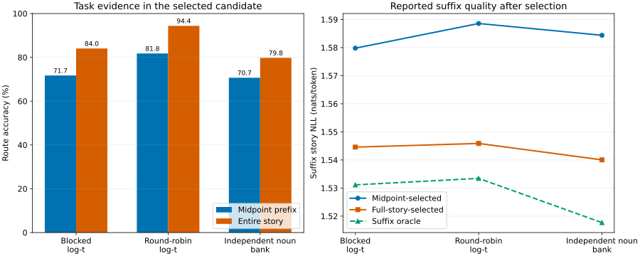

# TinyWorlds nouns-v2 full-story routing diagnostic

The hypothesis is supported: full-story access raises routing accuracy by 9.08–12.64 percentage points and lowers story-weighted suffix NLL by 0.03523–0.04434 across all three final banks.

This is a versioned addendum to the [temporal-consolidation report](../report.md),
not a replacement for it. It uses all 4,440 official validation stories and the
three already-trained final banks. No model or adapter was retrained.

| Final bank | Accuracy meaning | Midpoint route | Full-story route | Midpoint suffix NLL | Full-story suffix NLL | Suffix oracle | Oracle gap recovered |
|---|---|---:|---:|---:|---:|---:|---:|
| Blocked log-t | Noun support | 71.71% | 84.03% | 1.57980 | 1.54457 | 1.53113 | 72.4% |
| Round-robin log-t | Noun support | 81.76% | 94.39% | 1.58858 | 1.54588 | 1.53345 | 77.4% |
| Independent noun bank | Exact noun | 70.68% | 79.75% | 1.58438 | 1.54004 | 1.51770 | 66.5% |

The suffix result for full-story routing is intentionally **selection-leaking**:
the router reads the same suffix whose NLL is then reported. It measures whether
the complete story contains enough evidence to identify a useful memory; it is
not a deployable held-out routing estimate. The whole-story self-selected losses
are preserved in `aggregate.csv` as a second, explicitly self-selected view.

What this says about the hypothesis

The experiment separates weak midpoint cues from poor memories. If route
accuracy rises and suffix NLL falls when the rest of the story becomes visible,
the original midpoint protocol was charging the memory system for missing
addressing evidence. The remaining distance to the suffix oracle is the portion
not removed by this full-story selector. Mixed log-t intervals can contain more
than one noun, so their accuracy is noun support; only the independent bank has
an exact noun-route label. A base selection counts as a miss in both cases.

Canonical scoring and bounded audit

For candidate `j`, short-story whole NLL is reconstructed as
`(prefix_mean[j] * prefix_tokens + suffix_mean[j] * suffix_tokens) /
(prefix_tokens + suffix_tokens)`. This is the same causal computation as the
canonical 256-token story windows whenever the midpoint prefix is at most 256
transitions. All 111 longer stories were rescored
directly. The deterministic audit additionally included near ties and the
minimum-margin short story for every noun: 190
unique stories × three banks = 570
direct rows. Maximum short-story score error was
4e-07; there were
0 selection mismatches. The smallest
unaudited margin was 0.000200103, more than
twice the fixed `1e-4` score tolerance.

Candidate order is inherited exactly from each parent ledger, base remains
first, and ties use the stable first minimum. The chained work ledgers are
resumable and tamper-rejecting.

Paired uncertainty

Differences are full-story minus midpoint. Intervals use deterministic seed-zero
10,000-sample paired bootstrap resampling within each of the 24 noun strata.

| Bank | Metric | Difference | 95% interval |
|---|---|---:|---:|
| blocked log t | route accuracy change | +0.123198 | [+0.110811, +0.135586] |
| blocked log t | suffix story nll change | -0.035227 | [-0.037671, -0.032857] |
| blocked log t | whole story nll change | -0.013709 | [-0.014788, -0.012670] |
| round robin log t | route accuracy change | +0.126351 | [+0.115090, +0.137838] |
| round robin log t | suffix story nll change | -0.042699 | [-0.044904, -0.040630] |
| round robin log t | whole story nll change | -0.015567 | [-0.016541, -0.014655] |
| independent noun | route accuracy change | +0.090766 | [+0.078153, +0.103384] |
| independent noun | suffix story nll change | -0.044338 | [-0.047131, -0.041635] |
| independent noun | whole story nll change | -0.016522 | [-0.017707, -0.015389] |

Per-task, confusion, execution, and provenance

`per-task.csv` contains all 72 bank/noun summaries; `confusion.csv` contains
both routing rules' task-to-candidate counts. `analysis.json` binds these tables,
the exact parent ledgers, the 13,320-row derived ledger, and the 570-row direct
audit ledger. `manifest.json` hashes every published addendum artifact. The
parent contract is `3f4ef4a10fd471b418a32a8f7b45431602c1f6abc080c19a7822ea2c2dd839b4` and remains byte-identical.

End-to-end runtime was 168.7 s.
Peak JAX allocator use was 3.35
GiB against the fixed 12 GiB gate.

