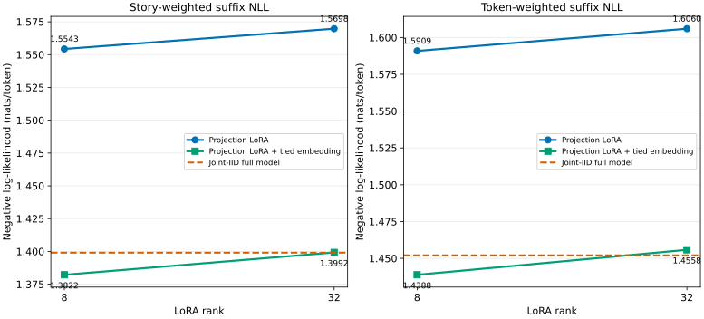

# TinyWorlds nouns-v2 joint-IID LoRA plus tied embedding

Jointly training the tied embedding gives rank 8: 1.382183 story NLL, 110.8% of its projection-only gap recovered; rank 32: 1.399205 story NLL, 99.9% of its projection-only gap recovered. The full-model reference is 1.399026.

This addendum tests whether the frozen token embedding/output classifier caused
the projection-only LoRA gap. It uses the exact 98,304-story joint-IID training
population and the exact 4,440-story final suffix evaluation from the
[temporal-consolidation report](../report.md).

| Condition | Rank | Story NLL | Token NLL | Suffix token accuracy |
|---|---:|---:|---:|---:|
| Joint-IID full model | — | 1.399026 | 1.452044 | 61.864% |
| Projection LoRA rank 8 | 8 | 1.554322 | 1.590877 | 61.134% |
| Projection LoRA rank 32 | 32 | 1.569790 | 1.605972 | 60.802% |
| Projection LoRA + tied embedding rank 8 | 8 | 1.382183 | 1.438839 | 62.145% |
| Projection LoRA + tied embedding rank 32 | 32 | 1.399205 | 1.455794 | 61.822% |

Story NLL weights every story equally. Token NLL weights all 476,035 evaluator-only
suffix targets equally. Accuracy is teacher-forced next-token accuracy, not
routing accuracy.

Method and trainable parameters

The new conditions train all six LoRA projections in every transformer block
and one tied token matrix used both for input lookup and output logits. The
original transformer kernels, position embedding, layer norms, and biases stay
frozen. Both ranks use alpha equal to rank, hence LoRA scale one.

One joint loss and one combined global-norm clip feed two AdamW groups: LoRA at
`1e-3` and the tied embedding at `5e-5`; both use weight decay `0.01`. Training
uses four epochs, batch 32, context 256, and 15,024 updates.

| Rank | LoRA params | Embedding params | Total trainable | Base fraction | Final train loss | Embedding relative displacement | Runtime |
|---:|---:|---:|---:|---:|---:|---:|---:|
| 8 | 294,912 | 12,865,792 | 13,160,704 | 66.80% | 1.42258 | 0.3466 | 67.8 min |
| 32 | 1,179,648 | 12,865,792 | 14,045,440 | 71.29% | 1.43405 | 0.3448 | 68.3 min |

The trained-embedding-only diagnostic disables the jointly learned LoRA at
evaluation time. It is not a separately optimized baseline and therefore
should not be interpreted as an additive decomposition.

| Training rank | Embedding-only story NLL | Embedding-only token NLL |
|---:|---:|---:|
| 8 | 1.470652 | 1.516825 |
| 32 | 1.472401 | 1.518614 |

Paired uncertainty

Differences are condition minus reference. Intervals use the deterministic
seed-zero 10,000-sample paired bootstrap stratified by noun; negative NLL
favors the condition.

| Condition | Reference | Metric | Difference | 95% interval |
|---|---|---|---:|---:|
| lora embedding rank 8 | lora rank 8 | story mean nll | -0.172139 | [-0.177414, -0.166913] |
| lora embedding rank 8 | lora rank 8 | token mean nll | -0.152038 | [-0.157070, -0.147034] |
| lora embedding rank 32 | lora rank 32 | story mean nll | -0.170585 | [-0.175792, -0.165459] |
| lora embedding rank 32 | lora rank 32 | token mean nll | -0.150179 | [-0.155275, -0.145084] |
| lora embedding rank 8 | full model | story mean nll | -0.016843 | [-0.018336, -0.015400] |
| lora embedding rank 8 | full model | token mean nll | -0.013205 | [-0.014695, -0.011750] |
| lora embedding rank 32 | full model | story mean nll | +0.000179 | [-0.001360, +0.001672] |
| lora embedding rank 32 | full model | token mean nll | +0.003750 | [+0.002214, +0.005266] |
| lora embedding rank 32 | lora embedding rank 8 | story mean nll | +0.017022 | [+0.016220, +0.017826] |
| lora embedding rank 32 | lora embedding rank 8 | token mean nll | +0.016955 | [+0.016182, +0.017725] |

Per-noun results

| Noun | Condition | Story NLL | Token NLL | Token accuracy |
|---|---|---:|---:|---:|
| mouse | Joint-IID full model | 1.27605 | 1.31497 | 64.47% |
| rabbit | Joint-IID full model | 1.43145 | 1.46834 | 61.75% |
| boat | Joint-IID full model | 1.37099 | 1.42129 | 62.49% |
| brother | Joint-IID full model | 1.41771 | 1.46540 | 61.03% |
| parent | Joint-IID full model | 1.78686 | 1.77819 | 55.72% |
| duck | Joint-IID full model | 1.28771 | 1.35485 | 64.01% |
| sister | Joint-IID full model | 1.29781 | 1.34759 | 63.26% |
| pet | Joint-IID full model | 1.43708 | 1.48172 | 61.28% |
| bicycle | Joint-IID full model | 1.38332 | 1.44598 | 62.10% |
| grandma | Joint-IID full model | 1.57501 | 1.60492 | 58.56% |
| lion | Joint-IID full model | 1.36610 | 1.43962 | 62.41% |
| fairy | Joint-IID full model | 1.39871 | 1.43408 | 62.11% |
| train | Joint-IID full model | 1.33846 | 1.38346 | 63.01% |
| cow | Joint-IID full model | 1.27048 | 1.33185 | 64.65% |
| wheel | Joint-IID full model | 1.32468 | 1.38806 | 62.80% |
| monkey | Joint-IID full model | 1.28850 | 1.32676 | 64.20% |
| princess | Joint-IID full model | 1.54276 | 1.57724 | 59.15% |
| plane | Joint-IID full model | 1.43637 | 1.46151 | 61.58% |
| elephant | Joint-IID full model | 1.27858 | 1.30488 | 64.72% |
| neighbor | Joint-IID full model | 1.45876 | 1.51976 | 60.48% |
| dragon | Joint-IID full model | 1.45354 | 1.49841 | 61.95% |
| queen | Joint-IID full model | 1.33315 | 1.39328 | 62.23% |
| horse | Joint-IID full model | 1.33595 | 1.59473 | 62.71% |
| bus | Joint-IID full model | 1.37665 | 1.41487 | 62.97% |
| mouse | Projection LoRA rank 8 | 1.49997 | 1.53024 | 63.18% |
| rabbit | Projection LoRA rank 8 | 1.62881 | 1.65689 | 61.04% |
| boat | Projection LoRA rank 8 | 1.64651 | 1.67249 | 61.28% |
| brother | Projection LoRA rank 8 | 1.48708 | 1.52395 | 61.08% |
| parent | Projection LoRA rank 8 | 1.89695 | 1.88489 | 55.29% |
| duck | Projection LoRA rank 8 | 1.37403 | 1.44846 | 63.52% |
| sister | Projection LoRA rank 8 | 1.37340 | 1.41716 | 62.89% |
| pet | Projection LoRA rank 8 | 1.45422 | 1.50529 | 61.21% |
| bicycle | Projection LoRA rank 8 | 1.55719 | 1.60793 | 61.13% |
| grandma | Projection LoRA rank 8 | 1.70226 | 1.72779 | 57.77% |
| lion | Projection LoRA rank 8 | 1.65397 | 1.69247 | 61.29% |
| fairy | Projection LoRA rank 8 | 1.65472 | 1.67381 | 60.80% |
| train | Projection LoRA rank 8 | 1.70681 | 1.69496 | 60.83% |
| cow | Projection LoRA rank 8 | 1.30966 | 1.37149 | 64.13% |
| wheel | Projection LoRA rank 8 | 1.39075 | 1.44845 | 62.55% |
| monkey | Projection LoRA rank 8 | 1.42618 | 1.46381 | 63.79% |
| princess | Projection LoRA rank 8 | 1.71710 | 1.71217 | 58.28% |
| plane | Projection LoRA rank 8 | 1.68713 | 1.67837 | 60.31% |
| elephant | Projection LoRA rank 8 | 1.45460 | 1.48081 | 63.85% |
| neighbor | Projection LoRA rank 8 | 1.54606 | 1.60251 | 60.27% |
| dragon | Projection LoRA rank 8 | 1.50780 | 1.55922 | 61.16% |
| queen | Projection LoRA rank 8 | 1.52245 | 1.56264 | 61.08% |
| horse | Projection LoRA rank 8 | 1.49871 | 1.71825 | 61.10% |
| bus | Projection LoRA rank 8 | 1.40844 | 1.44855 | 62.05% |
| mouse | Projection LoRA rank 32 | 1.51950 | 1.54962 | 62.73% |
| rabbit | Projection LoRA rank 32 | 1.64618 | 1.67419 | 60.71% |
| boat | Projection LoRA rank 32 | 1.66234 | 1.68931 | 60.94% |
| brother | Projection LoRA rank 32 | 1.50291 | 1.53966 | 60.66% |
| parent | Projection LoRA rank 32 | 1.91451 | 1.90218 | 55.13% |
| duck | Projection LoRA rank 32 | 1.38768 | 1.46211 | 63.09% |
| sister | Projection LoRA rank 32 | 1.39109 | 1.43309 | 62.43% |
| pet | Projection LoRA rank 32 | 1.46980 | 1.52107 | 60.84% |
| bicycle | Projection LoRA rank 32 | 1.57190 | 1.62195 | 60.71% |
| grandma | Projection LoRA rank 32 | 1.71469 | 1.73745 | 57.36% |
| lion | Projection LoRA rank 32 | 1.66948 | 1.70846 | 60.92% |
| fairy | Projection LoRA rank 32 | 1.66564 | 1.68496 | 60.50% |
| train | Projection LoRA rank 32 | 1.71735 | 1.70531 | 60.63% |
| cow | Projection LoRA rank 32 | 1.32137 | 1.38538 | 64.10% |
| wheel | Projection LoRA rank 32 | 1.40197 | 1.46011 | 62.26% |
| monkey | Projection LoRA rank 32 | 1.44392 | 1.48155 | 63.27% |
| princess | Projection LoRA rank 32 | 1.73349 | 1.72704 | 58.17% |
| plane | Projection LoRA rank 32 | 1.70645 | 1.69679 | 59.92% |
| elephant | Projection LoRA rank 32 | 1.47174 | 1.49704 | 63.44% |
| neighbor | Projection LoRA rank 32 | 1.56208 | 1.61937 | 59.59% |
| dragon | Projection LoRA rank 32 | 1.51469 | 1.56500 | 60.92% |
| queen | Projection LoRA rank 32 | 1.53463 | 1.57697 | 61.04% |
| horse | Projection LoRA rank 32 | 1.51373 | 1.72694 | 61.55% |
| bus | Projection LoRA rank 32 | 1.42110 | 1.46219 | 62.31% |
| mouse | Projection LoRA + tied embedding rank 8 | 1.24807 | 1.28770 | 65.09% |
| rabbit | Projection LoRA + tied embedding rank 8 | 1.40919 | 1.44671 | 62.26% |
| boat | Projection LoRA + tied embedding rank 8 | 1.35341 | 1.40441 | 62.94% |
| brother | Projection LoRA + tied embedding rank 8 | 1.40212 | 1.45501 | 61.41% |
| parent | Projection LoRA + tied embedding rank 8 | 1.76452 | 1.76182 | 56.05% |
| duck | Projection LoRA + tied embedding rank 8 | 1.26805 | 1.33728 | 64.19% |
| sister | Projection LoRA + tied embedding rank 8 | 1.28115 | 1.33391 | 63.49% |
| pet | Projection LoRA + tied embedding rank 8 | 1.42590 | 1.47699 | 61.37% |
| bicycle | Projection LoRA + tied embedding rank 8 | 1.36385 | 1.43119 | 62.12% |
| grandma | Projection LoRA + tied embedding rank 8 | 1.56321 | 1.60049 | 58.46% |
| lion | Projection LoRA + tied embedding rank 8 | 1.35056 | 1.42675 | 62.96% |
| fairy | Projection LoRA + tied embedding rank 8 | 1.38923 | 1.42609 | 62.71% |
| train | Projection LoRA + tied embedding rank 8 | 1.33699 | 1.38354 | 62.92% |
| cow | Projection LoRA + tied embedding rank 8 | 1.25970 | 1.32128 | 64.89% |
| wheel | Projection LoRA + tied embedding rank 8 | 1.31181 | 1.38403 | 62.92% |
| monkey | Projection LoRA + tied embedding rank 8 | 1.26519 | 1.30628 | 64.70% |
| princess | Projection LoRA + tied embedding rank 8 | 1.52146 | 1.56255 | 59.42% |
| plane | Projection LoRA + tied embedding rank 8 | 1.42919 | 1.45501 | 61.73% |
| elephant | Projection LoRA + tied embedding rank 8 | 1.26133 | 1.28989 | 65.33% |
| neighbor | Projection LoRA + tied embedding rank 8 | 1.44841 | 1.51308 | 60.44% |
| dragon | Projection LoRA + tied embedding rank 8 | 1.44348 | 1.49400 | 61.71% |
| queen | Projection LoRA + tied embedding rank 8 | 1.32094 | 1.38126 | 62.93% |
| horse | Projection LoRA + tied embedding rank 8 | 1.31678 | 1.57786 | 62.43% |
| bus | Projection LoRA + tied embedding rank 8 | 1.37490 | 1.41444 | 62.52% |
| mouse | Projection LoRA + tied embedding rank 32 | 1.26704 | 1.30722 | 64.65% |
| rabbit | Projection LoRA + tied embedding rank 32 | 1.42880 | 1.46673 | 61.94% |
| boat | Projection LoRA + tied embedding rank 32 | 1.36940 | 1.42158 | 62.54% |
| brother | Projection LoRA + tied embedding rank 32 | 1.41827 | 1.47028 | 61.08% |
| parent | Projection LoRA + tied embedding rank 32 | 1.78221 | 1.77928 | 55.71% |
| duck | Projection LoRA + tied embedding rank 32 | 1.28687 | 1.35651 | 63.77% |
| sister | Projection LoRA + tied embedding rank 32 | 1.29432 | 1.34667 | 63.40% |
| pet | Projection LoRA + tied embedding rank 32 | 1.44044 | 1.49215 | 61.05% |
| bicycle | Projection LoRA + tied embedding rank 32 | 1.38072 | 1.44774 | 61.81% |
| grandma | Projection LoRA + tied embedding rank 32 | 1.58159 | 1.61715 | 58.31% |
| lion | Projection LoRA + tied embedding rank 32 | 1.37049 | 1.44600 | 62.65% |
| fairy | Projection LoRA + tied embedding rank 32 | 1.40392 | 1.44144 | 62.34% |
| train | Projection LoRA + tied embedding rank 32 | 1.35146 | 1.39971 | 62.62% |
| cow | Projection LoRA + tied embedding rank 32 | 1.27060 | 1.33405 | 64.58% |
| wheel | Projection LoRA + tied embedding rank 32 | 1.32614 | 1.39685 | 62.67% |
| monkey | Projection LoRA + tied embedding rank 32 | 1.28308 | 1.32483 | 64.29% |
| princess | Projection LoRA + tied embedding rank 32 | 1.53811 | 1.57866 | 59.26% |
| plane | Projection LoRA + tied embedding rank 32 | 1.44996 | 1.47428 | 61.43% |
| elephant | Projection LoRA + tied embedding rank 32 | 1.28090 | 1.30957 | 64.64% |
| neighbor | Projection LoRA + tied embedding rank 32 | 1.46412 | 1.52905 | 59.96% |
| dragon | Projection LoRA + tied embedding rank 32 | 1.45685 | 1.50752 | 61.63% |
| queen | Projection LoRA + tied embedding rank 32 | 1.33976 | 1.40072 | 62.51% |
| horse | Projection LoRA + tied embedding rank 32 | 1.33668 | 1.59871 | 62.22% |
| bus | Projection LoRA + tied embedding rank 32 | 1.39749 | 1.43518 | 62.01% |

Provenance and execution

- Contract: `b5e1d49866bcaa06fd840fd055cf6d658ace1bacb4433b04333549ac543372ae`
- Parent rank-sweep contract: `e87a835334a64c22b634a5e51f300cf5ad5fd529bd9fdcdf2268842fbd3df301`
- Parent rank-sweep manifest: `bf8b74cdb996679adf501234aaf4f540ba92cf599ac44590960d47ffc83676bb`
- Exact batch/random namespace: `cd4605c8240b459058c5a916ac6747edfd7712e99fcfd3710bd80cad1470a3cb`
- Exact suffix targets: 476,035
- Allocator peak: 8.16 GiB of 12 GiB
- End-to-end runtime: 140.2 minutes

CSV exports beside this report preserve aggregate, per-task, uncertainty,
training, embedding-only, and ledger-provenance records.

