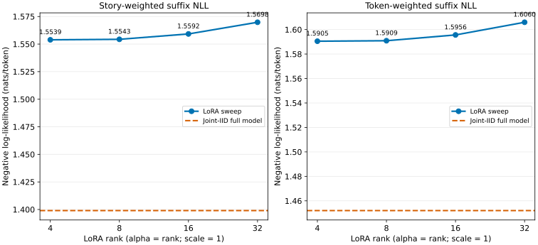

# TinyWorlds nouns-v2 joint-IID LoRA rank sweep

Rank 4 is the best LoRA condition at 1.553880 story-weighted suffix NLL. Relative to canonical rank 8 (1.554322), it recovers 0.3% of the gap to the joint-IID full model (1.399026).

This addendum evaluates LoRA ranks 4, 8, 16, and 32 on the exact 4,440-story
final suffix condition used by the [temporal-consolidation report](../report.md).
The rank-8 rows and joint-IID full-model rows are the original authenticated
results, not recomputed approximations.

| Condition | Rank | Story NLL | Token NLL | Suffix token accuracy | Stories | Suffix tokens |
|---|---:|---:|---:|---:|---:|---:|
| Joint-IID full model | — | 1.399026 | 1.452044 | 61.864% | 4,440 | 476,035 |
| Joint-IID LoRA rank 4 | 4 | 1.553880 | 1.590484 | 61.212% | 4,440 | 476,035 |
| Joint-IID LoRA rank 8 | 8 | 1.554322 | 1.590877 | 61.134% | 4,440 | 476,035 |
| Joint-IID LoRA rank 16 | 16 | 1.559201 | 1.595611 | 61.072% | 4,440 | 476,035 |
| Joint-IID LoRA rank 32 | 32 | 1.569790 | 1.605972 | 60.802% | 4,440 | 476,035 |

The story-weighted NLL gives every story equal weight, matching the report's
primary final-quality figure. Token-weighted NLL sums all suffix losses before
dividing by all suffix tokens. Both are teacher-forced next-token cross-entropy
on the evaluator-only story suffix; “token accuracy” is included only as the
fraction of those suffix targets whose most likely token was correct.

Method and direct-comparability controls

Every new adapter sees the same 98,304 selected training stories for four
epochs and the same 15,024 minibatches as canonical rank 8. The epoch-order and
random namespaces are both the canonical rank-8 job identity. AdamW settings
remain batch 32, LR `1e-3`, weight decay `0.01`, gradient clipping `1.0`, and
context length 256. Alpha equals rank, so all four conditions have LoRA scale
`alpha / rank = 1`; only low-rank capacity changes.

Rank 8 is strict-loaded from the original adapter and its original 4,440-row
ledger. The full-model line is also the original joint-IID control (trained
under its already published full-model schedule), so it is a quality reference,
not a parameter-matched LoRA condition. All ledgers share exact story order,
suffix token masks, and 476,035 suffix targets.
The maximum base-path NLL drift induced by compiling different rank shapes is
`0`.

| Rank | Alpha | Trainable parameters | Fraction of base | Updates | Final train loss | Runtime | Source |
|---:|---:|---:|---:|---:|---:|---:|---|
| 4 | 4 | 147,456 | 0.748% | 15,024 | 1.53990 | 65.3 min | new |
| 8 | 8 | 294,912 | 1.497% | 15,024 | 1.54387 | 26.2 min | reused |
| 16 | 16 | 589,824 | 2.994% | 15,024 | 1.54563 | 65.2 min | new |
| 32 | 32 | 1,179,648 | 5.987% | 15,024 | 1.54711 | 65.5 min | new |

Paired uncertainty intervals

Intervals use the preregistered deterministic seed-zero, 10,000-sample paired
bootstrap, stratified by noun. Differences are condition minus reference, so a
negative NLL difference favors the swept rank.

| Condition | Reference | Metric | Difference | 95% interval |
|---|---|---|---:|---:|
| rank 4 | full model | story mean nll | +0.154854 | [+0.149376, +0.160282] |
| rank 4 | full model | token mean nll | +0.138440 | [+0.133254, +0.143622] |
| rank 4 | rank 8 | story mean nll | -0.000443 | [-0.001118, +0.000225] |
| rank 4 | rank 8 | token mean nll | -0.000393 | [-0.001037, +0.000255] |
| rank 8 | full model | story mean nll | +0.155296 | [+0.149902, +0.160661] |
| rank 8 | full model | token mean nll | +0.138833 | [+0.133670, +0.143918] |
| rank 16 | full model | story mean nll | +0.160174 | [+0.154741, +0.165541] |
| rank 16 | full model | token mean nll | +0.143567 | [+0.138416, +0.148690] |
| rank 16 | rank 8 | story mean nll | +0.004878 | [+0.004174, +0.005592] |
| rank 16 | rank 8 | token mean nll | +0.004734 | [+0.004056, +0.005404] |
| rank 32 | full model | story mean nll | +0.170763 | [+0.165283, +0.176189] |
| rank 32 | full model | token mean nll | +0.153928 | [+0.148757, +0.159068] |
| rank 32 | rank 8 | story mean nll | +0.015467 | [+0.014554, +0.016380] |
| rank 32 | rank 8 | token mean nll | +0.015095 | [+0.014199, +0.015980] |

Per-noun results

| Noun | Condition | Story NLL | Token NLL | Token accuracy |
|---|---|---:|---:|---:|
| mouse | Joint-IID full model | 1.27605 | 1.31497 | 64.47% |
| rabbit | Joint-IID full model | 1.43145 | 1.46834 | 61.75% |
| boat | Joint-IID full model | 1.37099 | 1.42129 | 62.49% |
| brother | Joint-IID full model | 1.41771 | 1.46540 | 61.03% |
| parent | Joint-IID full model | 1.78686 | 1.77819 | 55.72% |
| duck | Joint-IID full model | 1.28771 | 1.35485 | 64.01% |
| sister | Joint-IID full model | 1.29781 | 1.34759 | 63.26% |
| pet | Joint-IID full model | 1.43708 | 1.48172 | 61.28% |
| bicycle | Joint-IID full model | 1.38332 | 1.44598 | 62.10% |
| grandma | Joint-IID full model | 1.57501 | 1.60492 | 58.56% |
| lion | Joint-IID full model | 1.36610 | 1.43962 | 62.41% |
| fairy | Joint-IID full model | 1.39871 | 1.43408 | 62.11% |
| train | Joint-IID full model | 1.33846 | 1.38346 | 63.01% |
| cow | Joint-IID full model | 1.27048 | 1.33185 | 64.65% |
| wheel | Joint-IID full model | 1.32468 | 1.38806 | 62.80% |
| monkey | Joint-IID full model | 1.28850 | 1.32676 | 64.20% |
| princess | Joint-IID full model | 1.54276 | 1.57724 | 59.15% |
| plane | Joint-IID full model | 1.43637 | 1.46151 | 61.58% |
| elephant | Joint-IID full model | 1.27858 | 1.30488 | 64.72% |
| neighbor | Joint-IID full model | 1.45876 | 1.51976 | 60.48% |
| dragon | Joint-IID full model | 1.45354 | 1.49841 | 61.95% |
| queen | Joint-IID full model | 1.33315 | 1.39328 | 62.23% |
| horse | Joint-IID full model | 1.33595 | 1.59473 | 62.71% |
| bus | Joint-IID full model | 1.37665 | 1.41487 | 62.97% |
| mouse | Joint-IID LoRA rank 4 | 1.49697 | 1.52731 | 63.43% |
| rabbit | Joint-IID LoRA rank 4 | 1.62426 | 1.65221 | 61.06% |
| boat | Joint-IID LoRA rank 4 | 1.64502 | 1.67057 | 61.28% |
| brother | Joint-IID LoRA rank 4 | 1.48614 | 1.52331 | 61.22% |
| parent | Joint-IID LoRA rank 4 | 1.89672 | 1.88432 | 55.28% |
| duck | Joint-IID LoRA rank 4 | 1.37558 | 1.45097 | 63.53% |
| sister | Joint-IID LoRA rank 4 | 1.37264 | 1.41645 | 62.98% |
| pet | Joint-IID LoRA rank 4 | 1.45662 | 1.50759 | 61.23% |
| bicycle | Joint-IID LoRA rank 4 | 1.55828 | 1.60911 | 61.20% |
| grandma | Joint-IID LoRA rank 4 | 1.70277 | 1.72912 | 57.82% |
| lion | Joint-IID LoRA rank 4 | 1.65690 | 1.69476 | 61.30% |
| fairy | Joint-IID LoRA rank 4 | 1.65977 | 1.67815 | 60.80% |
| train | Joint-IID LoRA rank 4 | 1.70690 | 1.69494 | 61.10% |
| cow | Joint-IID LoRA rank 4 | 1.31338 | 1.37543 | 64.19% |
| wheel | Joint-IID LoRA rank 4 | 1.39226 | 1.44945 | 62.44% |
| monkey | Joint-IID LoRA rank 4 | 1.42510 | 1.46245 | 63.79% |
| princess | Joint-IID LoRA rank 4 | 1.71192 | 1.70684 | 58.54% |
| plane | Joint-IID LoRA rank 4 | 1.68601 | 1.67602 | 60.19% |
| elephant | Joint-IID LoRA rank 4 | 1.45590 | 1.48243 | 64.05% |
| neighbor | Joint-IID LoRA rank 4 | 1.54487 | 1.60257 | 60.00% |
| dragon | Joint-IID LoRA rank 4 | 1.51033 | 1.56087 | 61.22% |
| queen | Joint-IID LoRA rank 4 | 1.52073 | 1.56057 | 61.55% |
| horse | Joint-IID LoRA rank 4 | 1.49538 | 1.71236 | 61.79% |
| bus | Joint-IID LoRA rank 4 | 1.40462 | 1.44551 | 62.34% |
| mouse | Joint-IID LoRA rank 8 | 1.49997 | 1.53024 | 63.18% |
| rabbit | Joint-IID LoRA rank 8 | 1.62881 | 1.65689 | 61.04% |
| boat | Joint-IID LoRA rank 8 | 1.64651 | 1.67249 | 61.28% |
| brother | Joint-IID LoRA rank 8 | 1.48708 | 1.52395 | 61.08% |
| parent | Joint-IID LoRA rank 8 | 1.89695 | 1.88489 | 55.29% |
| duck | Joint-IID LoRA rank 8 | 1.37403 | 1.44846 | 63.52% |
| sister | Joint-IID LoRA rank 8 | 1.37340 | 1.41716 | 62.89% |
| pet | Joint-IID LoRA rank 8 | 1.45422 | 1.50529 | 61.21% |
| bicycle | Joint-IID LoRA rank 8 | 1.55719 | 1.60793 | 61.13% |
| grandma | Joint-IID LoRA rank 8 | 1.70226 | 1.72779 | 57.77% |
| lion | Joint-IID LoRA rank 8 | 1.65397 | 1.69247 | 61.29% |
| fairy | Joint-IID LoRA rank 8 | 1.65472 | 1.67381 | 60.80% |
| train | Joint-IID LoRA rank 8 | 1.70681 | 1.69496 | 60.83% |
| cow | Joint-IID LoRA rank 8 | 1.30966 | 1.37149 | 64.13% |
| wheel | Joint-IID LoRA rank 8 | 1.39075 | 1.44845 | 62.55% |
| monkey | Joint-IID LoRA rank 8 | 1.42618 | 1.46381 | 63.79% |
| princess | Joint-IID LoRA rank 8 | 1.71710 | 1.71217 | 58.28% |
| plane | Joint-IID LoRA rank 8 | 1.68713 | 1.67837 | 60.31% |
| elephant | Joint-IID LoRA rank 8 | 1.45460 | 1.48081 | 63.85% |
| neighbor | Joint-IID LoRA rank 8 | 1.54606 | 1.60251 | 60.27% |
| dragon | Joint-IID LoRA rank 8 | 1.50780 | 1.55922 | 61.16% |
| queen | Joint-IID LoRA rank 8 | 1.52245 | 1.56264 | 61.08% |
| horse | Joint-IID LoRA rank 8 | 1.49871 | 1.71825 | 61.10% |
| bus | Joint-IID LoRA rank 8 | 1.40844 | 1.44855 | 62.05% |
| mouse | Joint-IID LoRA rank 16 | 1.50564 | 1.53615 | 63.10% |
| rabbit | Joint-IID LoRA rank 16 | 1.63508 | 1.66320 | 61.00% |
| boat | Joint-IID LoRA rank 16 | 1.64990 | 1.67634 | 61.34% |
| brother | Joint-IID LoRA rank 16 | 1.49291 | 1.52934 | 61.00% |
| parent | Joint-IID LoRA rank 16 | 1.90281 | 1.89083 | 55.07% |
| duck | Joint-IID LoRA rank 16 | 1.37957 | 1.45379 | 63.36% |
| sister | Joint-IID LoRA rank 16 | 1.37774 | 1.42037 | 62.92% |
| pet | Joint-IID LoRA rank 16 | 1.46031 | 1.51090 | 61.17% |
| bicycle | Joint-IID LoRA rank 16 | 1.56272 | 1.61306 | 61.01% |
| grandma | Joint-IID LoRA rank 16 | 1.70629 | 1.72980 | 57.87% |
| lion | Joint-IID LoRA rank 16 | 1.66166 | 1.69942 | 61.00% |
| fairy | Joint-IID LoRA rank 16 | 1.65731 | 1.67615 | 60.72% |
| train | Joint-IID LoRA rank 16 | 1.70921 | 1.69742 | 60.70% |
| cow | Joint-IID LoRA rank 16 | 1.31266 | 1.37513 | 64.38% |
| wheel | Joint-IID LoRA rank 16 | 1.39280 | 1.45253 | 62.43% |
| monkey | Joint-IID LoRA rank 16 | 1.43276 | 1.47059 | 63.49% |
| princess | Joint-IID LoRA rank 16 | 1.72182 | 1.71858 | 58.51% |
| plane | Joint-IID LoRA rank 16 | 1.69609 | 1.68704 | 60.14% |
| elephant | Joint-IID LoRA rank 16 | 1.45718 | 1.48364 | 64.06% |
| neighbor | Joint-IID LoRA rank 16 | 1.55142 | 1.60897 | 59.99% |
| dragon | Joint-IID LoRA rank 16 | 1.51036 | 1.56169 | 60.86% |
| queen | Joint-IID LoRA rank 16 | 1.52335 | 1.56448 | 61.28% |
| horse | Joint-IID LoRA rank 16 | 1.50154 | 1.71683 | 61.12% |
| bus | Joint-IID LoRA rank 16 | 1.41169 | 1.45185 | 62.22% |
| mouse | Joint-IID LoRA rank 32 | 1.51950 | 1.54962 | 62.73% |
| rabbit | Joint-IID LoRA rank 32 | 1.64618 | 1.67419 | 60.71% |
| boat | Joint-IID LoRA rank 32 | 1.66234 | 1.68931 | 60.94% |
| brother | Joint-IID LoRA rank 32 | 1.50291 | 1.53966 | 60.66% |
| parent | Joint-IID LoRA rank 32 | 1.91451 | 1.90218 | 55.13% |
| duck | Joint-IID LoRA rank 32 | 1.38768 | 1.46211 | 63.09% |
| sister | Joint-IID LoRA rank 32 | 1.39109 | 1.43309 | 62.43% |
| pet | Joint-IID LoRA rank 32 | 1.46980 | 1.52107 | 60.84% |
| bicycle | Joint-IID LoRA rank 32 | 1.57190 | 1.62195 | 60.71% |
| grandma | Joint-IID LoRA rank 32 | 1.71469 | 1.73745 | 57.36% |
| lion | Joint-IID LoRA rank 32 | 1.66948 | 1.70846 | 60.92% |
| fairy | Joint-IID LoRA rank 32 | 1.66564 | 1.68496 | 60.50% |
| train | Joint-IID LoRA rank 32 | 1.71735 | 1.70531 | 60.63% |
| cow | Joint-IID LoRA rank 32 | 1.32137 | 1.38538 | 64.10% |
| wheel | Joint-IID LoRA rank 32 | 1.40197 | 1.46011 | 62.26% |
| monkey | Joint-IID LoRA rank 32 | 1.44392 | 1.48155 | 63.27% |
| princess | Joint-IID LoRA rank 32 | 1.73349 | 1.72704 | 58.17% |
| plane | Joint-IID LoRA rank 32 | 1.70645 | 1.69679 | 59.92% |
| elephant | Joint-IID LoRA rank 32 | 1.47174 | 1.49704 | 63.44% |
| neighbor | Joint-IID LoRA rank 32 | 1.56208 | 1.61937 | 59.59% |
| dragon | Joint-IID LoRA rank 32 | 1.51469 | 1.56500 | 60.92% |
| queen | Joint-IID LoRA rank 32 | 1.53463 | 1.57697 | 61.04% |
| horse | Joint-IID LoRA rank 32 | 1.51373 | 1.72694 | 61.55% |
| bus | Joint-IID LoRA rank 32 | 1.42110 | 1.46219 | 62.31% |

Provenance and execution

- Sweep contract: `e87a835334a64c22b634a5e51f300cf5ad5fd529bd9fdcdf2268842fbd3df301`
- Parent temporal contract: `3f4ef4a10fd471b418a32a8f7b45431602c1f6abc080c19a7822ea2c2dd839b4`
- Parent publication manifest: `15f3ee2a5a2c5054b158ba62d7a0d1b9fcaa22e40634a73c9cbffceca5888bcb`
- Canonical rank-8 job: `cd4605c8240b459058c5a916ac6747edfd7712e99fcfd3710bd80cad1470a3cb`
- Canonical full-model job: `61376ee6e474516ab6471d74ca97dfe2737586863c2d5b3a50c123147120bc80`
- Exact batch/random namespace: `cd4605c8240b459058c5a916ac6747edfd7712e99fcfd3710bd80cad1470a3cb`
- Allocator peak: 7.78 GiB of a 12 GiB gate
- End-to-end runtime: 201.1 minutes

Raw aggregates, per-task rows, paired intervals, training metadata, and ledger
hashes are exported as CSV beside this report. The HTML report is standalone
and embeds the same accessible SVG.

