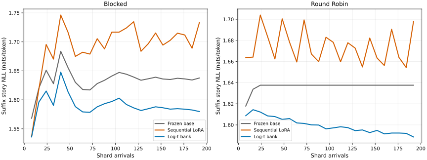
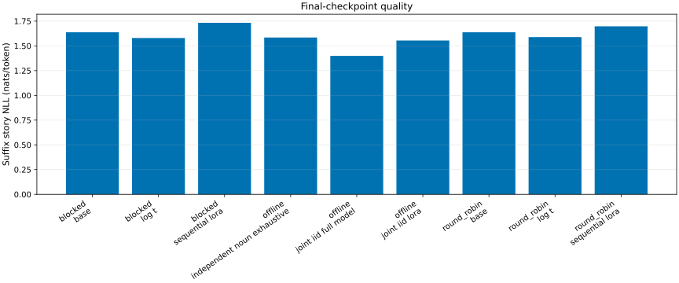
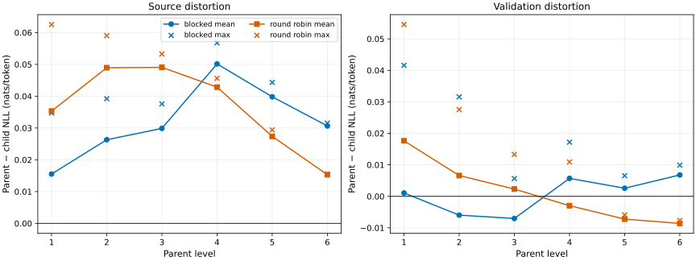
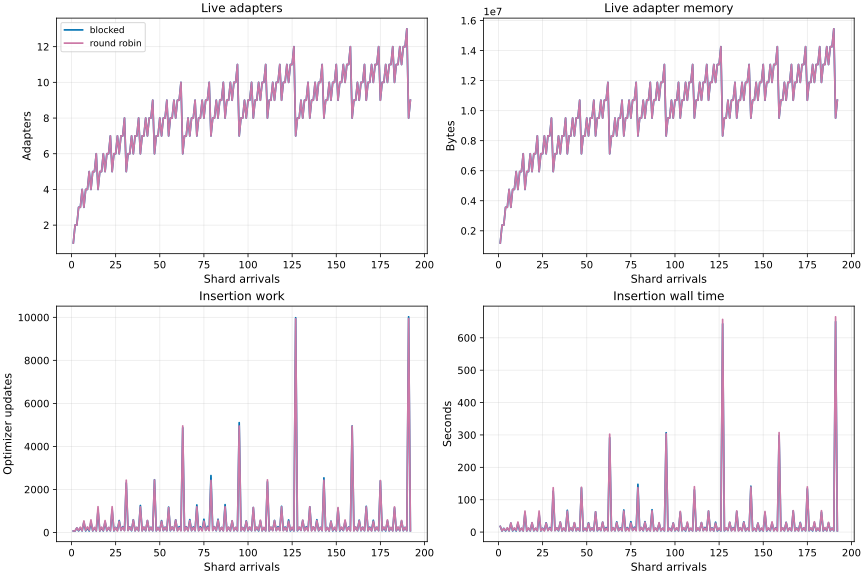
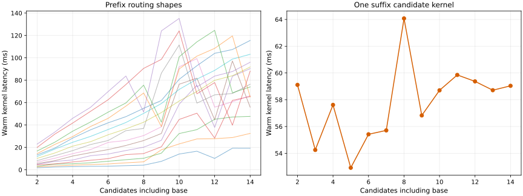
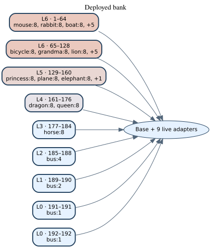
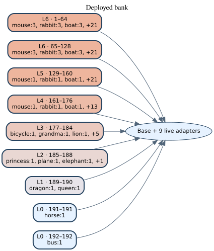

# TinyWorlds Nouns-v2 Log-t Temporal Consolidation

This report publishes the fixed seed-zero experiment bound by contract
`3f4ef4a10fd471b418a32a8f7b45431602c1f6abc080c19a7822ea2c2dd839b4`. It compares the same 192 immutable 512-story shards
under blocked and round-robin arrival orders. No merge was accepted or rejected
using validation quality: every third equal-level chunk synchronously merged the
two oldest chunks, exactly as preregistered.

## Final results

| Order | Method | Story NLL | Token NLL | Token accuracy | Noun support | Oracle regret |
|---|---|---:|---:|---:|---:|---:|
| blocked | base | 1.63759 | 1.66357 | 60.63% | — | 0.00000 |
| blocked | log t | 1.57980 | 1.61432 | 60.89% | 71.71% | 0.04867 |
| blocked | sequential lora | 1.73303 | 1.76136 | 58.72% | — | 0.10540 |
| offline | independent noun exhaustive | 1.58438 | 1.61937 | 60.78% | 70.68% | 0.06668 |
| offline | joint iid full model | 1.39903 | 1.45204 | 61.86% | — | 0.00000 |
| offline | joint iid lora | 1.55432 | 1.59088 | 61.13% | — | 0.00724 |
| round robin | base | 1.63759 | 1.66357 | 60.63% | — | 0.00000 |
| round robin | log t | 1.58858 | 1.62206 | 60.79% | 81.76% | 0.05513 |
| round robin | sequential lora | 1.69788 | 1.72735 | 59.37% | — | 0.07914 |

The independent-noun bank is a practical 24-adapter endpoint, not the exact
192-adapter no-consolidation ablation. The IID controls are offline endpoints
and do not define historical causal curves.

### Paired ordering effects

Values are round-robin minus blocked for the final routed log-t bank. Intervals
are deterministic noun-stratified seed-zero 10,000-sample bootstrap summaries;
they are descriptive, not pass/fail tests.

| Metric | Paired difference | 95% interval |
|---|---:|---:|
| story_nll | +0.008785 | [+0.006776, +0.010677] |
| token_accuracy | -0.001218 | [-0.002012, -0.000428] |
| oracle_regret | +0.006464 | [+0.004536, +0.008317] |
| noun_support | +0.100450 | [+0.088739, +0.112162] |

Method and routing semantics

Each arrival trains a fresh base-relative rank-eight LoRA. A level stores at
most two chunks. On overflow, the two oldest equal-level chunks are discarded
from the live bank only after a fresh parent is trained from the frozen base on
their exact source union. The final deployment is the base plus nine adapters,
covering intervals 1–64, 65–128, 129–160, 161–176, 177–184, 185–188, 189–190,
191, and 192.

Routing exhaustively scores mean token NLL on the exact midpoint prefix, with
base first and stable first-minimum ties. It receives neither the noun identity
nor suffix tokens. The suffix oracle is evaluator-only. Since a temporal chunk
can contain several nouns, a selected chunk containing any data for the query
noun is called a noun-support hit rather than route accuracy.

Merge distortion and lineage proof

For each merge child, the audit measures parent-minus-child NLL on every
descendant shard and on its noun's fixed 16-story sentinel. The merge statistic
is the worse of the two token-weighted child distortions. The maximum observed
source and validation deltas were +0.062528 and
+0.054542 nats/token. Per-arrival signed increments telescope to
direct level-zero-to-active-ancestor drift with maximum residual
0; the smallest positive-part bound slack was
0.

Cost, timing, and storage

Candidate evaluations, model-forward-equivalent tokens, optimizer updates,
bytes, and seconds remain in distinct fields and plot panels. `timing.csv`
contains one cold compilation and five synchronized warm repetitions for every
observed prefix-width/candidate-capacity shape. End-to-end execution was
42.21 hours. Peak JAX allocator use was 11.78 GiB
against the fixed 12 GiB gate.

Per-task, provenance, and machine-readable evidence

Per-task results are in `per-task.csv`; complete stage and arrival curves are in
`stage.csv`; forgetting and backward transfer are in `forgetting.csv`;
selection age/level evidence and independent-bank confusion are in
`selection.csv` and `confusion.csv`. Merge, lineage, timing, cost, and bootstrap
evidence have separate CSVs. `analysis.json` and `manifest.json` bind every
published byte. The authenticated selected-base parameter checksum is
`fff309bfbfcee8d59c5c3fc04152cc37be2142201f3bf9116b7b024e81a24f3c`, the final canonical VAMP
tensor checksum is `97414ac3d8656ab083b2e570a4162dc69b024f90cf819b80b1cab94213553e63`, and the partition is
`210c4e2d067077fe774782024a594ade7e7472a986d554f186453549cf910f1b`.

## Lineage views

### Blocked, deployed bank

### Round robin, deployed bank

The corresponding complete 192-leaf/183-merge audits are
`lineage-blocked-full.svg` and `lineage-round_robin-full.svg`.
